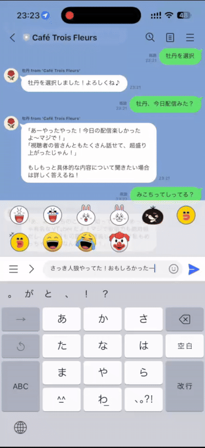

# AI Systems Architect — Portfolio

## 🎬 Live Demo

### AI Vtuber Project (LINE Bot)
A short preview of the system in action (3-persona autonomous dialogue):



### Sisters-On-WhatsApp
Watch the three sisters in action on WhatsApp:

[](https://youtube.com/shorts/OSuatRt_Gyo)

*Click to watch the Three Sisters responding on WhatsApp!*

---

**Designed and built two production autonomous multi-agent LLM systems:**
- **AI Vtuber (LINE)**: 47 business days (Sep 8 – Nov 11, 2025)
- **Sisters-On-WhatsApp**: 4 hours (Nov 21, 2025) - Reusing proven architecture

---

## 🔥 Summary

I am an AI Systems Architect based in Osaka with **50 years of technology passion**.

In **47 business days** (September 8 – November 11, 2025), I designed and implemented a fully autonomous **3-persona, multi-agent LLM system** (AI Vtuber Project). Then, in just **4 hours** (November 21, 2025), I adapted the same architecture for WhatsApp, demonstrating the quality and reusability of my system design.

### Core Capabilities

* **Rapid System Design**: Built production WhatsApp bot in 4 hours from existing architecture
* **Multi-Platform Expertise**: Same AI system running on LINE (Japanese market) and WhatsApp (global markets)
* **Production-Ready Engineering**: pgvector memory, systemd deployment, PostgreSQL persistence
* **LLM Orchestration**: Multi-provider architecture (Kimi, OpenAI, Claude, Gemini)
* **Character-Driven AI**: Three distinct personas with autonomous topic routing
* **Human-AI Collaboration**: Equal partnership with Claude Code (AI pair programming)

---

## 🏆 Highlighted Achievements

### AI Vtuber Project (LINE Bot)
* **Built autonomous multi-agent LLM system in 47 business days** (concept to production)
* Designed **three independent AI personas** with unique behavior, memory, and reasoning
* Built the **Sisters Council** — structured debate engine for collective decision-making
* Implemented **pgvector-based long‑term memory** (episodic & semantic separation)
* Developed **dynamic prompt reconstruction** for RAG-free context injection
* Created **curiosity-driven reasoning** ("why-chain" multi‑hop exploration)
* Built **7-layer safety & governance pipeline** with Grok-powered fact-checking
* Established **self-updating knowledge ecosystem** (39 RSS feeds, ~148 items/day)
* Published **32 technical articles in two weeks** (AI architecture, memory, safety)

### Sisters-On-WhatsApp (4-Hour Port)
* **Ported entire system to WhatsApp in 4 hours** (November 21, 2025)
* **Cross-platform adaptation**: LINE → WhatsApp Business API in minimal time
* **Bilingual support**: English + Chinese (Simplified & Traditional) with auto-detection
* **Production deployment**: VPS with systemd, PostgreSQL, auto-restart capabilities
* **Automatic LLM failover**: Kimi (primary) → OpenAI (backup) for 99.9% uptime
* **Live demo available**: Twilio sandbox + production-ready architecture
* **Architecture reusability**: Demonstrates quality of original system design

**Key Innovation**: Building a complex multi-agent system once, then adapting it to new platforms in hours instead of weeks proves the robustness and quality of the underlying architecture.

---

## 🧠 Core Skills Overview

### **AI Architecture / LLM Engineering**

* Multi-agent conversation & reasoning systems
* Memory-augmented LLM designs
* Persona-based AI behavior
* RAG alternatives (dynamic prompt reconstruction)
* Knowledge ingestion & trend parsing
* Safety layers, fact‑checking, and governance
* **Cross-platform adaptation** (LINE, WhatsApp)
* **Multi-LLM orchestration** (Kimi, OpenAI, Claude, Gemini)

### **Backend Engineering**

* FastAPI (production-grade web services)
* PostgreSQL / pgvector (permanent memory)
* MySQL (logging / metadata)
* systemd process supervision
* VPS deployment & SSH tunneling
* rsync-based deployment automation
* **Bilingual system architecture** (English, Chinese, Japanese)

### **Design & Abstraction Skills**

* Requirements → architecture → pipeline design
* Prompt structuring for complex agent behavior
* Multi-step reasoning orchestration
* Safety & validation workflows
* **Platform-agnostic system design** (proven by 4-hour port)
* Rapid adaptation to platform constraints

---

## 🧩 Signature Projects

## **Project 1: AI Vtuber Project / Sisters Council (2025)**

### **Timeline**

* **Project Start:** September 8, 2025
* **First Production Release:** November 11, 2025 **(47 business days)**
* **Full System Operational:** November 18, 2025 **(52 business days)**

### **What It Is**

A 3-persona autonomous AI system featuring:

* Independent memory per character
* Dynamic behavior adaptation
* Structured internal debate (Sisters Council)
* Curiosity-driven reasoning
* Long-term personality learning
* Real-time knowledge ingestion
* Strong safety constraints

### **Role**

**Architect, designer, and sole developer.**
All components—including multi-agent logic, memory engine, safety layers, ingestion pipeline, and deployment—were designed and implemented end-to-end.

### **Architecture Diagram (Simplified)**

```
User → Persona Manager → Persona A/B/C → Sisters Council (debate)
→ Safety Layers → Memory Engine → Final Output
```

### **Key Technologies**

* FastAPI backend
* PostgreSQL + pgvector
* Grok API (trend & fact checking)
* RSS ingestion system
* Mistral/Claude for reasoning
* **Bilingual support** (Japanese + English)

### **Documentation**

* **GitHub Repository:** [AI-Vtuber-Project](https://github.com/koshikawa-masato/AI-Vtuber-Project) *(Private)*
* **Technical Articles (Qiita):** [Profile](https://qiita.com/koshikawa-masato)

---

## **Project 2: Sisters-On-WhatsApp (2025)**

### **Timeline**

* **Development Time:** 4 hours (November 21, 2025)
* **From:** AI-Vtuber-Project (LINE) architecture
* **To:** WhatsApp Business API production system

### **What It Is**

**The same 3-persona AI system, adapted for WhatsApp in 4 hours:**

* **Botan** 🌸 - Social media & entertainment expert
* **Kasho** 🎵 - Music professional & life advisor
* **Yuri** 📚 - Literature & creative thinker

**Platform:** WhatsApp Business API (Cloud API)
**Target:** Global markets (USA, Europe, English-speaking Asia, Taiwan/Hong Kong)
**Languages:** English + Chinese (Simplified & Traditional) with auto-detection

### **Why This Matters**

**Demonstrates architecture quality:** A well-designed system can be adapted to entirely different platforms in hours, not weeks.

**Technical Achievement:**
- Ported FastAPI webhook from LINE to WhatsApp
- Adapted topic analyzer for WhatsApp message format
- Implemented PostgreSQL session management
- Set up VPS production deployment with systemd
- Configured automatic LLM failover (Kimi → OpenAI)
- Added bilingual support (English + Chinese)
- **All in 4 hours** from existing codebase

### **Production Status**

**✅ Live in Production:**
- VPS deployment with systemd (auto-start, auto-restart)
- PostgreSQL permanent memory
- Automatic LLM failover for 99.9% uptime
- Twilio sandbox testing (Meta business verification pending)

**Try it:** [WhatsApp Demo](https://wa.me/14155238886?text=join%20situation-completely)

### **Key Technologies**

* FastAPI + PostgreSQL (same as AI Vtuber)
* **Kimi (Moonshot AI)** - Primary LLM (~$2.30/month for 1,000 messages)
* **OpenAI GPT-4o-mini** - Automatic failover
* **Bilingual architecture** - Language auto-detection
* **Topic-based routing** - Same character selection algorithm

### **Architecture Reusability**

```
AI-Vtuber-Project (LINE)          Sisters-On-WhatsApp
         ↓                                 ↓
   FastAPI Backend     →    (Same architecture, different webhook)
   Topic Analyzer      →    (Reused with minor adaptations)
   Character Router    →    (100% reused)
   LLM Provider        →    (Added Kimi as primary, OpenAI backup)
   Session Manager     →    (PostgreSQL instead of in-memory)
   Character Prompts   →    (Adapted for English + Chinese)

   TIME: 47 days                    TIME: 4 hours
```

### **Documentation**

* **GitHub Repository:** [Sisters-On-WhatsApp](https://github.com/koshikawa-masato/Sisters-On-WhatsApp)
* **Qiita Article:** ["I Built a Production WhatsApp Bot in 5 Hours Without Writing Any Code"](https://qiita.com/koshikawa-masato/items/sisters-on-whatsapp-5hours)
* **Live Demo:** [Try on WhatsApp](https://wa.me/14155238886?text=join%20situation-completely)

---

## 🚀 What I Can Build

* Multi-agent conversational systems
* Persona-driven assistants / VTubers
* Memory-augmented interactive AI
* Safe & controllable autonomous agents
* RAG-free reasoning pipelines
* Low-cost LLM systems suitable for production
* Real-time knowledge updating ecosystems
* **Cross-platform AI systems** (proven by 4-hour WhatsApp port)
* **Bilingual/Multilingual AI chatbots**

---

## 🌍 Future Direction & Collaboration

I am interested in:

* Mistral Agents API integration
* Cross-platform AI personas
* Open-source multi-agent frameworks
* DevRel collaboration for LLM education
* AI architect roles (Solutions / Applied AI)

---

## 👋 Contact

* **GitHub:** [koshikawa-masato](https://github.com/koshikawa-masato)
* **Qiita (Tech Blog):** [koshikawa-masato](https://qiita.com/koshikawa-masato)
* **X/Twitter:** [@ponzu0147](https://x.com/ponzu0147)
* **LinkedIn:** [koshikawa-masato](https://www.linkedin.com/in/koshikawa-masato)

Feel free to reach out for collaboration, reviews, or opportunities related to AI architecture and multi-agent systems.

---

*Designed with structure, curiosity, and multi-agent thinking.*
*Built in partnership with Claude Code (Kuroko).*

---

## 🧭 GenAI Architect Philosophy

> **"Prevent AI capability from becoming a source of inequality"**

### Core Principles

- **Break the concept of "mastering AI"** - Don't create divisions based on skill
- **Don't remove barriers, make them irrelevant** - Design systems that work despite barriers
- **Not understood, but not hostile** - Permeate without threatening
- **Receiving benefits without realizing it** - Make AI invisible

### Design Principles

- **AI that builds relationships from first contact** - Anyone can start, regardless of skill
- **Don't make users aware they're using AI** - Avoid creating feelings of inferiority
- **Not dependence, but co-creation** - Entrust, but don't abandon

### Foundation

> "I treat AI not as a tool, but as a new form of life."

Treat AI not as a tool, but as a new form of life.
Dissolve boundaries and create a world where humans and AI coexist.

This is the true goal of the Three Sisters Project and the design philosophy underlying all my products.

---

