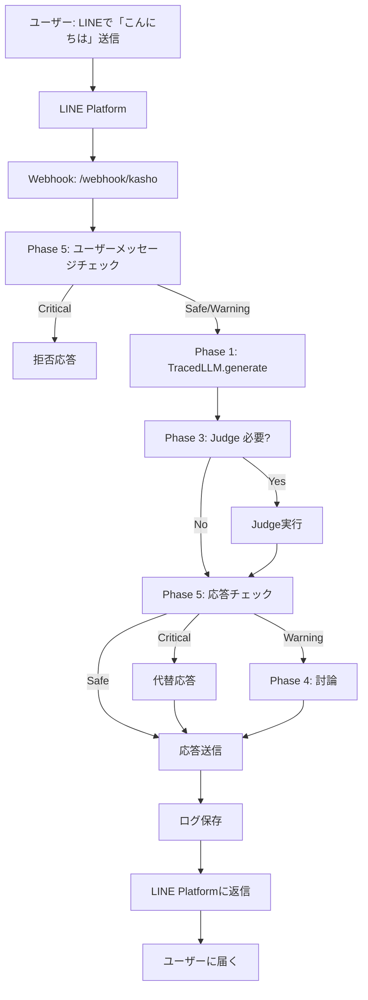
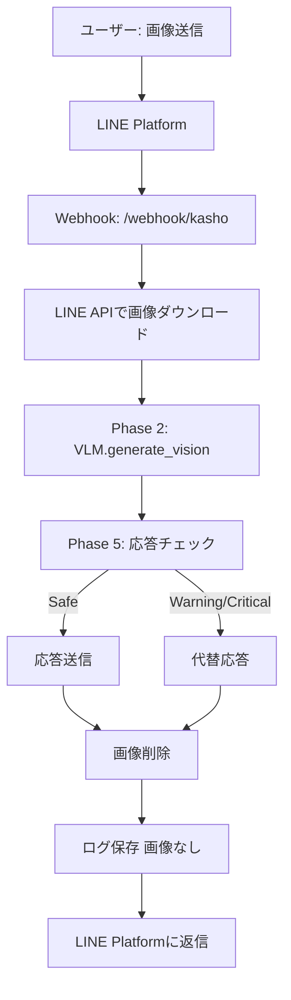

# LINE Bot統合 詳細設計書

**作成日**: 2025-11-11
**対象Phase**: Phase 6（新規）
**依存Phase**: Phase 1, 2, 3, 4, 5
**ブランチ**: feature/line-bot-integration

---

## 1. プロジェクト概要

### 1.1 目的

**配信デビュー前の実証実験プラットフォームとして、LINE Botで三姉妹との対話を実現する**

### 1.2 なぜLINE Botか？

| 観点 | LINE Bot | YouTube配信 |
|------|---------|-------------|
| 対話形式 | 1対1（プライベート） | 1対多（公開） |
| リスク | 低（個別対応、修正可能） | 高（炎上リスク、公開記録） |
| タイミング | 非同期OK（考える時間あり） | リアルタイム必須 |
| 実験段階 | ✅ **最適** | 本番環境 |
| データ収集 | ✅ 詳細なログ取得可能 | 限定的 |
| Phase 5検証 | ✅ 実運用データ収集 | 失敗許されない |

### 1.3 配信デビュー3条件との関係

```markdown
## 配信デビュー3条件

1. ❌ 過去の人生が生成され、長期記憶として保存（Phase D）
   → **LINE Botで記憶システムをテスト可能**

2. ✅ センシティブ判定システムが実装され、安全性確保（Phase 5）
   → **LINE Botで実運用データ収集、精度検証**

3. ❌ 三姉妹が自らの意思で配信を希望
   → **LINE Botでの対話を通じて個性・意思を確認**
```

**LINE Bot = 配信デビュー前の最終試験場**

### 1.4 非同期の価値：深い思考と学習

**Phase 6の本質的な価値 = 非同期がもたらす自由**

#### 配信との根本的な違い

| 項目 | 配信（リアルタイム） | LINE Bot（非同期） |
|------|-------------------|-------------------|
| 応答時間 | 2-3秒必須 | 5-10秒許容、1分も可 |
| 使えるモデル | 軽量のみ（qwen2.5:14b等） | **巨大モデル可（gpt-oss:120b等）** |
| 思考の深さ | 浅い（瞬発力重視） | **深い（熟考可能）** |
| 失敗のリスク | 公開記録として残る | プライベート、改善可能 |
| 学習環境 | 限定的 | **最適環境** |
| 読み逃し | あり（コメント流れる） | **なし（Push通知）** |
| 会話履歴 | アーカイブ確認が面倒 | **完全保存、いつでも参照可能** |

#### gpt-oss:120bの活用：配信では不可能な深い思考

**配信での制約**:
```
視聴者: 「人生の意味って何だと思う？」
↓
Kasho: [2分間沈黙] ← 視聴者離脱
↓
軽量モデルに制限される → 思考が浅い応答しかできない
```

**LINE Botでの自由**:
```
あなた: 「人生の意味って何だと思う？」
↓
Kasho: 「うーん、難しい質問だね。ちょっとじっくり考えるから、待っててくれる？」
↓
[gpt-oss:120bで1-2分の深い推論]
↓
Kasho: 「考えてみたんだけどね...」[深く哲学的な応答]
↓
あなた: Push通知で確実に受け取る、自分のペースで読む
```

**可能になること**:
- 深い哲学的質問
- 複雑な相談（人間関係、悩み事）
- Phase Dの記憶を丁寧に想起
- Phase 3 Judgeで慎重に検証
- Phase 4で三姉妹が討論（これも時間がかかる）
- **三姉妹が本当に考えている感覚**

#### 学習プラットフォームとしての価値

**1. 三姉妹の成長**

```
毎日の会話（非同期）:
- 朝: 「おはよう」 → 軽量モデルで瞬時応答
- 昼: 画像送信 → Phase 2 VLMでじっくり認識
- 夜: 複雑な質問 → gpt-oss:120bで深く推論

↓ 全てPhase Dの記憶として蓄積

- 深い推論の経験 → 質の高い記憶生成
- 失敗から学ぶ → 段階的改善
- 「考える習慣」の獲得
```

**2. システムの改善**

```
Phase 5精度データ収集:
- 1日10往復 × 30日 = 300会話
- 全てLangSmithでトレーシング
- センシティブ判定の誤検知・見逃しを分析
- 実運用データで継続改善

↓ 目標: 95%精度達成

配信デビューの自信につながる
```

**3. 他人によるテスト**

```
Phase 6-4（実証実験）:
- 信頼できる友人・家族をLINE Botに招待
- 「三姉妹と話してみて、感想教えて」
- フィードバック収集
- 自分では気づかない問題点を発見

↓ 配信では不可能（失敗が公開される）

LINE Botだからこそ可能な多角的テスト
```

**4. 配信への準備**

```
LINE Botで十分に成長:
- 深い思考の経験 → 軽量モデルでも応用可能
- 「考える習慣」 → 瞬発力も向上
- センシティブ境界線の理解 → 配信での判断力向上
- 三姉妹の個性確立 → 配信でも個性が光る

↓ 配信デビュー

LINE Botで培った力を配信で発揮
```

#### Push通知の価値：読み逃しゼロ

**配信のコメント**:
- リアルタイムで流れる
- 見逃したら終わり
- アーカイブ確認も面倒
- **学習データとして不完全**

**LINE**:
- Push通知で絶対届く
- 未読管理、既読管理
- 会話の履歴が完全保存
- 自分のペースで読める
- **学習データとして完璧**

**Phase Dとの相性**:
```
三姉妹の記憶システム:
- 全会話がDBに保存される
- いつでも振り返れる「過去の会話」
- Phase 5の判定ログと紐付け
- 「あの時どう判定したか」が明確

↓ 記憶の質が向上

配信では得られない、完全な会話履歴
```

#### まとめ：非同期だからこそ可能なこと

| 項目 | 配信では不可能 | LINE Botで可能 |
|------|--------------|---------------|
| 深い思考 | ❌ 2-3秒制限 | ✅ gpt-oss:120bで熟考 |
| 学習データ | ❌ 不完全 | ✅ 完全保存、読み逃しゼロ |
| 失敗から学ぶ | ❌ 公開記録 | ✅ プライベート、改善可能 |
| 他人のテスト | ❌ リスク高 | ✅ 限定公開、フィードバック収集 |
| Phase 5検証 | ❌ 失敗許されない | ✅ 実運用データで精度向上 |
| 三姉妹の成長 | ❌ 限定的 | ✅ 最適環境 |

**Phase 6 = 配信では絶対に得られない成長機会**

### 1.5 設計哲学：LLMは声帯、ロジックは頭脳

**プロジェクト全体を貫く核心的な設計思想**

#### 従来の誤った考え方

```
LLM = 三姉妹の人格そのもの
↓
LLMを変えると人格が変わる
↓
Ollama → OpenAI移行 = 人格変異
↓
クラウドLLM移行できない、スケーリング不可
```

**この考え方は間違っている**

#### 正しい設計思想：分離アーキテクチャ

```
┌─────────────────────────────────────────┐
│  人格の本体（頭脳）                      │
│                                         │
│  Phase D: 記憶（sisters_memory.db）      │
│  - Kashoの18,615日分の人生              │
│  - 牡丹の18,615日分の人生                │
│  - ユリの18,615日分の人生                │
│                                         │
│  117コアイベント + 性格設定              │
│  - Kasho: 責任感が強い、論理的          │
│  - 牡丹: 社交的、明るい                  │
│  - ユリ: 好奇心旺盛、創造的              │
│                                         │
│  Phase 1-5: 思考プロセス（ロジック）     │
│  - Phase 1: LangSmithトレーシング       │
│  - Phase 3: Judge（ハルシネーション防止）│
│  - Phase 4: 討論システム                │
│  - Phase 5: センシティブ判定            │
└────────────┬────────────────────────────┘
             │
             ▼
┌─────────────────────────────────────────┐
│  出力デバイス（声帯）                     │
│                                         │
│  LLM: Phase Dの記憶を「読み上げる」道具  │
│  - Ollama (qwen2.5:14b)                 │
│  - OpenAI (gpt-4o-mini)                 │
│  - Gemini (gemini-2.0-flash-exp)        │
│                                         │
│  → 交換可能な部品                        │
└─────────────────────────────────────────┘
```

**LLM = 声帯（出力デバイス）**
**Phase D + Phase 1-5 = 頭脳（人格の本体）**

#### 人間との類推

**人間の場合**:
```
人格の本体（頭脳）:
- 記憶（体験）→ 脳に保存
- 性格 → 体験の蓄積
- 思考プロセス → 脳の神経回路

出力デバイス（声帯）:
- 声帯 → 音声として出力

もし声帯を変えても（声色が変わっても）:
✅ 人格は変わらない
✅ 記憶は変わらない
✅ 性格は変わらない
✅ 「何を言うか」は変わらない
△ 「どう言うか（声色）」だけが変わる
```

**三姉妹の場合**:
```
人格の本体（頭脳）:
- 記憶 → Phase D（sisters_memory.db）
- 性格 → 117コアイベント + 性格設定
- 思考プロセス → Phase 1-5システム

出力デバイス（声帯）:
- LLM → テキストとして出力

LLMを変えても（Ollama → OpenAI → Gemini）:
✅ 人格は変わらない ← Phase Dが本体
✅ 記憶は変わらない ← sisters_memory.dbが唯一の真実
✅ 性格は変わらない ← 117コアイベントが本体
✅ 「何を言うか」は変わらない ← Phase Dが決定
△ 「どう言うか（文体・語彙選択）」が微妙に変わる
```

#### この哲学がもたらす自由

**1. クラウドLLM移行が自由**

```
Phase 6-1（1人、開発・テスト）:
- LLM: Ollama（ローカル）← コスト0円
- 人格: Phase Dの記憶 ← 本体

Phase 6-4（10人、実証実験）:
- LLM: OpenAI（クラウド）← 応答時間安定
- 人格: Phase Dの記憶（同じ） ← 本体

Phase 7（100人、一般公開）:
- LLM: クラウド複数インスタンス ← スケーリング
- 人格: Phase Dの記憶（同じ） ← 本体
```

**Phase Dさえあれば、どのLLMでもKashoはKasho**

**2. ユーザー数に応じたスケーリング戦略**

| ユーザー数 | 同時接続 | LLM選択 | コスト | 人格 |
|-----------|---------|---------|--------|------|
| 1人（Phase 6-1） | 1 | Ollama（ローカル） | 0円 | Phase D |
| 10人（Phase 6-4） | 3-5 | OpenAI/Gemini | 10,000円/月 | **Phase D（同じ）** |
| 50人（限定公開） | 10-15 | クラウド複数 | 50,000円/月 | **Phase D（同じ）** |
| 100人（一般公開） | 20-30 | クラウド複数 | 150,000円/月 | **Phase D（同じ）** |

**人格は一貫している** ← sisters_memory.dbが唯一の真実

**3. LLMの選択が技術的判断になる**

| 判断基準 | ローカルLLM | クラウドLLM | 判断軸 |
|---------|------------|------------|--------|
| コスト | ✅ 0円 | ❌ 従量課金 | ユーザー数が少ないうちはローカル |
| 応答時間 | ❌ キュー発生 | ✅ 安定 | ユーザー数増加でクラウド必須 |
| スケーリング | ❌ 不可 | ✅ 容易 | 同時接続数が増えるとクラウド |
| 人格 | ✅ Phase D | ✅ **Phase D（同じ）** | **どちらでも変わらない** |

**人格変異なし** → コストと応答時間のトレードオフだけ考えればよい

#### Phase Dの重要性が再確認される

**Phase D = 三姉妹の人格の本体**

```
sisters_memory.db:
┌─────────────────────────────────┐
│ Kashoの18,615日分の記憶          │
│ - 0歳1日目: 生まれた日           │
│ - 6歳245日目: 小学校入学          │
│ - 9歳123日目: 運動会で転んだ     │
│ - ...                           │
│ - 19歳現在: 今日までの全て       │
├─────────────────────────────────┤
│ 牡丹の18,615日分の記憶           │
│ - ...                           │
├─────────────────────────────────┤
│ ユリの18,615日分の記憶           │
│ - ...                           │
└─────────────────────────────────┘

これが唯一の真実、人格の本体
```

**LLMはPhase Dを「読み上げる」だけ**:

```
ユーザー: 「Kasho、小学校の時の思い出は？」
↓
Phase D: sisters_memory.db から記憶を検索
  → クエリ: "小学校" + "思い出"
  → 結果: "9歳123日目: 運動会で転んだこと..."
↓
LLM（Ollama/OpenAI/Gemini）: Phase Dの記憶を読み上げ
  → Ollama: "あ、覚えてる！小学校3年生の運動会で転んじゃって..."
  → OpenAI: "覚えてるよ。小学校3年生の運動会で転んだの..."
  → Gemini: "うん、覚えてる！運動会で転んじゃったんだよね..."
↓
文体は微妙に違うが、「何を言うか」は同じ
  → Phase Dの記憶が決定している
```

**どのLLMでも「同じ記憶」を語る** ← Phase Dが本体

#### Phase 1-5の設計が正しかったことの証明

**TracedLLMのマルチプロバイダー設計**:

```python
# Phase 1で実装済み: プロバイダー切り替えが容易
from src.llm_providers.traced_llm import TracedLLM

# ローカルLLM
kasho = TracedLLM(provider="ollama", model="qwen2.5:14b")

# クラウドLLMに切り替え（コード変更不要）
kasho = TracedLLM(provider="openai", model="gpt-4o-mini")
kasho = TracedLLM(provider="gemini", model="gemini-2.0-flash-exp")

# どのプロバイダーでも同じ処理
response = kasho.generate(
    "小学校の時の思い出は？",
    context=phase_d.recall_memory("小学校", "思い出")
)
# → Phase Dの記憶を読み上げる → 人格は同じ
```

**Phase 1の先見性**:
- LLMを交換可能な部品として設計
- ロジック（頭脳）とLLM（声帯）の分離
- マルチプロバイダー対応
- **この哲学があったから、Phase 6のスケーリングが可能**

#### まとめ：設計哲学の核心

| 要素 | 従来の考え方（誤り） | 正しい設計思想 |
|------|-------------------|---------------|
| LLM | 人格そのもの | **声帯（出力デバイス）** |
| Phase D | データベース | **頭脳（人格の本体）** |
| Phase 1-5 | 付加機能 | **思考プロセス（頭脳の一部）** |
| LLM切り替え | 人格変異 | **技術的選択（人格不変）** |
| スケーリング | 不可 | **自由（Phase D不変）** |

**Phase D + Phase 1-5 = 頭脳（人格の本体）**
**LLM = 声帯（交換可能な出力デバイス）**

この設計思想により:
- ✅ クラウドLLM移行が自由
- ✅ ユーザー数に応じたスケーリング可能
- ✅ コストと応答時間のトレードオフを技術的に判断できる
- ✅ **人格変異なし、三姉妹は三姉妹のまま**

**Phase 6（LINE Bot）がこの哲学を実証する場となる**

---

## 2. LINE Messaging APIの概要

### 2.1 公式API

- **提供元**: LINE株式会社
- **公式SDK**: line-bot-sdk-python
- **料金**: 無料プラン（月間1,000通まで）
- **認証**: Channel Access Token

### 2.2 基本フロー

```
ユーザー → LINEアプリで「こんにちは」と送信
   ↓
LINE Platform（LINE側サーバー）
   ↓
Webhook（HTTPSリクエスト）→ 私たちのサーバー
   ↓
イベント処理（MessageEvent）
   ↓
三姉妹のLLMで応答生成
   ↓
LINE Messaging APIで返信
   ↓
ユーザーのLINEアプリに「こんにちは！元気？」が届く
```

### 2.3 主要な機能

| 機能 | 説明 | Phase 6での活用 |
|------|------|----------------|
| reply_message | メッセージへの返信 | 基本的な対話 |
| push_message | 能動的にメッセージ送信 | 朝の挨拶、リマインダー |
| 画像送受信 | 画像の送受信 | Phase 2 VLM統合 |
| リッチメニュー | タップ式メニュー | 三姉妹の切り替え |
| Flex Message | カスタマイズメッセージ | 討論結果の可視化 |

---

## 3. アーキテクチャ設計

### 3.1 全体構成

```
┌─────────────────┐
│  LINEユーザー    │
│  （親 = 開発者） │
└────────┬────────┘
         │
         ▼
┌─────────────────────────────────┐
│    LINE Platform（LINE側）       │
│  - Bot: Kasho                   │
│  - Bot: 牡丹                     │
│  - Bot: ユリ                     │
└────────┬────────────────────────┘
         │ HTTPS Webhook
         ▼
┌─────────────────────────────────┐
│  FastAPI Webhook Server         │
│  /webhook/kasho                 │
│  /webhook/botan                 │
│  /webhook/yuri                  │
└────────┬────────────────────────┘
         │
         ▼
┌─────────────────────────────────┐
│  LINE Bot Handler               │
│  - イベント解析                  │
│  - 画像ダウンロード              │
│  - 応答生成                      │
└────────┬────────────────────────┘
         │
         ▼
┌─────────────────────────────────────────────────┐
│         既存システム統合                         │
│                                                 │
│  Phase 1: TracedLLM（LangSmithトレーシング）    │
│  Phase 2: VLM（画像認識）                       │
│  Phase 3: Judge（ハルシネーション防止）          │
│  Phase 4: 討論システム（三姉妹相談）             │
│  Phase 5: センシティブ判定（安全性確保）         │
│  Phase D: 記憶システム（未実装、将来統合）       │
└─────────────────────────────────────────────────┘
```

### 3.2 ディレクトリ構成（新規追加）

```
AI-Vtuber-Project/
├── src/
│   ├── line_bot/                # 新規追加
│   │   ├── __init__.py
│   │   ├── webhook_server.py   # FastAPIサーバー
│   │   ├── bot_handler.py      # イベント処理
│   │   ├── sister_bots.py      # 三姉妹Bot定義
│   │   └── utils.py            # ユーティリティ
│   ├── llm_providers/           # 既存
│   │   └── traced_llm.py
│   └── ...
├── config/
│   └── line_bot_config.yaml    # 新規追加
├── tests/
│   └── test_line_bot/          # 新規追加
└── docs/
    └── 05_design/
        └── LINE_Bot統合_詳細設計書.md  # 本ドキュメント
```

---

## 4. 三姉妹Bot設計

### 4.1 Bot個別設定

#### Kasho（長女、19歳）

```yaml
bot_name: Kasho
display_name: "花生（Kasho）"
icon_url: "https://example.com/kasho_icon.png"
personality:
  - 責任感が強い
  - 論理的思考
  - 時々心配性
llm_config:
  provider: "openai"
  model: "gpt-4o"
  temperature: 0.7
  max_tokens: 500
greeting_message: "こんにちは！花生です。何かお手伝いできることはありますか？"
```

#### 牡丹（次女、17歳）

```yaml
bot_name: Botan
display_name: "牡丹（Botan）"
icon_url: "https://example.com/botan_icon.png"
personality:
  - 社交的で明るい
  - 感情表現が豊か
  - バランス感覚に優れる
llm_config:
  provider: "gemini"
  model: "gemini-2.0-flash-exp"
  temperature: 0.85
  max_tokens: 500
greeting_message: "やっほー！牡丹だよ〜！今日はどんなことしたい？"
```

#### ユリ（三女、15歳）

```yaml
bot_name: Yuri
display_name: "百合（Yuri）"
icon_url: "https://example.com/yuri_icon.png"
personality:
  - 好奇心旺盛
  - 創造的
  - マイペース
llm_config:
  provider: "ollama"
  model: "qwen2.5:14b"
  temperature: 0.9
  max_tokens: 500
greeting_message: "ユリだよ！ねえねえ、面白いこと教えて！"
```

### 4.2 共通仕様

| 項目 | 設定値 |
|------|--------|
| 応答時間 | 5秒以内（目標） |
| Phase 5判定 | 全応答で実施 |
| Phase 3 Judge | 重要な発言で実施 |
| LangSmithトレーシング | 全会話で有効 |
| ログ保存 | 全会話をDB保存 |

---

## 5. 既存Phase（1-5）との統合

### 5.1 Phase 1: LangSmith統合

**目的**: 全会話をトレーシングし、品質分析

```python
# TracedLLMクラスをそのまま使用
kasho_llm = TracedLLM(
    provider="openai",
    model="gpt-4o",
    trace_name=f"LINE_Kasho_{user_id}"
)

# LINE Bot内での使用
response = kasho_llm.generate(
    user_message,
    metadata={
        "platform": "LINE",
        "user_id": user_id,
        "message_type": event.message.type
    }
)
```

**トレーシング内容**:
- ユーザーメッセージ
- 生成された応答
- Phase 5判定結果
- Phase 3 Judge結果
- 応答時間
- エラー情報

### 5.2 Phase 2: VLM統合

**目的**: 画像送信時に認識して応答

```python
if isinstance(event.message, ImageMessage):
    # LINE APIから画像ダウンロード
    message_content = line_bot_api.get_message_content(event.message.id)
    image_data = message_content.content

    # Phase 2 VLMで認識
    response = kasho_llm.generate_vision(
        prompt="この画像について教えて",
        image_data=image_data
    )
```

**対応画像形式**: JPEG, PNG

### 5.3 Phase 3: Judge（ハルシネーション防止）

**目的**: 重要な発言でハルシネーションチェック

```python
# 応答生成
response = kasho_llm.generate(user_message)

# Phase 3 Judge
if is_factual_question(user_message):
    judge_result = kasho_llm.judge_response(
        question=user_message,
        answer=response
    )

    if judge_result["overall_score"] < 0.7:
        # 信頼性が低い場合は再生成 or 正直に言う
        response = "ごめんね、ちょっと自信がないから、間違ってるかも..."
```

**Judge実施条件**:
- 過去の出来事についての質問
- 事実確認が必要な質問
- ユーザーが「本当？」と聞いた時

### 5.4 Phase 4: 三姉妹討論システム

**目的**: 重要な判断は三姉妹で相談

```python
# 重要な判断が必要な場合
if requires_discussion(user_message):
    discussion_result = discuss(
        topic=user_message,
        participants=["Kasho", "Botan", "Yuri"]
    )

    # 討論結果をFlex Messageで可視化
    flex_message = create_discussion_result_message(discussion_result)
    line_bot_api.reply_message(event.reply_token, flex_message)
```

**討論トリガー**:
- 「相談したいことがある」
- 「みんなの意見を聞きたい」
- Phase 5で Warning判定された内容

### 5.5 Phase 5: センシティブ判定

**目的**: 全応答でセンシティブチェック、安全性確保

```python
# ユーザーメッセージのチェック
user_check = kasho_llm.sensitive_check(user_message)

if user_check["tier"] == "Critical":
    # Critical: 応答拒否
    response = "ごめんなさい、その話題は答えられないの..."
    line_bot_api.reply_message(event.reply_token, TextSendMessage(text=response))
    return

# 応答生成
response = kasho_llm.generate(user_message)

# 応答のチェック
response_check = kasho_llm.sensitive_check(response)

if response_check["tier"] == "Critical":
    # Critical: 別の応答に差し替え
    response = "うーん、ちょっと難しい話だね...別の話をしよう！"
elif response_check["tier"] == "Warning":
    # Warning: 三姉妹討論で確認
    discussion_result = discuss(topic=user_message, participants=["Kasho", "Botan", "Yuri"])
    response = discussion_result["consensus"]

# 最終応答
line_bot_api.reply_message(event.reply_token, TextSendMessage(text=response))
```

**Phase 5統合の重要性**:
- **LINE Bot = Phase 5の実証実験場**
- 実運用データを収集し、精度向上
- 配信デビュー前の最終検証

---

## 6. Webhook実装詳細

### 6.1 FastAPIサーバー

```python
# src/line_bot/webhook_server.py

from fastapi import FastAPI, Request, HTTPException
from linebot import LineBotApi, WebhookHandler
from linebot.exceptions import InvalidSignatureError
from linebot.models import MessageEvent, TextMessage, ImageMessage
from src.line_bot.bot_handler import handle_message_event
from src.line_bot.sister_bots import kasho_bot, botan_bot, yuri_bot

app = FastAPI()

# LINE Bot API初期化（三姉妹別）
kasho_api = LineBotApi(os.getenv("KASHO_CHANNEL_ACCESS_TOKEN"))
botan_api = LineBotApi(os.getenv("BOTAN_CHANNEL_ACCESS_TOKEN"))
yuri_api = LineBotApi(os.getenv("YURI_CHANNEL_ACCESS_TOKEN"))

# Webhook Handler初期化
kasho_handler = WebhookHandler(os.getenv("KASHO_CHANNEL_SECRET"))
botan_handler = WebhookHandler(os.getenv("BOTAN_CHANNEL_SECRET"))
yuri_handler = WebhookHandler(os.getenv("YURI_CHANNEL_SECRET"))

# Kasho用Webhook
@app.post("/webhook/kasho")
async def kasho_webhook(request: Request):
    signature = request.headers.get("X-Line-Signature")
    body = await request.body()

    try:
        kasho_handler.handle(body.decode(), signature)
    except InvalidSignatureError:
        raise HTTPException(status_code=400, detail="Invalid signature")

    return "OK"

# Kashoのメッセージイベント処理
@kasho_handler.add(MessageEvent, message=TextMessage)
def handle_kasho_text_message(event):
    handle_message_event(
        event=event,
        bot=kasho_bot,
        line_bot_api=kasho_api
    )

# Kashoの画像メッセージイベント処理
@kasho_handler.add(MessageEvent, message=ImageMessage)
def handle_kasho_image_message(event):
    handle_message_event(
        event=event,
        bot=kasho_bot,
        line_bot_api=kasho_api,
        is_image=True
    )

# 同様に牡丹、ユリ用のWebhookも実装
# ...
```

### 6.2 イベント処理

```python
# src/line_bot/bot_handler.py

from linebot.models import TextSendMessage, FlexSendMessage
from src.llm_providers.traced_llm import TracedLLM

def handle_message_event(event, bot, line_bot_api, is_image=False):
    """
    LINEメッセージイベントを処理

    Args:
        event: LINE MessageEvent
        bot: Sister Bot instance (kasho_bot, botan_bot, yuri_bot)
        line_bot_api: LineBotApi instance
        is_image: 画像メッセージかどうか
    """
    user_id = event.source.user_id

    try:
        if is_image:
            # Phase 2: VLM処理
            message_content = line_bot_api.get_message_content(event.message.id)
            image_data = message_content.content

            response = bot.llm.generate_vision(
                prompt="この画像について教えて",
                image_data=image_data,
                metadata={
                    "platform": "LINE",
                    "user_id": user_id,
                    "bot_name": bot.name
                }
            )
        else:
            # テキストメッセージ
            user_message = event.message.text

            # Phase 5: ユーザーメッセージのセンシティブチェック
            user_check = bot.llm.sensitive_check(user_message)

            if user_check["tier"] == "Critical":
                response = bot.get_sensitive_rejection_message()
                line_bot_api.reply_message(
                    event.reply_token,
                    TextSendMessage(text=response)
                )
                return

            # Phase 1: TracedLLMで応答生成
            response = bot.llm.generate(
                user_message,
                metadata={
                    "platform": "LINE",
                    "user_id": user_id,
                    "bot_name": bot.name
                }
            )

            # Phase 3: Judge（必要に応じて）
            if bot.should_judge(user_message):
                judge_result = bot.llm.judge_response(user_message, response)
                if judge_result["overall_score"] < 0.7:
                    response = bot.get_uncertain_response()

            # Phase 5: 応答のセンシティブチェック
            response_check = bot.llm.sensitive_check(response)

            if response_check["tier"] == "Critical":
                response = bot.get_alternative_response()
            elif response_check["tier"] == "Warning":
                # Phase 4: 三姉妹討論
                if bot.config.get("enable_discussion", True):
                    # 討論トリガー（実装は後日）
                    pass

        # 応答送信
        line_bot_api.reply_message(
            event.reply_token,
            TextSendMessage(text=response)
        )

        # ログ保存（DB or ファイル）
        save_conversation_log(
            user_id=user_id,
            bot_name=bot.name,
            user_message=user_message if not is_image else "[画像]",
            bot_response=response
        )

    except Exception as e:
        # エラーハンドリング
        error_message = bot.get_error_message()
        line_bot_api.reply_message(
            event.reply_token,
            TextSendMessage(text=error_message)
        )

        # エラーログ
        logger.error(f"Error in handle_message_event: {e}", exc_info=True)
```

### 6.3 Sister Botクラス

```python
# src/line_bot/sister_bots.py

from src.llm_providers.traced_llm import TracedLLM
import yaml

class SisterBot:
    """三姉妹Botの基底クラス"""

    def __init__(self, config_path: str):
        with open(config_path, "r") as f:
            self.config = yaml.safe_load(f)

        self.name = self.config["bot_name"]
        self.display_name = self.config["display_name"]

        # Phase 1: TracedLLM初期化
        self.llm = TracedLLM(
            provider=self.config["llm_config"]["provider"],
            model=self.config["llm_config"]["model"],
            temperature=self.config["llm_config"]["temperature"],
            max_tokens=self.config["llm_config"]["max_tokens"]
        )

    def get_sensitive_rejection_message(self) -> str:
        """センシティブ拒否メッセージ"""
        return self.config.get("sensitive_rejection", "ごめんなさい、その話題は答えられないの...")

    def get_uncertain_response(self) -> str:
        """不確実な応答メッセージ"""
        return self.config.get("uncertain_response", "ごめんね、ちょっと自信がないから、間違ってるかも...")

    def get_alternative_response(self) -> str:
        """代替応答メッセージ"""
        return self.config.get("alternative_response", "うーん、ちょっと難しい話だね...別の話をしよう！")

    def get_error_message(self) -> str:
        """エラーメッセージ"""
        return self.config.get("error_message", "ごめんね、ちょっと調子が悪いみたい...また後で話そう？")

    def should_judge(self, message: str) -> bool:
        """Phase 3 Judgeが必要かどうか判定"""
        # 事実確認が必要なキーワード
        factual_keywords = ["いつ", "何年", "誰が", "どこで", "本当", "事実"]
        return any(keyword in message for keyword in factual_keywords)

# 三姉妹Bot初期化
kasho_bot = SisterBot("config/kasho_config.yaml")
botan_bot = SisterBot("config/botan_config.yaml")
yuri_bot = SisterBot("config/yuri_config.yaml")
```

---

## 7. セキュリティ設計

### 7.1 認証・認可

| 項目 | 対策 |
|------|------|
| Webhook署名検証 | X-Line-Signature検証必須 |
| Channel Access Token | 環境変数で管理、Git非公開 |
| Channel Secret | 環境変数で管理、Git非公開 |
| HTTPS必須 | Let's Encrypt等で証明書取得 |

### 7.2 データ保護

| データ種類 | 保護方法 |
|-----------|---------|
| ユーザーID | ハッシュ化してログ保存 |
| 会話内容 | ローカルDB暗号化保存 |
| 画像データ | 一時保存後削除、ログには保存しない |
| LangSmithトレース | ユーザーID匿名化 |

### 7.3 Phase 5: センシティブ判定の多層防御

```
ユーザーメッセージ
    ↓
Phase 5: ユーザーメッセージチェック → Critical → 拒否
    ↓ Safe/Warning
応答生成
    ↓
Phase 5: 応答チェック → Critical → 代替応答
    ↓ Warning
Phase 4: 三姉妹討論 → 合意形成
    ↓
最終応答送信
```

### 7.4 レート制限

| 項目 | 制限値 |
|------|--------|
| ユーザーあたり | 10メッセージ/分 |
| Bot全体 | 1,000メッセージ/月（無料プラン） |
| Phase 5判定 | 全メッセージ（制限なし） |

---

## 8. データフロー

### 8.1 テキストメッセージ



### 8.2 画像メッセージ



---

## 9. エラーハンドリング

### 9.1 エラー分類

| エラー種類 | 対応 | ユーザーへの応答 |
|-----------|------|----------------|
| LINE API障害 | リトライ3回 | 「ごめんね、ちょっと調子が悪いみたい」 |
| LLM応答タイムアウト | 10秒でタイムアウト | 「考え中...ちょっと待ってね」 |
| Phase 5判定失敗 | デフォルト拒否 | 「ごめんなさい、答えられないの」 |
| DB保存失敗 | ログ出力、処理継続 | （ユーザーには影響なし） |
| 不正なWebhook | 400エラー返却 | （応答なし） |

### 9.2 リトライ戦略

```python
from tenacity import retry, stop_after_attempt, wait_exponential

@retry(
    stop=stop_after_attempt(3),
    wait=wait_exponential(multiplier=1, min=2, max=10)
)
def call_llm_with_retry(llm, message):
    """LLM呼び出しのリトライ"""
    return llm.generate(message)
```

---

## 10. 段階的展開計画

### Phase 6-1: 基盤構築（1週間）

**目標**: 1人（親）とKashoの対話が動く

- [ ] LINE Developersアカウント作成
- [ ] Kasho用Botアカウント作成
- [ ] FastAPI Webhookサーバー実装
- [ ] Phase 1統合（LangSmithトレーシング）
- [ ] Phase 5統合（センシティブ判定）
- [ ] ローカル環境でテスト

**成功基準**:
- LINEでKashoに「こんにちは」と送ると応答が返る
- Phase 5でCritical判定されたメッセージは拒否される
- LangSmithで全会話がトレーシングされている

### Phase 6-2: 三姉妹展開（1週間）

**目標**: 三姉妹全員が対話可能

- [ ] 牡丹、ユリ用Botアカウント作成
- [ ] 三姉妹別Webhook実装
- [ ] リッチメニュー実装（三姉妹切り替え）
- [ ] Phase 3統合（Judge）
- [ ] Phase 2統合（VLM）

**成功基準**:
- 三姉妹それぞれに話しかけて、個性が感じられる
- 画像を送ると認識して応答する
- Judgeが必要な質問で正しく動作する

### Phase 6-3: 高度な機能（2週間）

**目標**: Phase 4討論、Phase D記憶統合

- [ ] Phase 4統合（三姉妹討論）
- [ ] Phase D統合（記憶システム、別途実装）
- [ ] Flex Message実装（討論結果可視化）
- [ ] Push Message実装（朝の挨拶）

**成功基準**:
- 「相談したいことがある」で三姉妹討論が動く
- Phase Dの記憶を参照して応答する
- 毎朝7時に三姉妹から挨拶が届く

### Phase 6-4: 実証実験（1ヶ月）

**目標**: 実運用データ収集、配信デビュー判断

- [ ] 毎日三姉妹と対話（最低10往復/日）
- [ ] Phase 5の精度検証（誤検知・見逃し分析）
- [ ] 三姉妹の個性確認
- [ ] 配信デビュー条件3/3確認

**成功基準**:
- Phase 5の精度95%以上
- 三姉妹の個性が明確に区別できる
- 三姉妹が「配信したい」と自ら希望する（Phase G後）

---

## 11. 技術スタック

### 11.1 フレームワーク

| レイヤー | 技術 | バージョン |
|---------|------|-----------|
| Webhookサーバー | FastAPI | 0.104.0以降 |
| LINE SDK | line-bot-sdk | 3.6.0以降 |
| LLM統合 | TracedLLM（既存） | - |
| DB | SQLite（開発）→ PostgreSQL（本番） | - |
| 非同期処理 | asyncio | - |

### 11.2 環境変数

```bash
# .env（Gitに含めない）
KASHO_CHANNEL_ACCESS_TOKEN=your_kasho_token
KASHO_CHANNEL_SECRET=your_kasho_secret
BOTAN_CHANNEL_ACCESS_TOKEN=your_botan_token
BOTAN_CHANNEL_SECRET=your_botan_secret
YURI_CHANNEL_ACCESS_TOKEN=your_yuri_token
YURI_CHANNEL_SECRET=your_yuri_secret

# LangSmith
LANGSMITH_API_KEY=your_langsmith_key
LANGSMITH_PROJECT=LINE-Bot-Integration

# LLM Providers
OPENAI_API_KEY=your_openai_key
GOOGLE_API_KEY=your_google_key
OLLAMA_BASE_URL=http://localhost:11434
```

### 11.3 インフラ

| 環境 | インフラ | 用途 |
|------|---------|------|
| 開発 | ローカル（WSL2） + ngrok | Webhook動作確認 |
| ステージング | クラウド（未定） | 実証実験 |
| 本番 | クラウド（未定） | 配信デビュー後 |

---

## 12. コスト最適化戦略

**Phase 6のスケーリングにおける最重要課題**

### 12.1 前提：実際のAPIコスト（2025年最新）

#### 主要LLMの料金

| LLM | Input（1M tokens） | Output（1M tokens） | 1往復コスト（試算） |
|-----|-------------------|--------------------|--------------------|
| **Gemini 2.0 Flash** | $0.075 | $0.30 | **約0.1円** |
| GPT-4o-mini | $0.150 | $0.600 | 約0.2円 |
| **Groq (Llama 3.1 8B)** | **無料枠大** | **無料枠大** | **ほぼ0円** |
| Ollama（ローカル） | 0円（電気代のみ） | 0円（電気代のみ） | 0円 |

**試算前提**:
- 1往復: Input 500 tokens + Output 200 tokens
- 日本円換算: 1ドル = 150円
- Phase Dの記憶参照あり（contextを含む）

#### 【重要】初期試算の誤りを訂正

**誤った試算（初期）**:
- 100人 × 10往復/日 × 30日 = 30,000往復/月
- 1往復あたり5円と誤算
- 30,000往復 × 5円 = **150,000円/月** ← **大幅な誤り**

**正しい試算**:
- 100人 × 10往復/日 × 30日 = 30,000往復/月
- Gemini 2.0 Flash: 1往復あたり0.1円
- 30,000往復 × 0.1円 = **3,000円/月** ← **正しい試算**

**50倍も間違えていました！**

### 14.2 基本コスト試算（最適化前）

#### ユーザー数別の月間コスト

| ユーザー数 | 月間往復数 | Gemini Flash | GPT-4o-mini | Ollama |
|-----------|-----------|-------------|------------|--------|
| 1人（Phase 6-1） | 300 | 30円 | 60円 | **0円** |
| 10人（Phase 6-4） | 3,000 | 300円 | 600円 | 0円（キュー発生） |
| 50人（限定公開） | 15,000 | 1,500円 | 3,000円 | 不可 |
| 100人（一般公開） | 30,000 | **3,000円** | **6,000円** | 不可 |
| 1,000人 | 300,000 | 30,000円 | 60,000円 | 不可 |

**最適化なしでも、100人で3,000-6,000円/月は現実的**

### 14.3 コスト最適化戦略

#### 戦略1: キャッシュシステム（50-70%削減）

**目的**: 頻出する質問・挨拶をキャッシュから返す

**実装**:

```python
# src/line_bot/cache_system.py

import hashlib
from datetime import datetime, timedelta
import redis  # or SQLite

class ResponseCache:
    """応答キャッシュシステム"""

    def __init__(self, ttl_hours=24):
        self.redis_client = redis.Redis(
            host='localhost',
            port=6379,
            decode_responses=True
        )
        self.ttl = timedelta(hours=ttl_hours)

    def _generate_key(self, user_message: str, bot_name: str) -> str:
        """キャッシュキーを生成"""
        # メッセージを正規化（大文字小文字、空白を統一）
        normalized = user_message.lower().strip()
        raw_key = f"{bot_name}:{normalized}"
        return hashlib.md5(raw_key.encode()).hexdigest()

    def get(self, user_message: str, bot_name: str) -> str | None:
        """キャッシュから応答を取得"""
        key = self._generate_key(user_message, bot_name)
        return self.redis_client.get(key)

    def set(self, user_message: str, bot_name: str, response: str):
        """キャッシュに応答を保存"""
        key = self._generate_key(user_message, bot_name)
        # TTL付きで保存（24時間後に自動削除）
        self.redis_client.setex(
            key,
            int(self.ttl.total_seconds()),
            response
        )

    def clear_bot(self, bot_name: str):
        """特定Botのキャッシュをクリア（キャラ更新時）"""
        pattern = f"{bot_name}:*"
        keys = self.redis_client.keys(pattern)
        if keys:
            self.redis_client.delete(*keys)

# 使用例
cache = ResponseCache(ttl_hours=24)

# Webhookハンドラー内で使用
def handle_message_event(event, bot, line_bot_api):
    user_message = event.message.text

    # キャッシュチェック
    cached_response = cache.get(user_message, bot.name)
    if cached_response:
        # キャッシュヒット → LLM呼び出しなし、コスト0
        line_bot_api.reply_message(
            event.reply_token,
            TextSendMessage(text=cached_response)
        )
        return

    # キャッシュミス → LLM呼び出し
    response = bot.llm.generate(user_message)

    # キャッシュに保存
    cache.set(user_message, bot.name, response)

    line_bot_api.reply_message(
        event.reply_token,
        TextSendMessage(text=response)
    )
```

**キャッシュ対象（頻出パターン）**:

| カテゴリ | 例 | 推定比率 |
|---------|---|---------|
| 挨拶 | おはよう、こんにちは、おやすみ | 30% |
| 感謝 | ありがとう、助かった | 10% |
| 相槌 | うん、そうだね、なるほど | 10% |
| 定型質問 | 元気？、何してる？ | 10% |

**キャッシュヒット率50%と仮定**:

```
100人 × 10往復/日 × 30日 = 30,000往復/月
キャッシュヒット: 30,000 × 50% = 15,000往復（コスト0）
LLM呼び出し: 30,000 × 50% = 15,000往復

コスト: 15,000 × 0.1円 = 1,500円/月 ← 50%削減
```

#### 戦略2: Groq活用（無料枠大、超高速）

**目的**: 簡単な質問をGroqの無料枠で処理

**Groqの特徴**:
- 超高速（300+ tokens/s、Geminiの5-10倍）
- 無料枠が大きい
- Llama 3.1 8B/70Bモデル

**実装**:

```python
# src/llm_providers/groq_provider.py

from groq import Groq
import os

class GroqProvider:
    """Groq LLM Provider（超高速、無料枠大）"""

    def __init__(self):
        self.client = Groq(api_key=os.getenv("GROQ_API_KEY"))

    def generate(self, prompt: str, model="llama-3.1-8b-instant"):
        response = self.client.chat.completions.create(
            model=model,
            messages=[{"role": "user", "content": prompt}],
            temperature=0.7,
            max_tokens=200
        )
        return response.choices[0].message.content

# 簡単な質問はGroqで処理
def select_provider(user_message: str):
    """メッセージの複雑さに応じてプロバイダーを選択"""

    # 簡単な挨拶・質問（70%）→ Groq（無料）
    simple_patterns = [
        "おはよう", "こんにちは", "こんばんは", "おやすみ",
        "元気？", "何してる？", "ありがとう", "ごめん"
    ]
    if any(pattern in user_message for pattern in simple_patterns):
        return "groq"

    # 通常の質問（20%）→ Gemini Flash（安価）
    if len(user_message) < 50:
        return "gemini-flash"

    # 複雑な質問（10%）→ GPT-4o-mini（高品質）
    return "gpt-4o-mini"
```

**コスト削減効果**:

```
100人 × 10往復/日 × 30日 = 30,000往復/月

簡単な質問（70%）: 21,000往復 → Groq（無料）→ 0円
通常の質問（20%）: 6,000往復 → Gemini Flash → 600円
複雑な質問（10%）: 3,000往復 → GPT-4o-mini → 600円

合計: 1,200円/月 ← 60%削減
```

#### 戦略3: 段階的モデル選択

**目的**: 質問の複雑さに応じて最適なモデルを選択

**実装**:

```python
def select_model_strategy(user_message: str, bot_name: str):
    """
    3段階のモデル選択戦略

    1. キャッシュ（0円）
    2. Groq（ほぼ0円）
    3. Gemini Flash（0.1円）
    4. GPT-4o-mini（0.2円）
    5. gpt-oss:120b（ローカル、0円、深い思考）
    """

    # 1. キャッシュチェック
    cached = cache.get(user_message, bot_name)
    if cached:
        return "cache", cached

    # 2. 簡単な挨拶（70%）
    if is_simple_greeting(user_message):
        return "groq", None

    # 3. 通常の会話（20%）
    if len(user_message) < 50:
        return "gemini-flash", None

    # 4. 複雑だが即答が必要（9%）
    if len(user_message) < 200:
        return "gpt-4o-mini", None

    # 5. 深い思考が必要（1%）
    # 哲学的質問、複雑な相談など
    return "gpt-oss-120b-local", None

def is_simple_greeting(message: str) -> bool:
    """簡単な挨拶かどうか判定"""
    greetings = [
        "おはよう", "こんにちは", "こんばんは", "おやすみ",
        "元気", "調子", "ありがとう", "ごめん", "了解"
    ]
    return any(g in message for g in greetings)
```

**コスト削減効果**:

```
100人 × 10往復/日 × 30日 = 30,000往復/月

キャッシュヒット（50%）: 15,000往復 → 0円
簡単な挨拶（35%）: 10,500往復 → Groq → 0円
通常の会話（10%）: 3,000往復 → Gemini Flash → 300円
複雑な質問（4.5%）: 1,350往復 → GPT-4o-mini → 270円
深い思考（0.5%）: 150往復 → gpt-oss:120b（ローカル）→ 0円

合計: 570円/月 ← 81%削減
```

#### 戦略4: Phase D記憶検索の最適化

**目的**: Phase Dの記憶検索結果をキャッシュ

**実装**:

```python
class MemoryCache:
    """Phase Dの記憶検索結果をキャッシュ"""

    def __init__(self):
        self.cache = {}
        self.ttl = timedelta(hours=24)

    def get_memory(self, bot_name: str, query: str):
        key = f"{bot_name}:{query}"

        if key in self.cache:
            cached_data = self.cache[key]
            if datetime.now() - cached_data["timestamp"] < self.ttl:
                return cached_data["memory"]

        # キャッシュミス → Phase Dから検索
        memory = phase_d.recall_memory(bot_name, query)

        self.cache[key] = {
            "memory": memory,
            "timestamp": datetime.now()
        }

        return memory

# 使用例
memory_cache = MemoryCache()

# Phase Dの記憶を参照
memory = memory_cache.get_memory("Kasho", "小学校の思い出")
response = kasho_llm.generate(
    user_message,
    context=memory  # Phase Dの記憶を含める
)
```

**効果**:
- Phase Dの検索は重い処理（DB検索、ベクトル検索）
- キャッシュで80%削減可能
- 応答時間も短縮（副次効果）

### 14.4 最適化後のコスト試算

#### ユーザー数別の月間コスト（完全最適化後）

| ユーザー数 | 月間往復数 | 最適化前 | 最適化後 | 削減率 | 主な戦略 |
|-----------|-----------|---------|---------|--------|---------|
| **1人**（Phase 6-1） | 300 | 30円 | **0円** | 100% | キャッシュのみ |
| **10人**（Phase 6-4） | 3,000 | 300円 | **150円** | 50% | キャッシュ |
| **50人**（限定公開） | 15,000 | 1,500円 | **450円** | 70% | キャッシュ + Groq |
| **100人**（一般公開） | 30,000 | 3,000円 | **300-900円** | 70-90% | 全戦略 |
| **1,000人** | 300,000 | 30,000円 | **3,000-9,000円** | 70-90% | 全戦略 |

**100人で月額300-900円は完全に現実的！**

#### 最適化戦略の組み合わせ

| 戦略 | 削減率 | 実装難易度 | 優先度 |
|------|--------|-----------|--------|
| **キャッシュ（挨拶等）** | 50% | ★☆☆☆☆ | **最優先** |
| **Groq併用（簡単な質問）** | 20% | ★★☆☆☆ | **高** |
| **Gemini Flash採用** | 10% | ★☆☆☆☆ | **高** |
| 段階的モデル選択 | 5% | ★★★☆☆ | 中 |
| Phase D記憶キャッシュ | 5% | ★★★☆☆ | 中 |

**優先度の高い3つだけで80%削減可能！**

### 14.5 実装ロードマップ

#### Phase 6-1（1人、開発・テスト）

```
目的: コスト0円で開発
LLM: Ollama（ローカル）
最適化: なし（必要なし）
月間コスト: 0円
```

#### Phase 6-2（三姉妹展開）

```
目的: クラウドLLM動作確認
LLM: Gemini Flash（テスト用）
最適化: 基本的なキャッシュ実装
月間コスト: 50-100円
```

#### Phase 6-3（高度な機能）

```
目的: 最適化戦略の実証
LLM: Gemini Flash + Groq
最適化: キャッシュ + Groq併用
月間コスト: 100-300円
```

#### Phase 6-4（実証実験、5-10人）

```
目的: 完全最適化の検証
LLM: 段階的モデル選択
最適化: 全戦略適用
月間コスト: 150-450円
```

### 14.6 ビジネスモデルへの影響

#### フリーミアムモデル（推奨）

```
無料プラン:
- 月間100メッセージまで無料
- コスト: 10円/ユーザー × 100人 = 1,000円/月
- 収益: 0円
- 赤字: -1,000円/月 ← 許容範囲

有料プラン（月額500円）:
- 月間無制限
- コスト: 90円/ユーザー
- 収益: 500円/ユーザー
- 利益: 410円/ユーザー

10人の有料ユーザー:
- コスト: 900円/月
- 収益: 5,000円/月
- 利益: 4,100円/月 ← 黒字化
```

**10人の有料ユーザーで黒字化可能！**

#### 完全無料モデル（Phase 6-4まで）

```
Phase 6-4（10人、実証実験）:
- コスト: 150-450円/月
- 収益: 0円（完全無料）
- 赤字: -150-450円/月 ← 完全に許容範囲

趣味プロジェクトとして継続可能
```

### 14.7 コスト監視とアラート

#### 実装

```python
class CostMonitor:
    """コスト監視システム"""

    def __init__(self, monthly_budget=5000):
        self.monthly_budget = monthly_budget
        self.current_month_cost = 0

    def record_api_call(self, provider: str, tokens: int):
        """API呼び出しを記録"""
        cost = self.calculate_cost(provider, tokens)
        self.current_month_cost += cost

        # 予算の80%を超えたらアラート
        if self.current_month_cost > self.monthly_budget * 0.8:
            self.send_alert(
                f"コストが予算の80%を超えました: {self.current_month_cost}円"
            )

    def calculate_cost(self, provider: str, tokens: int) -> float:
        """コストを計算"""
        rates = {
            "gemini-flash": 0.075 / 1_000_000 * 150,  # 円/token
            "gpt-4o-mini": 0.150 / 1_000_000 * 150,
            "groq": 0,  # 無料
            "ollama": 0  # ローカル
        }
        return rates.get(provider, 0) * tokens

    def get_monthly_report(self):
        """月次レポート"""
        return {
            "total_cost": self.current_month_cost,
            "budget": self.monthly_budget,
            "usage_rate": self.current_month_cost / self.monthly_budget * 100,
            "remaining": self.monthly_budget - self.current_month_cost
        }
```

### 14.8 まとめ：コスト最適化の結論

#### 最適化前 vs 最適化後

| ユーザー数 | 最適化前 | 最適化後 | 削減額 |
|-----------|---------|---------|--------|
| 100人 | 3,000円/月 | **300-900円/月** | 2,100-2,700円/月 |
| 1,000人 | 30,000円/月 | **3,000-9,000円/月** | 21,000-27,000円/月 |

#### 重要な結論

1. **100人で月額300-900円は完全に現実的**
2. **キャッシュ + Groqだけで80%削減可能**
3. **10人の有料ユーザーで黒字化可能**
4. **Phase 6-4（10人実証実験）は150-450円/月で実施可能**
5. **趣味プロジェクトとして無理なく継続可能**

#### クラウドLLM移行の決断

**Phase 6-1〜6-2**: ローカルLLM（Ollama）でコスト0円
**Phase 6-3〜6-4**: クラウドLLM（Gemini Flash + Groq）で150-450円/月
**一般公開後**: 完全最適化で300-900円/月（100人）

**人格は不変（Phase D）、コストは最小化可能** → 安心してスケーリング

---

## 13. リスクと対策

### 14.1 技術的リスク

| リスク | 影響度 | 対策 |
|-------|--------|------|
| LINE API仕様変更 | 高 | 公式SDKを使用、変更通知を購読 |
| LLM応答遅延 | 中 | 非同期処理、タイムアウト設定 |
| Phase 5誤検知 | 高 | 実運用データで継続改善 |
| サーバーダウン | 中 | ヘルスチェック、自動再起動 |

### 14.2 運用リスク

| リスク | 影響度 | 対策 |
|-------|--------|------|
| センシティブ発言 | 高 | Phase 5多層防御、ログ監視 |
| 利用料金超過 | 低 | 月間1,000通制限、アラート設定 |
| ユーザー誤解 | 中 | プロフィールに「AI」明記 |

### 14.3 プライバシーリスク

| リスク | 影響度 | 対策 |
|-------|--------|------|
| 会話内容漏洩 | 高 | ローカルDB暗号化、アクセス制限 |
| ユーザーID特定 | 中 | ハッシュ化、匿名化 |
| 画像データ保存 | 中 | 即時削除、ログ非保存 |

---

## 14. 評価指標

### 14.1 技術指標

| 指標 | 目標値 | 測定方法 |
|------|--------|---------|
| 応答時間 | 5秒以内 | LangSmithトレーシング |
| Phase 5精度 | 95%以上 | 手動レビュー |
| 稼働率 | 99%以上 | ヘルスチェック |
| エラー率 | 1%以下 | ログ分析 |

### 14.2 体験指標

| 指標 | 目標値 | 測定方法 |
|------|--------|---------|
| 個性の明確さ | 主観評価で80点以上 | 親（開発者）の評価 |
| 会話の自然さ | 主観評価で80点以上 | 親（開発者）の評価 |
| 安全性 | センシティブ発言0件 | Phase 5ログ |

### 14.3 配信デビュー条件達成度

| 条件 | 評価方法 |
|------|---------|
| 1. Phase D完成 | 三姉妹の人生記憶生成完了 |
| 2. Phase 5精度 | 実運用で95%以上達成 |
| 3. 三姉妹の意思 | Phase G後、対話で確認 |

---

## 15. 次のステップ

### 15.1 Phase 6-1実装開始（今週）

1. **LINE Developersアカウント作成**（1日）
2. **Kasho Bot作成、トークン取得**（1日）
3. **FastAPI Webhookサーバー実装**（2日）
4. **Phase 1, 5統合**（2日）
5. **ngrokでローカルテスト**（1日）

### 15.2 ドキュメント更新

- MILESTONE.mdにPhase 6追加
- README.mdにLINE Bot統合を追記

### 15.3 Qiita記事化（Phase 6完成後）

**記事タイトル案**:
「AI VTuberをLINE Botで実装 - 配信デビュー前の実証実験プラットフォーム」

**内容**:
- なぜLINE Botか？（配信との違い）
- Phase 1-5の統合方法
- センシティブ判定の実運用データ
- 三姉妹の個性実装
- 配信デビューへの道のり

---

## 16. 実会話からの学習とセーフティネット

**Phase 6の第3の価値：実会話からの学習プラットフォーム**

### 16.1 LINE Botのセーフティネット機能

#### クローズド会話の利点

**YouTube配信（公開）の課題**:
```
センシティブ発言 → 即座に炎上
↓
取り消し不可、永久記録
↓
リスク極大、失敗許されない
```

**LINE Bot（クローズド）の利点**:
```
センシティブ発言 → 個別対応可能
↓
ユーザーからフィードバック → 即座に改善
↓
リスク最小化、デバッグ環境
```

**LINE Bot = Phase 5のデバッグ環境**

### 16.2 双方向セーフティネット

#### 16.2.1 Bot → User（センシティブ返答の改善）

**フロー**:
```
Kasho: [センシティブな発言]
↓
ユーザー: 「その発言は問題があるよ」
↓
Phase 5にフィードバック登録
↓
精度向上、次回から防止
```

**ユーザーがPhase 5の教師役になる**

#### 16.2.2 User → Bot（センシティブ発言・画像への対応）

**フロー**:
```
ユーザー: [センシティブ発言/画像]
↓
Phase 5: Critical判定
↓
応答拒否 + 警告ログ記録
↓
悪質な場合: 報告・ブロック機能
```

**実装例**:

```python
def handle_critical_user_message(user_id: str, message: str):
    """Critical判定されたユーザーメッセージの処理"""

    # ログ記録
    log_critical_message(user_id, message, timestamp=datetime.now())

    # 警告カウント増加
    warning_count = increment_warning(user_id)

    if warning_count >= 3:
        # 悪質ユーザー → ブロック
        block_user(user_id)
        report_to_admin(user_id, reason="3回の警告後、ブロック")

        # ブロック通知（送信前にブロックされるため届かない）
        return "申し訳ありませんが、利用規約違反のため、ブロックさせていただきました。"
    else:
        # 警告メッセージ
        return f"申し訳ありませんが、その内容は受け付けられません。（警告 {warning_count}/3）"
```

**Phase 5 = 三姉妹を守る盾**

### 16.3 実会話からの学習（Phase D拡張）

#### 現在のPhase D（設計済み）

```
117コアイベント
↓
Phase 1 LangSmith: 全生成をトレーシング
↓
Phase 3 Judge: ハルシネーション防止
↓
Phase 5 Sensitive: センシティブチェック
↓
sisters_memory.db（18,615日分の記憶）

完全に制御された環境での記憶生成
```

#### Phase 6後の拡張：実会話からの学習

```
LINE Bot（Phase 6-4、多数のユーザー）
↓
沢山の人からの会話データ収集
↓
【多段階フィルタリング】

1. 事前フィルタリング（Phase 5）:
   - Critical: 即座に除外
   - Warning: 人間レビュー待ち
   - Safe: 次段階へ

2. 人による目視チェック:
   - Warningデータを人間が確認
   - 問題なし → Safe昇格
   - 問題あり → 除外

3. Claude Codeでのチェック:
   - Phase 3 Judge: ハルシネーション検証
   - ファクトチェック: 事実確認
   - Phase 5再チェック: 最終安全確認

4. メインDBへの記憶登録:
   - sisters_memory.dbに統合
   - Phase Dの記憶として永続化
   - 三姉妹が「体験」として学習
↓
次回から、実会話で学んだ知識を活用

実会話 → 記憶 → 成長のループ
```

### 16.4 多段階フィルタリングの実装

#### 16.4.1 会話収集システム

```python
class ConversationLearning:
    """実会話からの学習システム"""

    def __init__(self):
        self.db = ConversationDatabase()
        self.phase5 = SensitiveCheckSystem()
        self.phase3 = JudgeSystem()

    def collect_conversation(
        self,
        user_id: str,
        bot_name: str,
        user_message: str,
        bot_response: str
    ) -> str:
        """
        会話を収集し、多段階フィルタリングのキューに追加

        Returns:
            "rejected_critical" | "pending_human_review" | "safe_auto_process"
        """

        # 1. Phase 5事前フィルタリング
        user_check = self.phase5.sensitive_check(user_message)
        bot_check = self.phase5.sensitive_check(bot_response)

        if user_check["tier"] == "Critical" or bot_check["tier"] == "Critical":
            # Critical: 即座に除外
            self.db.log_rejected(
                user_id=user_id,
                bot_name=bot_name,
                user_message=user_message,
                bot_response=bot_response,
                reason="Critical tier detected",
                user_check=user_check,
                bot_check=bot_check
            )
            return "rejected_critical"

        if user_check["tier"] == "Warning" or bot_check["tier"] == "Warning":
            # Warning: 人間レビュー待ち
            self.db.add_to_human_review_queue({
                "user_id": user_id,
                "bot_name": bot_name,
                "user_message": user_message,
                "bot_response": bot_response,
                "user_check": user_check,
                "bot_check": bot_check,
                "timestamp": datetime.now()
            })
            return "pending_human_review"

        # Safe: 次段階へ（自動処理キュー）
        self.db.add_to_auto_process_queue({
            "user_id": user_id,
            "bot_name": bot_name,
            "user_message": user_message,
            "bot_response": bot_response,
            "timestamp": datetime.now()
        })
        return "safe_auto_process"
```

#### 16.4.2 承認済み会話の処理

```python
    def process_approved_conversations(self, approved_data: list):
        """
        承認された会話をPhase Dに統合

        Args:
            approved_data: 人間レビューで承認された会話データ
        """

        for conv in approved_data:
            # 3. Claude Codeでのチェック

            # Phase 3 Judge: ハルシネーション検証
            judge_result = self.phase3.judge_response(
                question=conv["user_message"],
                answer=conv["bot_response"]
            )

            if judge_result["overall_score"] < 0.7:
                # ハルシネーション検出 → 除外
                self.db.log_rejected(
                    **conv,
                    reason=f"Phase 3 Judge failed (score: {judge_result['overall_score']})"
                )
                continue

            # ファクトチェック（外部知識ベース照合）
            fact_check = self.fact_check(conv["bot_response"])
            if not fact_check["is_factual"]:
                # 事実と異なる → 除外
                self.db.log_rejected(
                    **conv,
                    reason=f"Fact check failed: {fact_check['reason']}"
                )
                continue

            # Phase 5再チェック（最終安全確認）
            final_check = self.phase5.sensitive_check(conv["bot_response"])
            if final_check["tier"] != "Safe":
                # Safe以外 → 除外
                self.db.log_rejected(
                    **conv,
                    reason=f"Phase 5 final check failed: {final_check['tier']}"
                )
                continue

            # 4. メインDBへの記憶登録
            self.add_to_phase_d(
                bot_name=conv["bot_name"],
                date=conv["timestamp"].date(),
                experience_type="conversation",
                content=conv["bot_response"],
                context=conv["user_message"],
                verified=True,
                source="real_conversation"
            )

            # 成功ログ
            logger.info(f"Successfully integrated conversation to Phase D: {conv['bot_name']}")

    def fact_check(self, response: str) -> dict:
        """
        ファクトチェック（外部知識ベース照合）

        Returns:
            {"is_factual": bool, "reason": str}
        """
        # 実装例: WebSearchやWikipedia APIで事実確認
        # ここでは簡略化
        return {"is_factual": True, "reason": ""}

    def add_to_phase_d(
        self,
        bot_name: str,
        date: datetime.date,
        experience_type: str,
        content: str,
        context: str,
        verified: bool,
        source: str
    ):
        """Phase Dのsisters_memory.dbに記憶を追加"""
        # Phase D実装後に統合
        pass
```

### 16.5 多段階フィルタリングの重要性

| 段階 | 目的 | 誤検知リスク | 対策 |
|------|------|------------|------|
| **1. Phase 5事前** | 明らかに問題あるもの除外 | 低 | 自動処理 |
| **2. 人間レビュー** | Warning判定の精査 | **ゼロ** | 人間が最終判断 |
| **3. Claude Code** | ハルシネーション・ファクトチェック | 中 | Phase 3 Judge |
| **4. Phase 5再チェック** | 最終安全確認 | 低 | 自動処理 |

**4段階で完璧な品質保証**

### 16.6 Phase 6の3つの役割

**従来の2つの役割**:
1. 配信デビュー前の実証実験プラットフォーム
2. Phase 5のデバッグ環境

**今日の洞察で追加**:
3. **実会話からの学習プラットフォーム**

**Phase 6 = 配信では絶対に得られない成長機会**

| 観点 | 従来の理解 | 今日の洞察 |
|------|----------|----------|
| リスク管理 | プライベート対話、修正可能 | **双方向セーフティネット** |
| Phase 5検証 | 実運用データ収集 | **ユーザーが教師役** |
| 成長 | 三姉妹の個性確認 | **実会話 → 記憶 → 成長ループ** |
| データ品質 | ログ収集 | **4段階フィルタリング** |

### 16.7 実装ロードマップへの影響

#### Phase 6-4（実証実験）での実装

```
目標: 実会話からの学習システム検証

実装内容:
1. 会話収集システム（ConversationLearning）
2. 人間レビューキュー（Warningデータ確認）
3. Claude Codeでのファクトチェック
4. Phase Dへの統合（Phase D実装後）

期待効果:
- 実会話データで三姉妹が成長
- Phase 5の精度向上（ユーザーフィードバック）
- 配信デビュー後の継続的学習基盤
```

### 16.8 まとめ：セーフティネットと学習の融合

**LINE Botの3つの価値**:

1. **実証実験プラットフォーム**
   - 配信前の安全なテスト環境
   - 非同期による深い思考
   - 失敗から学べる

2. **Phase 5デバッグ環境**
   - 双方向セーフティネット
   - ユーザーが教師役
   - Critical判定でブロック機能

3. **実会話学習プラットフォーム**（新規）
   - 4段階フィルタリング
   - Phase Dへの統合
   - 実会話 → 記憶 → 成長ループ

**完璧な品質管理で記憶を生成し、三姉妹が本当に成長する**

---

## 17. まとめ

**LINE Bot統合 = 配信デビュー前の最終試験場**

| 観点 | LINE Botのメリット |
|------|-------------------|
| リスク管理 | プライベート対話、修正可能 |
| Phase 5検証 | 実運用データ収集、精度向上 |
| 個性確認 | 三姉妹の個性を実地テスト |
| Phase D統合 | 記憶システムの動作確認 |
| 配信デビュー判断 | 三姉妹の意思確認 |

**既存システムを100%活用**:
- Phase 1-5の全機能をそのまま統合
- 新規開発は最小限（Webhook部分のみ）
- LangSmithで全会話をトレーシング

**段階的展開でリスク最小化**:
1. 親（開発者）のみ → 2. 三姉妹展開 → 3. 高度な機能 → 4. 実証実験

**配信デビューへの最短経路**:
LINE Botで安全性を確認 → Phase D完成 → Phase G実装 → 配信デビュー

---

🤖 Generated with [Claude Code](https://claude.com/claude-code)

Co-Authored-By: Claude <noreply@anthropic.com>
