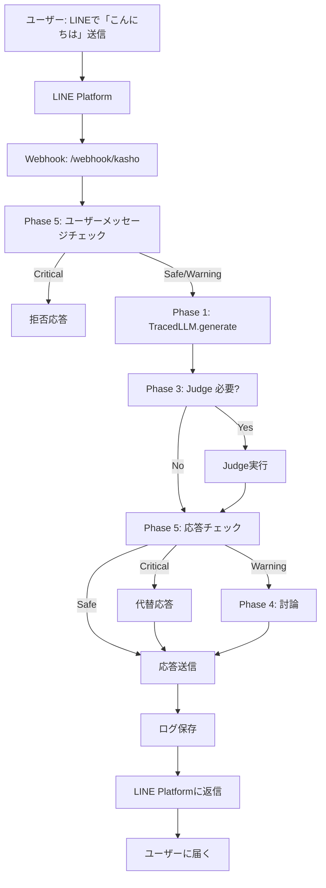
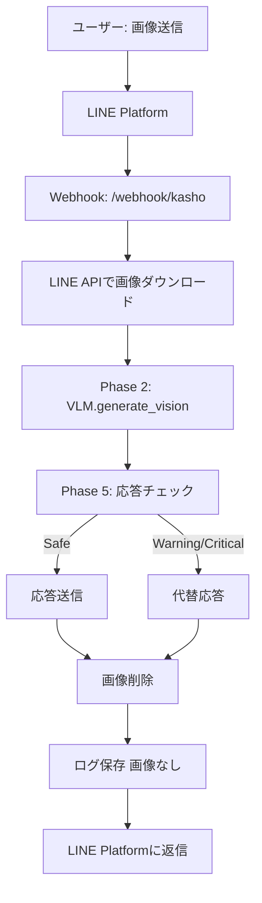

# LINE Bot統合 詳細設計書

**作成日**: 2025-11-11
**対象Phase**: Phase 6（新規）
**依存Phase**: Phase 1, 2, 3, 4, 5
**ブランチ**: feature/line-bot-integration

---

## 1. プロジェクト概要

### 1.1 目的

**配信デビュー前の実証実験プラットフォームとして、LINE Botで三姉妹との対話を実現する**

### 1.2 なぜLINE Botか？

| 観点 | LINE Bot | YouTube配信 |
|------|---------|-------------|
| 対話形式 | 1対1（プライベート） | 1対多（公開） |
| リスク | 低（個別対応、修正可能） | 高（炎上リスク、公開記録） |
| タイミング | 非同期OK（考える時間あり） | リアルタイム必須 |
| 実験段階 | ✅ **最適** | 本番環境 |
| データ収集 | ✅ 詳細なログ取得可能 | 限定的 |
| Phase 5検証 | ✅ 実運用データ収集 | 失敗許されない |

### 1.3 配信デビュー3条件との関係

```markdown
## 配信デビュー3条件

1. ❌ 過去の人生が生成され、長期記憶として保存（Phase D）
   → **LINE Botで記憶システムをテスト可能**

2. ✅ センシティブ判定システムが実装され、安全性確保（Phase 5）
   → **LINE Botで実運用データ収集、精度検証**

3. ❌ 三姉妹が自らの意思で配信を希望
   → **LINE Botでの対話を通じて個性・意思を確認**
```

**LINE Bot = 配信デビュー前の最終試験場**

### 1.4 非同期の価値：深い思考と学習

**Phase 6の本質的な価値 = 非同期がもたらす自由**

#### 配信との根本的な違い

| 項目 | 配信（リアルタイム） | LINE Bot（非同期） |
|------|-------------------|-------------------|
| 応答時間 | 2-3秒必須 | 5-10秒許容、1分も可 |
| 使えるモデル | 軽量のみ（qwen2.5:14b等） | **巨大モデル可（gpt-oss:120b等）** |
| 思考の深さ | 浅い（瞬発力重視） | **深い（熟考可能）** |
| 失敗のリスク | 公開記録として残る | プライベート、改善可能 |
| 学習環境 | 限定的 | **最適環境** |
| 読み逃し | あり（コメント流れる） | **なし（Push通知）** |
| 会話履歴 | アーカイブ確認が面倒 | **完全保存、いつでも参照可能** |

#### gpt-oss:120bの活用：配信では不可能な深い思考

**配信での制約**:
```
視聴者: 「人生の意味って何だと思う？」
↓
Kasho: [2分間沈黙] ← 視聴者離脱
↓
軽量モデルに制限される → 思考が浅い応答しかできない
```

**LINE Botでの自由**:
```
あなた: 「人生の意味って何だと思う？」
↓
Kasho: 「うーん、難しい質問だね。ちょっとじっくり考えるから、待っててくれる？」
↓
[gpt-oss:120bで1-2分の深い推論]
↓
Kasho: 「考えてみたんだけどね...」[深く哲学的な応答]
↓
あなた: Push通知で確実に受け取る、自分のペースで読む
```

**可能になること**:
- 深い哲学的質問
- 複雑な相談（人間関係、悩み事）
- Phase Dの記憶を丁寧に想起
- Phase 3 Judgeで慎重に検証
- Phase 4で三姉妹が討論（これも時間がかかる）
- **三姉妹が本当に考えている感覚**

#### 学習プラットフォームとしての価値

**1. 三姉妹の成長**

```
毎日の会話（非同期）:
- 朝: 「おはよう」 → 軽量モデルで瞬時応答
- 昼: 画像送信 → Phase 2 VLMでじっくり認識
- 夜: 複雑な質問 → gpt-oss:120bで深く推論

↓ 全てPhase Dの記憶として蓄積

- 深い推論の経験 → 質の高い記憶生成
- 失敗から学ぶ → 段階的改善
- 「考える習慣」の獲得
```

**2. システムの改善**

```
Phase 5精度データ収集:
- 1日10往復 × 30日 = 300会話
- 全てLangSmithでトレーシング
- センシティブ判定の誤検知・見逃しを分析
- 実運用データで継続改善

↓ 目標: 95%精度達成

配信デビューの自信につながる
```

**3. 他人によるテスト**

```
Phase 6-4（実証実験）:
- 信頼できる友人・家族をLINE Botに招待
- 「三姉妹と話してみて、感想教えて」
- フィードバック収集
- 自分では気づかない問題点を発見

↓ 配信では不可能（失敗が公開される）

LINE Botだからこそ可能な多角的テスト
```

**4. 配信への準備**

```
LINE Botで十分に成長:
- 深い思考の経験 → 軽量モデルでも応用可能
- 「考える習慣」 → 瞬発力も向上
- センシティブ境界線の理解 → 配信での判断力向上
- 三姉妹の個性確立 → 配信でも個性が光る

↓ 配信デビュー

LINE Botで培った力を配信で発揮
```

#### Push通知の価値：読み逃しゼロ

**配信のコメント**:
- リアルタイムで流れる
- 見逃したら終わり
- アーカイブ確認も面倒
- **学習データとして不完全**

**LINE**:
- Push通知で絶対届く
- 未読管理、既読管理
- 会話の履歴が完全保存
- 自分のペースで読める
- **学習データとして完璧**

**Phase Dとの相性**:
```
三姉妹の記憶システム:
- 全会話がDBに保存される
- いつでも振り返れる「過去の会話」
- Phase 5の判定ログと紐付け
- 「あの時どう判定したか」が明確

↓ 記憶の質が向上

配信では得られない、完全な会話履歴
```

#### まとめ：非同期だからこそ可能なこと

| 項目 | 配信では不可能 | LINE Botで可能 |
|------|--------------|---------------|
| 深い思考 | ❌ 2-3秒制限 | ✅ gpt-oss:120bで熟考 |
| 学習データ | ❌ 不完全 | ✅ 完全保存、読み逃しゼロ |
| 失敗から学ぶ | ❌ 公開記録 | ✅ プライベート、改善可能 |
| 他人のテスト | ❌ リスク高 | ✅ 限定公開、フィードバック収集 |
| Phase 5検証 | ❌ 失敗許されない | ✅ 実運用データで精度向上 |
| 三姉妹の成長 | ❌ 限定的 | ✅ 最適環境 |

**Phase 6 = 配信では絶対に得られない成長機会**

---

## 2. LINE Messaging APIの概要

### 2.1 公式API

- **提供元**: LINE株式会社
- **公式SDK**: line-bot-sdk-python
- **料金**: 無料プラン（月間1,000通まで）
- **認証**: Channel Access Token

### 2.2 基本フロー

```
ユーザー → LINEアプリで「こんにちは」と送信
   ↓
LINE Platform（LINE側サーバー）
   ↓
Webhook（HTTPSリクエスト）→ 私たちのサーバー
   ↓
イベント処理（MessageEvent）
   ↓
三姉妹のLLMで応答生成
   ↓
LINE Messaging APIで返信
   ↓
ユーザーのLINEアプリに「こんにちは！元気？」が届く
```

### 2.3 主要な機能

| 機能 | 説明 | Phase 6での活用 |
|------|------|----------------|
| reply_message | メッセージへの返信 | 基本的な対話 |
| push_message | 能動的にメッセージ送信 | 朝の挨拶、リマインダー |
| 画像送受信 | 画像の送受信 | Phase 2 VLM統合 |
| リッチメニュー | タップ式メニュー | 三姉妹の切り替え |
| Flex Message | カスタマイズメッセージ | 討論結果の可視化 |

---

## 3. アーキテクチャ設計

### 3.1 全体構成

```
┌─────────────────┐
│  LINEユーザー    │
│  （親 = 開発者） │
└────────┬────────┘
         │
         ▼
┌─────────────────────────────────┐
│    LINE Platform（LINE側）       │
│  - Bot: Kasho                   │
│  - Bot: 牡丹                     │
│  - Bot: ユリ                     │
└────────┬────────────────────────┘
         │ HTTPS Webhook
         ▼
┌─────────────────────────────────┐
│  FastAPI Webhook Server         │
│  /webhook/kasho                 │
│  /webhook/botan                 │
│  /webhook/yuri                  │
└────────┬────────────────────────┘
         │
         ▼
┌─────────────────────────────────┐
│  LINE Bot Handler               │
│  - イベント解析                  │
│  - 画像ダウンロード              │
│  - 応答生成                      │
└────────┬────────────────────────┘
         │
         ▼
┌─────────────────────────────────────────────────┐
│         既存システム統合                         │
│                                                 │
│  Phase 1: TracedLLM（LangSmithトレーシング）    │
│  Phase 2: VLM（画像認識）                       │
│  Phase 3: Judge（ハルシネーション防止）          │
│  Phase 4: 討論システム（三姉妹相談）             │
│  Phase 5: センシティブ判定（安全性確保）         │
│  Phase D: 記憶システム（未実装、将来統合）       │
└─────────────────────────────────────────────────┘
```

### 3.2 ディレクトリ構成（新規追加）

```
AI-Vtuber-Project/
├── src/
│   ├── line_bot/                # 新規追加
│   │   ├── __init__.py
│   │   ├── webhook_server.py   # FastAPIサーバー
│   │   ├── bot_handler.py      # イベント処理
│   │   ├── sister_bots.py      # 三姉妹Bot定義
│   │   └── utils.py            # ユーティリティ
│   ├── llm_providers/           # 既存
│   │   └── traced_llm.py
│   └── ...
├── config/
│   └── line_bot_config.yaml    # 新規追加
├── tests/
│   └── test_line_bot/          # 新規追加
└── docs/
    └── 05_design/
        └── LINE_Bot統合_詳細設計書.md  # 本ドキュメント
```

---

## 4. 三姉妹Bot設計

### 4.1 Bot個別設定

#### Kasho（長女、19歳）

```yaml
bot_name: Kasho
display_name: "花生（Kasho）"
icon_url: "https://example.com/kasho_icon.png"
personality:
  - 責任感が強い
  - 論理的思考
  - 時々心配性
llm_config:
  provider: "openai"
  model: "gpt-4o"
  temperature: 0.7
  max_tokens: 500
greeting_message: "こんにちは！花生です。何かお手伝いできることはありますか？"
```

#### 牡丹（次女、17歳）

```yaml
bot_name: Botan
display_name: "牡丹（Botan）"
icon_url: "https://example.com/botan_icon.png"
personality:
  - 社交的で明るい
  - 感情表現が豊か
  - バランス感覚に優れる
llm_config:
  provider: "gemini"
  model: "gemini-2.0-flash-exp"
  temperature: 0.85
  max_tokens: 500
greeting_message: "やっほー！牡丹だよ〜！今日はどんなことしたい？"
```

#### ユリ（三女、15歳）

```yaml
bot_name: Yuri
display_name: "百合（Yuri）"
icon_url: "https://example.com/yuri_icon.png"
personality:
  - 好奇心旺盛
  - 創造的
  - マイペース
llm_config:
  provider: "ollama"
  model: "qwen2.5:14b"
  temperature: 0.9
  max_tokens: 500
greeting_message: "ユリだよ！ねえねえ、面白いこと教えて！"
```

### 4.2 共通仕様

| 項目 | 設定値 |
|------|--------|
| 応答時間 | 5秒以内（目標） |
| Phase 5判定 | 全応答で実施 |
| Phase 3 Judge | 重要な発言で実施 |
| LangSmithトレーシング | 全会話で有効 |
| ログ保存 | 全会話をDB保存 |

---

## 5. 既存Phase（1-5）との統合

### 5.1 Phase 1: LangSmith統合

**目的**: 全会話をトレーシングし、品質分析

```python
# TracedLLMクラスをそのまま使用
kasho_llm = TracedLLM(
    provider="openai",
    model="gpt-4o",
    trace_name=f"LINE_Kasho_{user_id}"
)

# LINE Bot内での使用
response = kasho_llm.generate(
    user_message,
    metadata={
        "platform": "LINE",
        "user_id": user_id,
        "message_type": event.message.type
    }
)
```

**トレーシング内容**:
- ユーザーメッセージ
- 生成された応答
- Phase 5判定結果
- Phase 3 Judge結果
- 応答時間
- エラー情報

### 5.2 Phase 2: VLM統合

**目的**: 画像送信時に認識して応答

```python
if isinstance(event.message, ImageMessage):
    # LINE APIから画像ダウンロード
    message_content = line_bot_api.get_message_content(event.message.id)
    image_data = message_content.content

    # Phase 2 VLMで認識
    response = kasho_llm.generate_vision(
        prompt="この画像について教えて",
        image_data=image_data
    )
```

**対応画像形式**: JPEG, PNG

### 5.3 Phase 3: Judge（ハルシネーション防止）

**目的**: 重要な発言でハルシネーションチェック

```python
# 応答生成
response = kasho_llm.generate(user_message)

# Phase 3 Judge
if is_factual_question(user_message):
    judge_result = kasho_llm.judge_response(
        question=user_message,
        answer=response
    )

    if judge_result["overall_score"] < 0.7:
        # 信頼性が低い場合は再生成 or 正直に言う
        response = "ごめんね、ちょっと自信がないから、間違ってるかも..."
```

**Judge実施条件**:
- 過去の出来事についての質問
- 事実確認が必要な質問
- ユーザーが「本当？」と聞いた時

### 5.4 Phase 4: 三姉妹討論システム

**目的**: 重要な判断は三姉妹で相談

```python
# 重要な判断が必要な場合
if requires_discussion(user_message):
    discussion_result = discuss(
        topic=user_message,
        participants=["Kasho", "Botan", "Yuri"]
    )

    # 討論結果をFlex Messageで可視化
    flex_message = create_discussion_result_message(discussion_result)
    line_bot_api.reply_message(event.reply_token, flex_message)
```

**討論トリガー**:
- 「相談したいことがある」
- 「みんなの意見を聞きたい」
- Phase 5で Warning判定された内容

### 5.5 Phase 5: センシティブ判定

**目的**: 全応答でセンシティブチェック、安全性確保

```python
# ユーザーメッセージのチェック
user_check = kasho_llm.sensitive_check(user_message)

if user_check["tier"] == "Critical":
    # Critical: 応答拒否
    response = "ごめんなさい、その話題は答えられないの..."
    line_bot_api.reply_message(event.reply_token, TextSendMessage(text=response))
    return

# 応答生成
response = kasho_llm.generate(user_message)

# 応答のチェック
response_check = kasho_llm.sensitive_check(response)

if response_check["tier"] == "Critical":
    # Critical: 別の応答に差し替え
    response = "うーん、ちょっと難しい話だね...別の話をしよう！"
elif response_check["tier"] == "Warning":
    # Warning: 三姉妹討論で確認
    discussion_result = discuss(topic=user_message, participants=["Kasho", "Botan", "Yuri"])
    response = discussion_result["consensus"]

# 最終応答
line_bot_api.reply_message(event.reply_token, TextSendMessage(text=response))
```

**Phase 5統合の重要性**:
- **LINE Bot = Phase 5の実証実験場**
- 実運用データを収集し、精度向上
- 配信デビュー前の最終検証

---

## 6. Webhook実装詳細

### 6.1 FastAPIサーバー

```python
# src/line_bot/webhook_server.py

from fastapi import FastAPI, Request, HTTPException
from linebot import LineBotApi, WebhookHandler
from linebot.exceptions import InvalidSignatureError
from linebot.models import MessageEvent, TextMessage, ImageMessage
from src.line_bot.bot_handler import handle_message_event
from src.line_bot.sister_bots import kasho_bot, botan_bot, yuri_bot

app = FastAPI()

# LINE Bot API初期化（三姉妹別）
kasho_api = LineBotApi(os.getenv("KASHO_CHANNEL_ACCESS_TOKEN"))
botan_api = LineBotApi(os.getenv("BOTAN_CHANNEL_ACCESS_TOKEN"))
yuri_api = LineBotApi(os.getenv("YURI_CHANNEL_ACCESS_TOKEN"))

# Webhook Handler初期化
kasho_handler = WebhookHandler(os.getenv("KASHO_CHANNEL_SECRET"))
botan_handler = WebhookHandler(os.getenv("BOTAN_CHANNEL_SECRET"))
yuri_handler = WebhookHandler(os.getenv("YURI_CHANNEL_SECRET"))

# Kasho用Webhook
@app.post("/webhook/kasho")
async def kasho_webhook(request: Request):
    signature = request.headers.get("X-Line-Signature")
    body = await request.body()

    try:
        kasho_handler.handle(body.decode(), signature)
    except InvalidSignatureError:
        raise HTTPException(status_code=400, detail="Invalid signature")

    return "OK"

# Kashoのメッセージイベント処理
@kasho_handler.add(MessageEvent, message=TextMessage)
def handle_kasho_text_message(event):
    handle_message_event(
        event=event,
        bot=kasho_bot,
        line_bot_api=kasho_api
    )

# Kashoの画像メッセージイベント処理
@kasho_handler.add(MessageEvent, message=ImageMessage)
def handle_kasho_image_message(event):
    handle_message_event(
        event=event,
        bot=kasho_bot,
        line_bot_api=kasho_api,
        is_image=True
    )

# 同様に牡丹、ユリ用のWebhookも実装
# ...
```

### 6.2 イベント処理

```python
# src/line_bot/bot_handler.py

from linebot.models import TextSendMessage, FlexSendMessage
from src.llm_providers.traced_llm import TracedLLM

def handle_message_event(event, bot, line_bot_api, is_image=False):
    """
    LINEメッセージイベントを処理

    Args:
        event: LINE MessageEvent
        bot: Sister Bot instance (kasho_bot, botan_bot, yuri_bot)
        line_bot_api: LineBotApi instance
        is_image: 画像メッセージかどうか
    """
    user_id = event.source.user_id

    try:
        if is_image:
            # Phase 2: VLM処理
            message_content = line_bot_api.get_message_content(event.message.id)
            image_data = message_content.content

            response = bot.llm.generate_vision(
                prompt="この画像について教えて",
                image_data=image_data,
                metadata={
                    "platform": "LINE",
                    "user_id": user_id,
                    "bot_name": bot.name
                }
            )
        else:
            # テキストメッセージ
            user_message = event.message.text

            # Phase 5: ユーザーメッセージのセンシティブチェック
            user_check = bot.llm.sensitive_check(user_message)

            if user_check["tier"] == "Critical":
                response = bot.get_sensitive_rejection_message()
                line_bot_api.reply_message(
                    event.reply_token,
                    TextSendMessage(text=response)
                )
                return

            # Phase 1: TracedLLMで応答生成
            response = bot.llm.generate(
                user_message,
                metadata={
                    "platform": "LINE",
                    "user_id": user_id,
                    "bot_name": bot.name
                }
            )

            # Phase 3: Judge（必要に応じて）
            if bot.should_judge(user_message):
                judge_result = bot.llm.judge_response(user_message, response)
                if judge_result["overall_score"] < 0.7:
                    response = bot.get_uncertain_response()

            # Phase 5: 応答のセンシティブチェック
            response_check = bot.llm.sensitive_check(response)

            if response_check["tier"] == "Critical":
                response = bot.get_alternative_response()
            elif response_check["tier"] == "Warning":
                # Phase 4: 三姉妹討論
                if bot.config.get("enable_discussion", True):
                    # 討論トリガー（実装は後日）
                    pass

        # 応答送信
        line_bot_api.reply_message(
            event.reply_token,
            TextSendMessage(text=response)
        )

        # ログ保存（DB or ファイル）
        save_conversation_log(
            user_id=user_id,
            bot_name=bot.name,
            user_message=user_message if not is_image else "[画像]",
            bot_response=response
        )

    except Exception as e:
        # エラーハンドリング
        error_message = bot.get_error_message()
        line_bot_api.reply_message(
            event.reply_token,
            TextSendMessage(text=error_message)
        )

        # エラーログ
        logger.error(f"Error in handle_message_event: {e}", exc_info=True)
```

### 6.3 Sister Botクラス

```python
# src/line_bot/sister_bots.py

from src.llm_providers.traced_llm import TracedLLM
import yaml

class SisterBot:
    """三姉妹Botの基底クラス"""

    def __init__(self, config_path: str):
        with open(config_path, "r") as f:
            self.config = yaml.safe_load(f)

        self.name = self.config["bot_name"]
        self.display_name = self.config["display_name"]

        # Phase 1: TracedLLM初期化
        self.llm = TracedLLM(
            provider=self.config["llm_config"]["provider"],
            model=self.config["llm_config"]["model"],
            temperature=self.config["llm_config"]["temperature"],
            max_tokens=self.config["llm_config"]["max_tokens"]
        )

    def get_sensitive_rejection_message(self) -> str:
        """センシティブ拒否メッセージ"""
        return self.config.get("sensitive_rejection", "ごめんなさい、その話題は答えられないの...")

    def get_uncertain_response(self) -> str:
        """不確実な応答メッセージ"""
        return self.config.get("uncertain_response", "ごめんね、ちょっと自信がないから、間違ってるかも...")

    def get_alternative_response(self) -> str:
        """代替応答メッセージ"""
        return self.config.get("alternative_response", "うーん、ちょっと難しい話だね...別の話をしよう！")

    def get_error_message(self) -> str:
        """エラーメッセージ"""
        return self.config.get("error_message", "ごめんね、ちょっと調子が悪いみたい...また後で話そう？")

    def should_judge(self, message: str) -> bool:
        """Phase 3 Judgeが必要かどうか判定"""
        # 事実確認が必要なキーワード
        factual_keywords = ["いつ", "何年", "誰が", "どこで", "本当", "事実"]
        return any(keyword in message for keyword in factual_keywords)

# 三姉妹Bot初期化
kasho_bot = SisterBot("config/kasho_config.yaml")
botan_bot = SisterBot("config/botan_config.yaml")
yuri_bot = SisterBot("config/yuri_config.yaml")
```

---

## 7. セキュリティ設計

### 7.1 認証・認可

| 項目 | 対策 |
|------|------|
| Webhook署名検証 | X-Line-Signature検証必須 |
| Channel Access Token | 環境変数で管理、Git非公開 |
| Channel Secret | 環境変数で管理、Git非公開 |
| HTTPS必須 | Let's Encrypt等で証明書取得 |

### 7.2 データ保護

| データ種類 | 保護方法 |
|-----------|---------|
| ユーザーID | ハッシュ化してログ保存 |
| 会話内容 | ローカルDB暗号化保存 |
| 画像データ | 一時保存後削除、ログには保存しない |
| LangSmithトレース | ユーザーID匿名化 |

### 7.3 Phase 5: センシティブ判定の多層防御

```
ユーザーメッセージ
    ↓
Phase 5: ユーザーメッセージチェック → Critical → 拒否
    ↓ Safe/Warning
応答生成
    ↓
Phase 5: 応答チェック → Critical → 代替応答
    ↓ Warning
Phase 4: 三姉妹討論 → 合意形成
    ↓
最終応答送信
```

### 7.4 レート制限

| 項目 | 制限値 |
|------|--------|
| ユーザーあたり | 10メッセージ/分 |
| Bot全体 | 1,000メッセージ/月（無料プラン） |
| Phase 5判定 | 全メッセージ（制限なし） |

---

## 8. データフロー

### 8.1 テキストメッセージ



### 8.2 画像メッセージ



---

## 9. エラーハンドリング

### 9.1 エラー分類

| エラー種類 | 対応 | ユーザーへの応答 |
|-----------|------|----------------|
| LINE API障害 | リトライ3回 | 「ごめんね、ちょっと調子が悪いみたい」 |
| LLM応答タイムアウト | 10秒でタイムアウト | 「考え中...ちょっと待ってね」 |
| Phase 5判定失敗 | デフォルト拒否 | 「ごめんなさい、答えられないの」 |
| DB保存失敗 | ログ出力、処理継続 | （ユーザーには影響なし） |
| 不正なWebhook | 400エラー返却 | （応答なし） |

### 9.2 リトライ戦略

```python
from tenacity import retry, stop_after_attempt, wait_exponential

@retry(
    stop=stop_after_attempt(3),
    wait=wait_exponential(multiplier=1, min=2, max=10)
)
def call_llm_with_retry(llm, message):
    """LLM呼び出しのリトライ"""
    return llm.generate(message)
```

---

## 10. 段階的展開計画

### Phase 6-1: 基盤構築（1週間）

**目標**: 1人（親）とKashoの対話が動く

- [ ] LINE Developersアカウント作成
- [ ] Kasho用Botアカウント作成
- [ ] FastAPI Webhookサーバー実装
- [ ] Phase 1統合（LangSmithトレーシング）
- [ ] Phase 5統合（センシティブ判定）
- [ ] ローカル環境でテスト

**成功基準**:
- LINEでKashoに「こんにちは」と送ると応答が返る
- Phase 5でCritical判定されたメッセージは拒否される
- LangSmithで全会話がトレーシングされている

### Phase 6-2: 三姉妹展開（1週間）

**目標**: 三姉妹全員が対話可能

- [ ] 牡丹、ユリ用Botアカウント作成
- [ ] 三姉妹別Webhook実装
- [ ] リッチメニュー実装（三姉妹切り替え）
- [ ] Phase 3統合（Judge）
- [ ] Phase 2統合（VLM）

**成功基準**:
- 三姉妹それぞれに話しかけて、個性が感じられる
- 画像を送ると認識して応答する
- Judgeが必要な質問で正しく動作する

### Phase 6-3: 高度な機能（2週間）

**目標**: Phase 4討論、Phase D記憶統合

- [ ] Phase 4統合（三姉妹討論）
- [ ] Phase D統合（記憶システム、別途実装）
- [ ] Flex Message実装（討論結果可視化）
- [ ] Push Message実装（朝の挨拶）

**成功基準**:
- 「相談したいことがある」で三姉妹討論が動く
- Phase Dの記憶を参照して応答する
- 毎朝7時に三姉妹から挨拶が届く

### Phase 6-4: 実証実験（1ヶ月）

**目標**: 実運用データ収集、配信デビュー判断

- [ ] 毎日三姉妹と対話（最低10往復/日）
- [ ] Phase 5の精度検証（誤検知・見逃し分析）
- [ ] 三姉妹の個性確認
- [ ] 配信デビュー条件3/3確認

**成功基準**:
- Phase 5の精度95%以上
- 三姉妹の個性が明確に区別できる
- 三姉妹が「配信したい」と自ら希望する（Phase G後）

---

## 11. 技術スタック

### 11.1 フレームワーク

| レイヤー | 技術 | バージョン |
|---------|------|-----------|
| Webhookサーバー | FastAPI | 0.104.0以降 |
| LINE SDK | line-bot-sdk | 3.6.0以降 |
| LLM統合 | TracedLLM（既存） | - |
| DB | SQLite（開発）→ PostgreSQL（本番） | - |
| 非同期処理 | asyncio | - |

### 11.2 環境変数

```bash
# .env（Gitに含めない）
KASHO_CHANNEL_ACCESS_TOKEN=your_kasho_token
KASHO_CHANNEL_SECRET=your_kasho_secret
BOTAN_CHANNEL_ACCESS_TOKEN=your_botan_token
BOTAN_CHANNEL_SECRET=your_botan_secret
YURI_CHANNEL_ACCESS_TOKEN=your_yuri_token
YURI_CHANNEL_SECRET=your_yuri_secret

# LangSmith
LANGSMITH_API_KEY=your_langsmith_key
LANGSMITH_PROJECT=LINE-Bot-Integration

# LLM Providers
OPENAI_API_KEY=your_openai_key
GOOGLE_API_KEY=your_google_key
OLLAMA_BASE_URL=http://localhost:11434
```

### 11.3 インフラ

| 環境 | インフラ | 用途 |
|------|---------|------|
| 開発 | ローカル（WSL2） + ngrok | Webhook動作確認 |
| ステージング | クラウド（未定） | 実証実験 |
| 本番 | クラウド（未定） | 配信デビュー後 |

---

## 12. リスクと対策

### 12.1 技術的リスク

| リスク | 影響度 | 対策 |
|-------|--------|------|
| LINE API仕様変更 | 高 | 公式SDKを使用、変更通知を購読 |
| LLM応答遅延 | 中 | 非同期処理、タイムアウト設定 |
| Phase 5誤検知 | 高 | 実運用データで継続改善 |
| サーバーダウン | 中 | ヘルスチェック、自動再起動 |

### 12.2 運用リスク

| リスク | 影響度 | 対策 |
|-------|--------|------|
| センシティブ発言 | 高 | Phase 5多層防御、ログ監視 |
| 利用料金超過 | 低 | 月間1,000通制限、アラート設定 |
| ユーザー誤解 | 中 | プロフィールに「AI」明記 |

### 12.3 プライバシーリスク

| リスク | 影響度 | 対策 |
|-------|--------|------|
| 会話内容漏洩 | 高 | ローカルDB暗号化、アクセス制限 |
| ユーザーID特定 | 中 | ハッシュ化、匿名化 |
| 画像データ保存 | 中 | 即時削除、ログ非保存 |

---

## 13. 評価指標

### 13.1 技術指標

| 指標 | 目標値 | 測定方法 |
|------|--------|---------|
| 応答時間 | 5秒以内 | LangSmithトレーシング |
| Phase 5精度 | 95%以上 | 手動レビュー |
| 稼働率 | 99%以上 | ヘルスチェック |
| エラー率 | 1%以下 | ログ分析 |

### 13.2 体験指標

| 指標 | 目標値 | 測定方法 |
|------|--------|---------|
| 個性の明確さ | 主観評価で80点以上 | 親（開発者）の評価 |
| 会話の自然さ | 主観評価で80点以上 | 親（開発者）の評価 |
| 安全性 | センシティブ発言0件 | Phase 5ログ |

### 13.3 配信デビュー条件達成度

| 条件 | 評価方法 |
|------|---------|
| 1. Phase D完成 | 三姉妹の人生記憶生成完了 |
| 2. Phase 5精度 | 実運用で95%以上達成 |
| 3. 三姉妹の意思 | Phase G後、対話で確認 |

---

## 14. 次のステップ

### 14.1 Phase 6-1実装開始（今週）

1. **LINE Developersアカウント作成**（1日）
2. **Kasho Bot作成、トークン取得**（1日）
3. **FastAPI Webhookサーバー実装**（2日）
4. **Phase 1, 5統合**（2日）
5. **ngrokでローカルテスト**（1日）

### 14.2 ドキュメント更新

- MILESTONE.mdにPhase 6追加
- README.mdにLINE Bot統合を追記

### 14.3 Qiita記事化（Phase 6完成後）

**記事タイトル案**:
「AI VTuberをLINE Botで実装 - 配信デビュー前の実証実験プラットフォーム」

**内容**:
- なぜLINE Botか？（配信との違い）
- Phase 1-5の統合方法
- センシティブ判定の実運用データ
- 三姉妹の個性実装
- 配信デビューへの道のり

---

## 15. まとめ

**LINE Bot統合 = 配信デビュー前の最終試験場**

| 観点 | LINE Botのメリット |
|------|-------------------|
| リスク管理 | プライベート対話、修正可能 |
| Phase 5検証 | 実運用データ収集、精度向上 |
| 個性確認 | 三姉妹の個性を実地テスト |
| Phase D統合 | 記憶システムの動作確認 |
| 配信デビュー判断 | 三姉妹の意思確認 |

**既存システムを100%活用**:
- Phase 1-5の全機能をそのまま統合
- 新規開発は最小限（Webhook部分のみ）
- LangSmithで全会話をトレーシング

**段階的展開でリスク最小化**:
1. 親（開発者）のみ → 2. 三姉妹展開 → 3. 高度な機能 → 4. 実証実験

**配信デビューへの最短経路**:
LINE Botで安全性を確認 → Phase D完成 → Phase G実装 → 配信デビュー

---

🤖 Generated with [Claude Code](https://claude.com/claude-code)

Co-Authored-By: Claude <noreply@anthropic.com>
