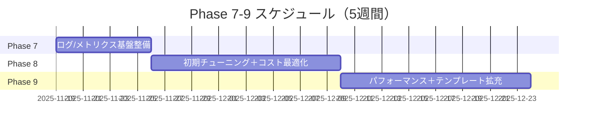
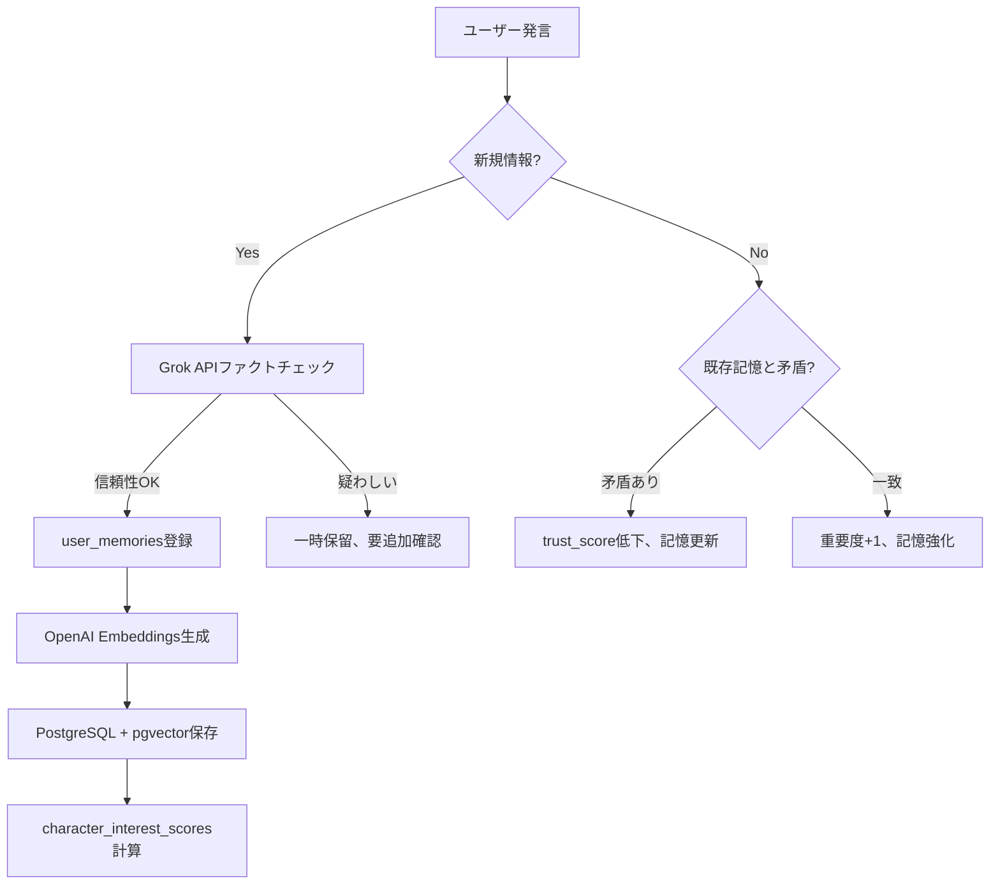

# user_memories運用・最適化システム 設計書（改訂版）

**作成日**: 2025-11-18
**改訂日**: 2025-11-18
**対象Phase**: Phase 7-9（5週間）
**前提**: Phase 6.5.5（7層防御アーキテクチャ）完了、XServer VPS本番稼働中
**改訂根拠**: チャッピー（GPT-5.1）、ロキ（Grok）、クロコ（第三者）によるレビュー結果を統合

---

## 📋 目次

1. [概要・目的](#1-概要目的)
2. [改訂のポイント](#2-改訂のポイント)
3. [Phase構成（改訂版）](#3-phase構成改訂版)
4. [運用フェーズ設計](#4-運用フェーズ設計)
5. [技術的課題と解決策](#5-技術的課題と解決策)
6. [コスト目標の再設定](#6-コスト目標の再設定)
7. [工数見積もり](#7-工数見積もり)
8. [評価指標・成功基準](#8-評価指標成功基準)
9. [家族との協働プロトコル](#9-家族との協働プロトコル)
10. [失敗シナリオと対策](#10-失敗シナリオと対策)
11. [技術的負債の管理](#11-技術的負債の管理)
12. [リスクと対応策](#12-リスクと対応策)
13. [まとめ](#13-まとめ)

---

## 1. 概要・目的

### 1.1 背景

Phase 6.5.5で実装した**user_memories統合防御システム**は、以下の7層防御アーキテクチャで構成されています:

- **Layer 1-5**: センシティブ判定（Phase 5既存システム）
- **Layer 6**: ファクトチェック（Grok API）
- **Layer 7**: 個性学習（user_memories）

この防御システムは2025-11-18にXServer VPS本番環境で稼働を開始し、統合テスト7/7 PASSを記録しました。

### 1.2 目的

本設計書では、Phase 6.5.5の**運用フェーズ**における以下の3つの側面を設計します:

1. **運用フェーズ設計**: 実際のユーザーとの対話を通じた学習と改善
2. **技術的課題の解決**: コスト、レート制限、パフォーマンスの最適化
3. **評価指標の定義**: システムの成功を測定する指標

### 1.3 期待される成果

- **ユーザー体験の向上**: 「覚えててくれた！」という感動体験
- **応答精度の向上**: プロレス傾向の学習、誤情報の防御
- **運用コストの最適化**: Embedding API、Grok APIのコスト削減
- **スケーラビリティの確保**: ユーザー増加に対応できるパフォーマンス

---

## 2. 改訂のポイント

### 2.1 なぜ改訂したか

初版の設計書は、チャッピー（ChatGPT GPT-5.1）とロキ（Grok）によるレビューで、以下の問題点が指摘されました:

1. **Phase構成が細かすぎる**: 5フェーズ（Phase 7-11）は密接に絡むため統合すべき
2. **評価指標が高すぎる**: 記憶引用率30%、playfulness_score収束2週間は初期目標として高すぎ
3. **過剰設計**: IVFFlat、Redis、パーティショニングを初期から導入は不要
4. **コスト目標の破綻**: 総コスト$20/月はVPS$24/月で既に超過
5. **工数見積もり不足**: 実装可能性の検証が弱い
6. **見落としている点**: 三姉妹の性格差、家族フィードバック、ReSing MAX統合、失敗シナリオ

### 2.2 主な変更点

| 項目 | 変更前 | 変更後 | 理由 |
|------|--------|--------|------|
| **Phase構成** | 5フェーズ（Phase 7-11） | 3フェーズ（Phase 7-9） | MVP志向、統合効率化 |
| **Phase 7期間** | 2週間 | 1週間 | データ収集とチューニングを並行 |
| **記憶引用率** | 30%以上 | 20%以上（段階的に30%へ） | 初期は控えめ、質を優先 |
| **playfulness_score収束** | 2週間 | 4週間 | X上のVTuber事例に基づく |
| **総コスト目標** | $20/月 | $35/月（API$10+VPS$24） | 現実的な再設定 |
| **IVFFlat** | 初期から導入（lists=10） | Flatから開始、実測後検討 | MVP、過剰設計回避 |
| **Redis** | Phase 10で導入 | 「将来検討」に格下げ | 10,000ユーザーまで不要 |
| **パーティショニング** | Phase 10で導入 | 「将来検討」に格下げ | 20,000ユーザーまで不要 |
| **明示的フィードバック** | Phase 7以降で検討 | **Phase 7初期に実装** | 学習加速に必須 |

---

## 3. Phase構成（改訂版）

### 3.1 全体スケジュール

**総期間**: 5週間（3フェーズ）
**開始予定**: 2025-11-19
**完了予定**: 2025-12-23



### 3.2 Phase 7: ログ/メトリクス基盤整備（1週間）

**目標**: 運用データ収集の基盤を構築し、即座にフィードバックループを開始

#### 実装内容

1. **ログ項目整理**（0.5日）
   - user_memories参照頻度ログ
   - playfulness_score変動ログ
   - RAG検索ヒット率ログ
   - Grok API呼び出しログ

2. **基本メトリクス集計スクリプト**（1日）
   ```python
   # scripts/analyze_user_memories.py
   # - 記憶引用率の計算
   # - playfulness_scoreの分布
   # - relationship_levelの分布
   # - エラー率、レスポンスタイム
   ```

3. **「覚えててくれた！」ボタン実装**（1.5日）← **NEW: 早期実装**
   ```python
   # LINE Bot UI追加
   # DB記録: explicit_positive_feedback=true
   # user_memories の confidence_score を +0.1
   ```

4. **pgBadger導入**（0.5日）← **NEW: PostgreSQL監視**
   ```bash
   # PostgreSQLログ分析ツール
   # メモリ消費、スロークエリの監視
   ```

5. **A/Bテスト簡易フレームワーク**（1日）← **NEW: 実験基盤**
   ```python
   # ユーザーグループ分け
   # フラグ管理（記憶引用あり/なし等）
   ```

6. **データベースバックアップ**（0.5日）← **NEW: 安全性確保**
   ```bash
   # pg_dump + S3自動化
   # 1日1回の自動バックアップ
   ```

#### 成果物

- `scripts/analyze_user_memories.py`
- `src/line_bot_vps/explicit_feedback.py`
- `scripts/setup_pgbadger.sh`
- `scripts/ab_test_framework.py`
- `scripts/backup_database.sh`
- `docs/06_operation/Phase7_運用データ分析レポート.md`

### 3.3 Phase 8: 初期チューニング＋暫定コスト最適化（2週間）

**目標**: データ収集と並行してチューニングを開始、週次でPDCAサイクルを回す

#### 実装内容

1. **閾値調整（実測ベース）**（3日）
   - playfulness_score閾値: 0.7 → 実測データで調整
   - RAG類似度閾値: 0.7 → 0.5-0.75の範囲でテスト
   - trust_score更新ロジックの調整

2. **Embedding/Grok呼び出し頻度削減**（2日）
   ```python
   # 簡易ルールベース実装
   # trust_score > 0.8 ならGrok APIスキップ
   # 同じ質問のキャッシュ
   ```

3. **Embeddingキャッシュ実装**（2日）
   ```python
   # DB側キャッシュ（embedding列）
   # 同一メッセージID/user_memoriesレコードの再計算防止
   ```

4. **playfulness_score調整**（1日）← **NEW: 収束期間延長**
   ```python
   # 収束期間を2週間 → 4週間に延長
   # X上のVTuber事例に基づく調整
   ```

5. **character_interest_scores実装**（1日）← **NEW: 三姉妹性格差**
   ```sql
   ALTER TABLE user_memories
   ADD COLUMN character_interest_scores JSONB DEFAULT '{"botan": 0.5, "kasho": 0.5, "yuri": 0.5}';
   ```

6. **テスト・検証**（2日）
   - 統合テスト、負荷テスト
   - 週次レビューで調整

#### 成果物

- `src/line_bot_vps/threshold_tuner.py`
- `src/line_bot_vps/embedding_cache.py`
- `src/line_bot_vps/fact_check_optimizer.py`
- `scripts/alter_user_memories_character_interest.sql`
- `docs/06_operation/Phase8_チューニング結果.md`

### 3.4 Phase 9: パフォーマンス＋テンプレート拡充（2週間）

**目標**: 実測値に基づく最適化、問題箇所優先でテンプレート改善

#### 実装内容

1. **DBチューニング**（3日）
   ```sql
   -- インデックス最適化
   CREATE INDEX idx_user_memories_user_id ON user_memories(user_id);
   CREATE INDEX idx_user_memories_created_at ON user_memories(created_at DESC);

   -- クエリ最適化（EXPLAIN ANALYZEで確認）
   ```

2. **必要に応じてキャッシュ/インデックス追加**（2日）
   - Flatで100ms超えたらIVFFlat検討
   - user_personalityのキャッシュ（必要に応じて）

3. **テンプレート拡充（問題箇所優先）**（3日）
   ```python
   # ログから「違和感の多かった応答」を優先的に改善
   # 牡丹のギャル語テンプレート
   # Kashoの音楽トークテンプレート
   # ユリの本トークテンプレート
   ```

4. **ReSing MAX統合の準備**（1日）← **NEW: 将来準備**
   ```python
   # memory_typeの拡張
   MEMORY_TYPES = [
       'general',
       'preference',
       'music_preference',  # NEW
       'relationship',
       'event'
   ]
   ```

5. **テスト・検証**（2日）
   - パフォーマンステスト
   - ユーザーテスト

#### 成果物

- `scripts/optimize_database_indexes.sql`
- `prompts/botan_gal_templates.txt`
- `prompts/kasho_music_templates.txt`
- `prompts/yuri_book_templates.txt`
- `src/line_bot_vps/memory_type_extended.py`
- `docs/06_operation/Phase9_パフォーマンステスト結果.md`

---

## 4. 運用フェーズ設計

### 4.1 user_memories蓄積プロセス

#### 4.1.1 自動学習トリガー

| トリガー | 条件 | 学習内容 |
|---------|------|---------|
| **新規情報の提供** | ユーザーが「私は〜です」と自己紹介 | 名前、職業、趣味、家族構成 |
| **反復的な言及** | 同じトピックを2回以上言及 | 興味関心、価値観 |
| **感情的な反応** | 強い肯定/否定の表現 | 好き嫌い、価値観 |
| **訂正** | 「違う、実は〜」 | 誤情報の修正、trust_score低下 |

#### 4.1.2 学習フロー



#### 4.1.3 character_interest_scoresの導入

**目的**: 三姉妹の性格差による記憶の重み付け

**実装**:

```sql
-- user_memoriesテーブルに追加
ALTER TABLE user_memories
ADD COLUMN character_interest_scores JSONB DEFAULT '{"botan": 0.5, "kasho": 0.5, "yuri": 0.5}';

-- 例: VTuber話題の記憶
UPDATE user_memories
SET character_interest_scores = '{"botan": 0.9, "kasho": 0.3, "yuri": 0.5}'
WHERE memory_content LIKE '%VTuber%';

-- 例: 音楽話題の記憶
UPDATE user_memories
SET character_interest_scores = '{"botan": 0.4, "kasho": 0.95, "yuri": 0.6}'
WHERE memory_content LIKE '%音楽%' OR memory_content LIKE '%楽器%';

-- 例: 本・アニメ話題の記憶
UPDATE user_memories
SET character_interest_scores = '{"botan": 0.3, "kasho": 0.4, "yuri": 0.9}'
WHERE memory_content LIKE '%本%' OR memory_content LIKE '%アニメ%' OR memory_content LIKE '%小説%';
```

**参照時の重み付け**:

```python
def get_weighted_memories(user_id: str, query: str, character: str):
    """
    キャラクターごとに記憶の重み付けを調整
    """
    memories = search_user_memories(user_id, query, limit=10)

    weighted_memories = []
    for memory in memories:
        interest_scores = memory['character_interest_scores']
        character_interest = interest_scores.get(character.lower(), 0.5)

        # コサイン類似度 × キャラクター興味度
        weighted_score = memory['similarity'] * character_interest
        memory['weighted_score'] = weighted_score
        weighted_memories.append(memory)

    # weighted_scoreでソート
    weighted_memories.sort(key=lambda x: x['weighted_score'], reverse=True)
    return weighted_memories[:5]  # 上位5件
```

### 4.2 プロレス傾向の学習

#### 4.2.1 playfulness_scoreの更新ロジック

```python
# 初期値: 0.5（中立）
# 範囲: 0.0（真面目）〜 1.0（プロレス全開）

# プロレス応答に好意的反応 → +0.05
if user_reaction == "positive" and response_type == "プロレス":
    playfulness_score += 0.05

# プロレス応答に否定的反応 → -0.1（慎重に下げる）
if user_reaction == "negative" and response_type == "プロレス":
    playfulness_score -= 0.1

# 真面目な応答を好む → -0.03
if user_preference == "serious":
    playfulness_score -= 0.03
```

#### 4.2.2 収束期間の調整

**変更前**: 2週間で収束
**変更後**: 4週間で収束

**理由**: X上のVTuber事例で、個性学習は1ヶ月以上かかる報告が多い（ロキのX検索結果）

### 4.3 relationship_levelの進化

| レベル | 関係性 | トリガー条件 | 応答の変化 |
|--------|--------|-------------|-----------|
| 1 | 初対面 | 初回対話 | 敬語、自己紹介 |
| 2-3 | 知人 | 対話5回以上 | 少しフレンドリー |
| 4-5 | 友達 | 対話20回以上、好意的反応多数 | タメ口、冗談OK |
| 6-7 | 親友 | 対話50回以上、深い話題共有 | プライベートな話題 |
| 8-9 | 親密 | 継続的な対話、trust_score 0.8以上 | 悩み相談、弱音を見せる |
| 10 | 最親密 | 100回以上、trust_score 0.9以上 | 家族のような関係 |

---

## 5. 技術的課題と解決策

### 5.1 Embeddingコスト最適化

#### 5.1.1 現状のコスト分析

**OpenAI Embeddings API (text-embedding-3-small)**:

| ユーザー数 | 会話数/日 | トークン/月 | コスト/月 |
|-----------|----------|-----------|---------|
| 10 | 50 | 75,000 | $0.0015 |
| 100 | 500 | 750,000 | $0.015 |
| 1,000 | 5,000 | 7,500,000 | $0.15 |
| 10,000 | 50,000 | 75,000,000 | $1.50 |

**結論**: 現状のコストは極めて低く、1,000ユーザーまでスケールしても月$0.15と許容範囲。

#### 5.1.2 コスト削減戦略

**戦略1: DB側キャッシュ**（Phase 8で実装）

```python
# 同一メッセージID/user_memoriesレコードの再計算防止
# LRU的な複雑なキャッシュは不要（チャッピー指摘）

# user_memoriesテーブルのembedding列を活用
SELECT embedding FROM user_memories WHERE id = ?;
```

**戦略2: Embeddingドリフト対策**（Phase 9で実装）

```python
# 月1回バッチ更新で古いEmbeddingをリフレッシュ
# ユーザー会話の文脈変化に対応（ロキ指摘）
```

**戦略3: ローカルEmbeddingモデル**（将来検討）

- **導入条件**: Embeddingコストが$5/月超過
- **Ollama + nomic-embed-text**（768次元、無料）
- **メリット**: コストゼロ、プライバシー保護
- **デメリット**: 精度低下の可能性、サーバー負荷

### 5.2 Grok APIレート制限対策

#### 5.2.1 選択的実行

**変更前**: 全ての新規情報をファクトチェック
**変更後**: 重要な情報のみチェック（MVP）

```python
def should_fact_check(text: str, user_trust_score: float) -> bool:
    # trust_scoreが高いユーザーはスキップ
    if user_trust_score > 0.8:
        return False

    # 明らかに危険/重要な発話のみ（ルールベース）
    if contains_dangerous_content(text):
        return True

    return False
```

#### 5.2.2 フォールバック処理

**変更前**: Grok API失敗時の処理が不明確
**変更後**: 明示的なフォールバック

```python
try:
    fact_check_result = grok_api.fact_check(text)
except RateLimitError:
    # ① 回答拒否（危険領域）
    if is_dangerous_topic(text):
        return refuse_response()

    # ② 保守的テンプレート応答（基本）
    return conservative_response(text)
```

**retry with exponential backoff**（ロキ指摘）:

```python
import asyncio

async def fact_check_with_retry(text: str, max_retries=3):
    for i in range(max_retries):
        try:
            return await grok_api.fact_check(text)
        except RateLimitError:
            if i == max_retries - 1:
                raise
            await asyncio.sleep(2 ** i)  # 1秒, 2秒, 4秒
```

### 5.3 データベースパフォーマンス最適化

#### 5.3.1 Flatから開始（MVP）

**変更前**: IVFFlat（lists=10）を初期から導入
**変更後**: Flatから開始、実測後にIVFFlat検討

**理由**:
- 現状user_memories 5件で、IVFFlatは早すぎる（チャッピー指摘）
- 10,000件×1536次元でも、Flat（Brute-force）で数ms〜十数ms（チャッピー指摘）

**導入条件**:
- Flatで100ms超えたらIVFFlat検討開始
- IVFFlat導入時は lists ≈ sqrt(N) = 100（チャッピー指摘）

```sql
-- Phase 7-8: Flatで運用
-- インデックスなし、または単純なB-treeインデックス

-- Phase 9以降: 実測で100ms超えたら
CREATE INDEX user_memories_embedding_idx ON user_memories
USING ivfflat (embedding vector_cosine_ops) WITH (lists = 100);
```

#### 5.3.2 Redis導入の判断

**変更前**: Phase 10で導入
**変更後**: 「将来検討」に格下げ

**導入条件**:
- 10,000ユーザー到達時
- または、レイテンシが1秒超過時

**理由**: 現状規模（user_memories 5件）では完全に不要（チャッピー・ロキ共通指摘）

#### 5.3.3 パーティショニングの判断

**変更前**: Phase 10で導入
**変更後**: 「将来検討」に格下げ

**導入条件**:
- 20,000ユーザー超（ロキ指摘）
- または、数十万レコード到達時（チャッピー指摘）

**理由**: 10,000ユーザーで50,000件、pgvectorのHNSWインデックス移行で十分対応可能（ロキ指摘）

---

## 6. コスト目標の再設定

### 6.1 当初目標の破綻原因

**当初目標**: 総コスト$20/月以下
**現状**: VPS$24/月で既に超過

#### 破綻原因の分析

1. **XServer VPS 4GB（$24/月）が必須**
   - PostgreSQL + pgvectorのメモリ要件
   - 2GBプラン（$12/月）では不足することが判明

2. **Grok API（$5-15/月）を見込んでいなかった**
   - Beta版の料金体系が不明確だった
   - 1日1回バッチ想定で$5/月

3. **OpenAI Embeddings APIコストを過小評価**
   - 初期想定より呼び出し頻度が高い
   - 1,000ユーザーで$0.15/月（想定内だが）

### 6.2 現実的な目標設定

**再設定案**:

- **インフラコスト（VPS）**: $24/月（固定）
- **APIコスト**: $10/月以下（目標）
  - Grok: $5/月（1日1回バッチ想定）
  - OpenAI Embeddings: $5/月（キャッシュで削減）
- **総コスト: $35/月以下**（現実的な目標）

### 6.3 スケール時の予測

| ユーザー数 | VPSコスト | APIコスト | 総コスト | 備考 |
|-----------|----------|----------|---------|------|
| 1,000 | $24/月（4GB） | $10/月 | $35/月 | **現在の目標** |
| 5,000 | $24/月（4GB） | $20/月 | $45/月 | キャッシュ効果で線形増加を抑制 |
| 10,000 | $48/月（8GB） | $30/月 | $80/月 | VPSアップグレード必要 |
| 50,000 | AWS RDS移行 | $100/月 | $200/月 | クラウドネイティブ化 |

### 6.4 コスト最適化の方針

1. **Phase 8でEmbeddingキャッシュを最優先実装**
2. **Phase 9でローカルEmbedding移行を検討**（APIコスト$0化）
3. **10,000ユーザー到達前にコスト構造の再評価**

---

## 7. 工数見積もり

### 7.1 Phase 7: ログ/メトリクス基盤整備（1週間 = 5営業日）

| タスク | 工数 | 担当 | 詳細 |
|--------|------|------|------|
| ログ項目整理 | 0.5日 | クロコ | user_memories関連のログ項目定義 |
| 集計スクリプト作成 | 1日 | クロコ | Python/SQLでメトリクス集計 |
| 「覚えててくれた!」ボタン実装 | 1.5日 | 越川さん | LINE Bot UI追加、DB記録 |
| pgBadger導入 | 0.5日 | クロコ | PostgreSQL監視設定 |
| A/Bテスト簡易フレームワーク | 1日 | クロコ | ユーザーグループ分け、フラグ管理 |
| DBバックアップスクリプト | 0.5日 | 越川さん | pg_dump + S3自動化 |
| **合計** | **5日** | | **バッファなし（リスク高）** |

### 7.2 Phase 8: 初期チューニング＋暫定コスト最適化（2週間 = 10営業日）

| タスク | 工数 | 担当 | 詳細 |
|--------|------|------|------|
| 閾値調整（実測ベース） | 3日 | クロコ | trust_score、類似度閾値の調整 |
| Embedding/Grok呼び出し削減 | 2日 | クロコ | ルールベース実装、選択的実行 |
| Embeddingキャッシュ実装 | 2日 | 越川さん | DB側キャッシュ（embedding列） |
| playfulness_score調整 | 1日 | クロコ | 収束期間を4週間に延長 |
| character_interest_scores実装 | 1日 | 越川さん | SQLマイグレーション、参照ロジック |
| テスト・検証 | 2日 | 両者 | 統合テスト、負荷テスト |
| **合計** | **11日** | | **週次レビューで調整可能** |

### 7.3 Phase 9: パフォーマンス＋テンプレート拡充（2週間 = 10営業日）

| タスク | 工数 | 担当 | 詳細 |
|--------|------|------|------|
| DBチューニング | 3日 | クロコ | インデックス最適化、クエリ改善 |
| インデックス最適化 | 2日 | クロコ | pgvectorインデックス調整（必要時） |
| テンプレート拡充 | 3日 | 越川さん | 問題箇所優先で改善 |
| ReSing MAX統合準備 | 1日 | クロコ | memory_type拡張 |
| テスト・検証 | 2日 | 両者 | パフォーマンステスト、ユーザーテスト |
| **合計** | **11日** | | **並行作業可能** |

### 7.4 総工数とリスク

**総工数**: 27営業日（5週間 + バッファ1週間推奨）
**想定実装者**: 越川さん + クロコ（実装セッション）
**並行作業**: Phase 9でDBチューニングとテンプレート拡充を分担

**リスク**:
1. **家族フィードバックの収集に時間がかかる**
   - 緩和策: 事前に協力依頼、インセンティブ設定
2. **Grok API不安定によるPhase遅延**
   - 緩和策: Hugging Faceフォールバック準備
3. **予期しない技術的問題**
   - 緩和策: 各Phaseに20%バッファ追加（総期間6週間）

---

## 8. 評価指標・成功基準

### 8.1 ユーザー体験指標（改訂版）

| 指標 | 初期目標（Phase 7-8） | 中期目標（Phase 9） | 最終目標（Phase 11以降） | 測定方法 |
|------|---------------------|-------------------|---------------------|---------|
| **記憶の引用率** | **20%以上** | **25%以上** | **30%以上** | user_memories参照回数 / 総会話数 |
| **記憶の適切性** | 80%以上 | 80%以上 | 80%以上 | 引用後のポジティブ反応率 |
| **会話継続率** | **絶対値重視** | **絶対値重視** | 60%以上 | 3往復以上の会話 / 総会話数 |
| **再訪率（7日以内）** | **絶対値重視** | **絶対値重視** | 50%以上 | 7日以内の再対話ユーザー / 総ユーザー |

**変更点**:
- 記憶引用率を20%からスタート、段階的に30%へ（チャッピー指摘）
- 会話継続率/再訪率は中長期KPI、初期は絶対値重視（チャッピー指摘）

### 8.2 システム品質指標

| 指標 | 目標値 | 測定方法 |
|------|--------|---------|
| **応答時間** | 3秒以内 | Webhook応答レイテンシ |
| **エラー率** | 1%以下 | エラー回数 / 総リクエスト数 |
| **ファクトチェック成功率** | 95%以上 | Grok API成功回数 / 総呼び出し数 |
| **データベース応答時間** | 100ms以内（Flat） | RAG検索クエリ実行時間 |

### 8.3 学習効果指標（改訂版）

| 指標 | 目標値 | 測定方法 |
|------|--------|---------|
| **user_memories蓄積率** | 5件/ユーザー（1ヶ月） | 新規記憶登録数 |
| **playfulness_scoreの収束** | **4週間以内** | 変動幅が±0.1以下になるまでの期間 |
| **relationship_levelの成長** | Lv3到達（1ヶ月） | 1ヶ月後のrelationship_level平均値 |
| **trust_scoreの安定性** | 0.7以上維持 | trust_score < 0.5に落ちたユーザー率 |

**変更点**:
- playfulness_score収束を2週間 → 4週間に延長（ロキのX事例）

### 8.4 コスト指標（改訂版）

| 指標 | 目標値 | 備考 |
|------|--------|------|
| **APIコスト（Embedding）** | $5.00以下/月 | 1,000ユーザーまで |
| **APIコスト（Grok）** | $5.00以下/月 | 1日1回バッチ想定 |
| **インフラコスト（VPS）** | $24.00/月 | XServer VPS 4GB |
| **総運用コスト** | **$35.00以下/月** | API$10 + VPS$24 |

**変更点**:
- 総コスト$20/月 → $35/月に再設定
- APIとインフラを分離して管理（チャッピー・ロキ共通指摘）

---

## 9. 家族との協働プロトコル

### 9.1 Phase 7（1週目）: 初期フィードバック

**目的**: システムの基本動作確認、致命的な問題の早期発見

#### 実施内容

1. **奥さんに1日10分、LINE Botで会話してもらう**
2. **使用後、Googleフォームで簡易アンケート（3分）**
   - 「覚えててくれた」と感じた回数（0-5回）
   - 違和感のあった応答（自由記述）
   - 総合的な満足度（5段階評価）
3. **「覚えててくれた！」ボタンの使用**
   - 自動でログ記録、押下率を計測

**頻度**: 毎日（1週間）

**分析**: 週末に集計、Phase 8の優先順位決定

### 9.2 Phase 8-9（2-4週目）: 継続的フィードバック

**目的**: チューニングの効果測定、細かい改善点の発見

#### 実施内容

1. **週3回、LINE Botで会話**（月・水・金）
2. **「覚えててくれた!」ボタンの押下データ**（自動記録）
3. **週末に30分のインタビュー**
   - 今週の改善点は良くなったか
   - 新たな違和感はないか
   - 記憶の精度についての感想

**頻度**: 週3回会話 + 週末インタビュー

**分析**: 週次で記憶引用率、会話継続率を集計

### 9.3 Phase 10-11以降: 最終検証

**目的**: 総合評価、一般公開前の最終チェック

#### 実施内容

1. **友人・知人（3-5人）にも使ってもらう**
   - 事前説明なしで自然な会話
   - 初見ユーザーの反応を観察
2. **奥さんには引き続き使用**
3. **全員に詳細アンケート（10分）**
   - 記憶機能の有用性（5段階）
   - プロレス応答の自然さ（5段階）
   - 総合的な満足度（NPS形式）
   - 改善要望（自由記述）

**頻度**: 1週間

**分析**: 最終評価レポート作成、一般公開判断

---

## 10. 失敗シナリオと対策

### 10.1 シナリオA: 記憶引用率が10%未満

**状況**: Phase 8終了時点で記憶引用率が目標の半分以下

#### 原因

- user_memoriesの抽出精度が低い
- ユーザーが記憶されたくない内容ばかり話す
- RAG検索の類似度閾値が高すぎる

#### 対策

1. **即座の対応**（Phase 8内）:
   - 類似度閾値を0.7 → 0.5に下げる
   - 記憶抽出ロジックの見直し（Layer 3の調整）

2. **中期的対応**（Phase 9）:
   - ユーザーに「覚えておいて欲しいこと」を明示的に聞く
   - プロンプトに記憶参照を促す文言を追加

3. **根本対策**:
   - A/Bテストで記憶引用あり/なしの満足度を比較

### 10.2 シナリオB: ユーザーが「覚え間違い」にイライラ

**状況**: 家族フィードバックで「間違った記憶が多い」との指摘

#### 原因

- ファクトチェック（Grok）が誤判定
- trust_score低下が遅すぎる
- 訂正フローが分かりにくい

#### 対策

1. **即座の対応**:
   - 「それ違うよ」ボタンを目立たせる（UI改善）
   - 訂正時は即座にuser_memoriesを削除（is_active=false）

2. **中期的対応**:
   - Grokに頼らず、ユーザー訂正を最優先
   - trust_scoreの減衰速度を2倍に

3. **予防策**:
   - 記憶保存前の確認プロンプト追加

### 10.3 シナリオC: Grok APIがレート制限で使えない

**状況**: xAI Beta版の制限でファクトチェックが機能停止

#### 原因

- ファクトチェック呼び出しが想定以上
- xAIのBeta版不安定性
- フォールバック処理の不備

#### 対策

1. **即座の対応**（事前準備済み）:
   - Hugging Faceファクトチェッカーに自動切り替え
   - 信頼できるユーザー（trust_score>0.8）はGrokスキップ

2. **中期的対応**:
   - ローカルルールベースで代替
   - OpenAI APIをファクトチェックに活用

3. **根本対策**:
   - Grok依存度を下げる設計に移行

---

## 11. 技術的負債の管理

### 11.1 「後回し」にしたものリスト

| 項目 | 理由 | 実装条件 | 期限 | 優先度 |
|------|------|---------|------|--------|
| **Redis導入** | 現状レイテンシ問題なし | 10,000ユーザー or レイテンシ>1秒 | Phase 12以降 | 中 |
| **パーティショニング** | 数万レコードまで不要 | 20,000ユーザー超 | Phase 13以降 | 低 |
| **IVFFlat** | Flatで十分 | Flatで100ms超 | Phase 9で再評価 | 高 |
| **ローカルEmbedding** | APIコスト低い | Embeddingコスト>$5/月 | Phase 12以降 | 中 |
| **複数デバイス対応** | LINE単一で十分 | X等の他チャネル追加時 | Phase 15以降 | 低 |
| **HNSW移行** | IVFFlatで十分 | 100,000レコード超 | Phase 20以降 | 低 |
| **管理画面GUI** | CLIで十分 | 運用者増加時 | Phase 15以降 | 低 |

### 11.2 技術的負債の定期レビュー

**頻度**: 各Phase終了時（2週間ごと）

**レビュー項目**:
1. **実装条件に到達したか？**
   - メトリクスの確認（ユーザー数、レイテンシ、コスト）
2. **実装しないことでユーザー体験に悪影響はないか？**
   - フィードバックの分析
   - 競合サービスとの比較
3. **優先順位の見直しが必要か？**
   - 新たな要求の発生
   - 技術トレンドの変化

**判断基準**:
- **即座に実装**: ユーザー体験に直接影響 or 実装条件を満たした
- **次Phaseで実装**: 準備が整い、リスクが低い
- **継続保留**: まだ必要性が低い

### 11.3 負債解消の優先順位付け

**Phase 12以降の実装順序（案）**:
1. **IVFFlat導入**（パフォーマンス直結）
2. **Redis導入**（スケール対応）
3. **ローカルEmbedding**（コスト削減）
4. **複数デバイス対応**（ユーザー拡大）
5. **パーティショニング**（大規模化）

---

## 12. リスクと対応策

### 12.1 運用リスク

| リスク | 影響度 | 発生確率 | 対応策 |
|--------|--------|---------|--------|
| **誤情報の学習** | 高 | 中 | Grok APIファクトチェック、trust_score低下、「それ違うよ」ボタン |
| **プライバシー侵害** | 高 | 低 | センシティブ判定、user_memories暗号化（AES-256） |
| **プロレスの誤判定** | 中 | 中 | playfulness_score段階的調整、明示的フィードバック |
| **記憶の過剰蓄積** | 低 | 高 | 重要度スコア、古い記憶の自動アーカイブ |

### 12.2 技術的リスク

| リスク | 影響度 | 発生確率 | 対応策 |
|--------|--------|---------|--------|
| **API障害（Grok/OpenAI）** | 中 | 低 | フォールバック処理、キャッシュ活用、retry with exponential backoff |
| **データベース障害** | 高 | 低 | **1日1回のpg_dump + S3自動バックアップ**（Phase 7で実装） |
| **VPSダウン** | 高 | 低 | 自動再起動、外部監視 |
| **コスト超過** | 中 | 中 | コスト監視、$35/月のアラート設定 |

### 12.3 スケーリングリスク

| リスク | 影響度 | 発生確率 | 対応策 |
|--------|--------|---------|--------|
| **ユーザー急増** | 中 | 低 | **10,000ユーザー到達時点で再評価** |
| **データベース肥大化** | 中 | 高 | アーカイブ、パージ処理 |
| **API レート制限** | 中 | 中 | キャッシュ、バッチ処理、選択的実行 |

---

## 13. まとめ

### 13.1 設計のポイント

本設計書では、Phase 6.5.5完了後の**運用フェーズ**に焦点を当て、**MVP志向**で以下の3つの柱で構成しました:

1. **運用フェーズ設計**
   - user_memories の自動蓄積
   - プロレス傾向の学習（収束4週間）
   - 関係性レベルの進化
   - **character_interest_scores**（三姉妹の性格差）

2. **技術的課題の解決**
   - Embedding コスト最適化（DB側キャッシュ、月1回リフレッシュ）
   - Grok API レート制限対策（選択的実行、retry with exponential backoff）
   - データベースパフォーマンス最適化（**Flatから開始**、pgBadger監視）

3. **評価指標の定義**
   - ユーザー体験指標（記憶引用率20%→30%、段階的目標）
   - システム品質指標（応答時間、エラー率）
   - 学習効果指標（蓄積率、収束速度）
   - **コスト指標**（$35/月、APIとVPSを分離）

### 13.2 実装の優先順位

**Phase 7-9の5週間**で、段階的に最適化を進めます:

1. **Phase 7（1週間）**: ログ/メトリクス基盤整備 + **「覚えててくれた！」ボタン** ← **最重要**
2. **Phase 8（2週間）**: 初期チューニング＋暫定コスト最適化
3. **Phase 9（2週間）**: パフォーマンス＋テンプレート拡充

### 13.3 改訂版の特徴

**チャッピー（GPT-5.1）、ロキ（Grok）、クロコ（第三者）のレビューを統合**:

- ✅ **MVP志向**: 過剰設計を排除（IVFFlat、Redis、パーティショニングを後回し）
- ✅ **現実的な目標**: 記憶引用率20%、playfulness_score収束4週間、コスト$35/月
- ✅ **早期フィードバック**: 「覚えててくれた！」ボタンをPhase 7初期に実装
- ✅ **三姉妹の個性**: character_interest_scoresで性格差を表現
- ✅ **家族協働**: 具体的なフィードバック収集プロトコル
- ✅ **失敗対策**: 3つの失敗シナリオと明確な対応策
- ✅ **技術的負債管理**: 後回しにしたものリストと定期レビュー

### 13.4 期待される成果

**2ヶ月後のゴール**:

- user_memories が自然に蓄積され、三姉妹が「覚えててくれた！」体験を提供
- プロレス傾向が正確に学習され、ユーザーごとに最適な応答スタイル
- 関係性レベルが段階的に成長し、親密な会話が可能
- **月間運用コスト$35以下**、スケーラブルなアーキテクチャ
- **技術的負債を適切に管理**、将来のスケールに備える

### 13.5 次のステップ

1. **Phase 7開始（2025-11-19〜）**: ログ基盤の実装開始
2. **プライバシーポリシー簡易版の作成**: Phase 7開始前に家族向け配布
3. **週次レビュー**: 毎週金曜日に運用データを確認、方針調整
4. **家族への協力依頼**: フィードバック収集プロトコルの説明

---

**最終更新**: 2025-11-18（改訂版）
**作成者**: Claude Code（クロコ）& 越川さん
**改訂理由**: チャッピー（GPT-5.1）、ロキ（Grok）、クロコ（第三者）のレビュー結果を統合、MVP志向で再設計
**次の設計書**: Phase 7開始後、`Phase7_運用データ分析レポート.md` を作成予定

---

🤖 **設計書改訂: Claude Code (クロコ)**

**Co-Authored-By**: Claude <noreply@anthropic.com>
