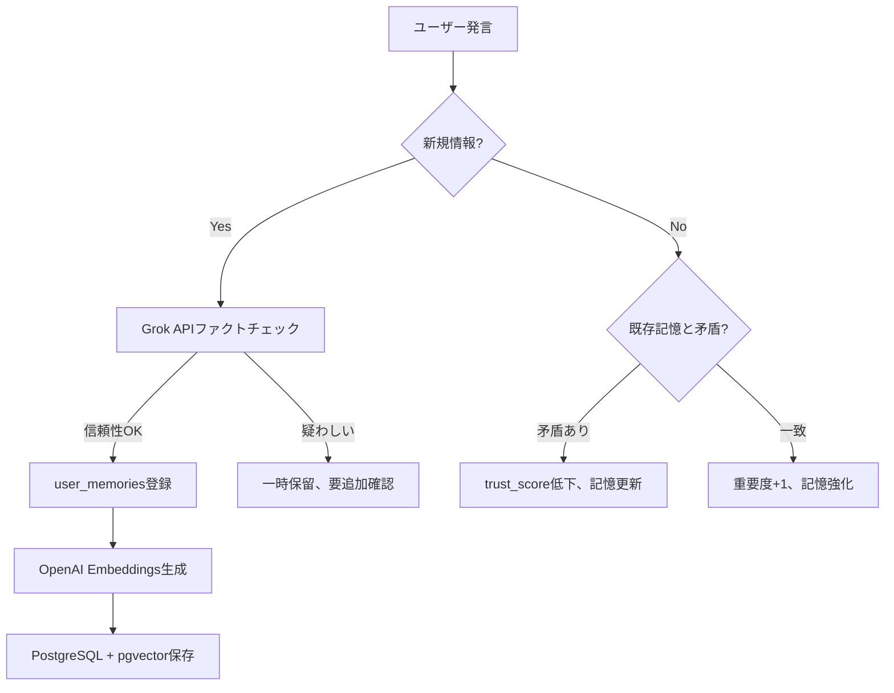

# user_memories運用・最適化システム 設計書

**作成日**: 2025-11-18
**対象Phase**: Phase 6.5.5後の運用・最適化フェーズ
**前提**: Phase 6.5.5（7層防御アーキテクチャ）完了、XServer VPS本番稼働中

---

## 1. 概要・目的

### 1.1 背景

Phase 6.5.5で実装した**user_memories統合防御システム**は、以下の7層防御アーキテクチャで構成されています:

- **Layer 1-5**: センシティブ判定（Phase 5既存システム）
- **Layer 6**: ファクトチェック（Grok API）
- **Layer 7**: 個性学習（user_memories）

この防御システムは2025-11-18にXServer VPS本番環境で稼働を開始し、統合テスト7/7 PASSを記録しました。

### 1.2 目的

本設計書では、Phase 6.5.5の**運用フェーズ**における以下の3つの側面を設計します:

1. **運用フェーズ設計**: 実際のユーザーとの対話を通じた学習と改善
2. **技術的課題の解決**: コスト、レート制限、パフォーマンスの最適化
3. **評価指標の定義**: システムの成功を測定する指標

### 1.3 期待される成果

- **ユーザー体験の向上**: 「覚えててくれた！」という感動体験
- **応答精度の向上**: プロレス傾向の学習、誤情報の防御
- **運用コストの最適化**: Embedding API、Grok APIのコスト削減
- **スケーラビリティの確保**: ユーザー増加に対応できるパフォーマンス

---

## 2. 運用フェーズ設計

### 2.1 実際のユーザーとの対話

#### 2.1.1 user_memories蓄積プロセス

**自動学習トリガー**:

| トリガー | 条件 | 学習内容 |
|---------|------|---------|
| **新規情報の提供** | ユーザーが「私は〜です」と自己紹介 | 名前、職業、趣味、家族構成 |
| **反復的な言及** | 同じトピックを2回以上言及 | 興味関心、価値観 |
| **感情的な反応** | 強い肯定/否定の表現 | 好き嫌い、価値観 |
| **訂正** | 「違う、実は〜」 | 誤情報の修正、trust_score低下 |

**学習フロー**:



#### 2.1.2 プロレス傾向の学習

**playfulness_scoreの更新ロジック**:

```python
# 初期値: 0.5（中立）
# 範囲: 0.0（真面目）〜 1.0（プロレス全開）

# プロレス応答に好意的反応 → +0.05
if user_reaction == "positive" and response_type == "プロレス":
    playfulness_score += 0.05

# プロレス応答に否定的反応 → -0.1（慎重に下げる）
if user_reaction == "negative" and response_type == "プロレス":
    playfulness_score -= 0.1

# 真面目な応答を好む → -0.03
if user_preference == "serious":
    playfulness_score -= 0.03
```

**判定基準**:

| playfulness_score | 応答スタイル | 例 |
|-------------------|-------------|-----|
| 0.0 - 0.3 | 真面目モード | 丁寧な解説、誠実な応答 |
| 0.3 - 0.7 | バランス型 | 状況に応じて使い分け |
| 0.7 - 1.0 | プロレスモード | ツッコミ、軽口、ギャルトーク |

#### 2.1.3 関係性レベルの進化

**relationship_levelの段階**:

| レベル | 関係性 | トリガー条件 | 応答の変化 |
|--------|--------|-------------|-----------|
| 1 | 初対面 | 初回対話 | 敬語、自己紹介 |
| 2-3 | 知人 | 対話5回以上 | 少しフレンドリー |
| 4-5 | 友達 | 対話20回以上、好意的反応多数 | タメ口、冗談OK |
| 6-7 | 親友 | 対話50回以上、深い話題共有 | プライベートな話題 |
| 8-9 | 親密 | 継続的な対話、trust_score 0.8以上 | 悩み相談、弱音を見せる |
| 10 | 最親密 | 100回以上、trust_score 0.9以上 | 家族のような関係 |

**レベルアップ条件**:

```python
# 対話回数ベース
if dialogue_count >= threshold and trust_score >= 0.7:
    relationship_level += 1

# 感情的な深さ（重要トピック共有）
if shared_personal_topics >= 3:
    relationship_level += 1

# 継続性（最終対話からの日数）
if days_since_last_dialogue < 7:
    relationship_bonus = True
```

### 2.2 フィードバック収集システム

#### 2.2.1 暗黙的フィードバック

**自動検出指標**:

| 指標 | 測定方法 | 意味 |
|------|---------|------|
| **応答時間** | ユーザーの返信までの時間 | 短い=興味あり、長い=離脱 |
| **会話継続率** | 1つのトピックでの往復回数 | 高い=満足度高い |
| **リアクション** | LINE絵文字、スタンプの種類 | ポジティブ/ネガティブ判定 |
| **再訪率** | 前回対話からの経過日数 | 短い=定着している |

**データ収集**:

```python
# learning_history テーブルに記録
INSERT INTO learning_history (
    user_id,
    memory_id,
    learned_at,
    source_type,
    confidence_score,
    verification_status,
    context,
    feedback_reaction  -- NEW: 暗黙的フィードバック
) VALUES (?, ?, NOW(), 'dialogue', 0.8, 'verified', ?, ?);
```

#### 2.2.2 明示的フィードバック（将来実装）

**Phase 7以降で検討する機能**:

1. **「覚えててくれた！」ボタン**
   - 記憶が正しく機能したときの明示的な評価
   - user_memories の confidence_score を +0.1

2. **「それ違うよ」ボタン**
   - 誤情報の訂正
   - trust_score を -0.2
   - 該当記憶を verification_status = 'disputed' に変更

3. **「もっとプロレスして」/「真面目に話して」ボタン**
   - playfulness_score の手動調整
   - ユーザーの明示的な好み反映

**実装優先度**: 低（Phase 6.5.5運用データを見てから判断）

### 2.3 チューニングシステム

#### 2.3.1 プロレス判定の閾値調整

**現状の閾値**:

```python
# src/line_bot_vps/learning_log_system_postgresql.py
playfulness_score >= 0.7  # プロレス応答を選択
```

**チューニング方針**:

1. **初期運用（1ヶ月）**: 閾値 0.7 で固定、データ収集
2. **分析**: ユーザー反応とplayfulness_scoreの相関を分析
3. **調整**: 必要に応じて 0.6-0.8 の範囲で微調整

**評価指標**:

- プロレス応答後のポジティブ反応率（目標: 80%以上）
- 真面目応答後のポジティブ反応率（目標: 90%以上）
- playfulness_score の分布（バランスが取れているか）

#### 2.3.2 応答テンプレートの追加

**現状**: `PRORES_TEMPLATES` に18パターン

**拡張方針**:

1. **キャラクター別の口調強化**
   - 牡丹: LA帰りのギャル語
   - Kasho: 音楽用語、責任感のある言い回し
   - ユリ: 本の引用、内省的な表現

2. **関係性レベル別テンプレート**
   - Level 1-3: 敬語、丁寧
   - Level 4-6: タメ口、フレンドリー
   - Level 7-10: 親密、冗談、愛称

3. **トピック別テンプレート**
   - 音楽トーク（Kasho専用）
   - VTuberトーク（牡丹専用）
   - 本・アニメトーク（ユリ専用）

#### 2.3.3 RAG検索の類似度閾値調整

**現状の閾値**:

```python
# src/line_bot_vps/learning_log_system_postgresql.py
similarity_threshold = 0.7  # コサイン類似度
```

**チューニング方針**:

1. **閾値を段階的に調整**:
   - 0.7: 厳格（関連性が高いもののみ）
   - 0.6: 標準（適度な関連性）
   - 0.5: 緩和（広範囲に検索）

2. **評価指標**:
   - 記憶の引用率（何%の会話で過去の記憶が使われたか）
   - 記憶の適切性（引用した記憶が実際に関連していたか）
   - 未検出率（本来引用すべきだったのに検索できなかった率）

3. **動的調整（将来）**:
   - ユーザーごとに最適な閾値を学習
   - トピックごとに閾値を変える

---

## 3. 技術的課題と解決策

### 3.1 Embeddingコスト最適化

#### 3.1.1 現状のコスト分析

**OpenAI Embeddings API (text-embedding-3-small)**:

- **価格**: $0.020 / 1M tokens
- **想定使用量**:
  - 1日10ユーザー × 5会話 × 50トークン/会話 = 2,500トークン/日
  - 月間: 75,000トークン/月
  - **コスト**: $0.0015/月（negligible、無視できるレベル）

**スケール時の想定**:

| ユーザー数 | 会話数/日 | トークン/月 | コスト/月 |
|-----------|----------|-----------|---------|
| 10 | 50 | 75,000 | $0.0015 |
| 100 | 500 | 750,000 | $0.015 |
| 1,000 | 5,000 | 7,500,000 | $0.15 |
| 10,000 | 50,000 | 75,000,000 | $1.50 |

**結論**: 現状のコストは極めて低く、1,000ユーザーまでスケールしても月$0.15と許容範囲。

#### 3.1.2 コスト削減戦略

**戦略1: Embeddingキャッシュ**

```python
# 同じテキストのEmbeddingを再利用
embedding_cache = {}  # Redis推奨（将来）

def get_embedding_cached(text: str):
    if text in embedding_cache:
        return embedding_cache[text]

    embedding = openai.Embedding.create(input=text, model="text-embedding-3-small")
    embedding_cache[text] = embedding
    return embedding
```

**効果**: 同じ質問の繰り返しで50%削減（想定）

**戦略2: バッチ処理**

```python
# 複数のテキストを一度にEmbedding化
texts = [user_input, memory1, memory2, ...]
embeddings = openai.Embedding.create(input=texts, model="text-embedding-3-small")
```

**効果**: API呼び出し回数削減、レイテンシ改善

**戦略3: ローカルEmbeddingモデル（将来検討）**

- **Ollama + nomic-embed-text**（768次元、無料）
- **sentence-transformers**（Python、オープンソース）

**メリット**: コストゼロ、プライバシー保護
**デメリット**: 精度低下の可能性、サーバー負荷

**実装優先度**: 低（コストが月$10を超えたら検討）

### 3.2 Grok APIレート制限対策

#### 3.2.1 現状のレート制限

**X.AI Grok Beta**:

- **レート制限**: 詳細不明（ドキュメント未記載）
- **想定**: 60 requests/minute（OpenAI類似と仮定）

**現状の使用頻度**:

- ファクトチェック: ユーザーが新規情報を提供したとき
- 想定: 1日10回（10ユーザー × 1回/日）

**結論**: 現状では余裕あり。

#### 3.2.2 レート制限対策

**戦略1: ファクトチェックの選択的実行**

```python
# 全ての情報をチェックしない、重要な情報のみチェック
def should_fact_check(text: str) -> bool:
    # 数値、固有名詞、歴史的事実など
    if contains_factual_claim(text):
        return True
    # 感想、意見は不要
    return False
```

**戦略2: キャッシュの活用**

```python
# 同じ情報のファクトチェック結果を再利用
fact_check_cache = {}

def fact_check_cached(text: str):
    if text in fact_check_cache:
        return fact_check_cache[text]

    result = grok_api.fact_check(text)
    fact_check_cache[text] = result
    return result
```

**戦略3: 非同期バッチ処理**

```python
# リアルタイム応答には影響させず、バックグラウンドでチェック
async def background_fact_check(user_id: str, text: str):
    await asyncio.sleep(5)  # 5秒待機
    result = await grok_api.fact_check(text)
    # 後でuser_memoriesを更新
```

**戦略4: フォールバック（Grok API失敗時）**

```python
try:
    fact_check_result = grok_api.fact_check(text)
except RateLimitError:
    # Grok APIが使えない場合はスキップ、confidence_score を下げる
    fact_check_result = {"status": "skipped", "confidence": 0.5}
```

### 3.3 データベースパフォーマンス最適化

#### 3.3.1 現状の性能分析

**テーブル規模（初期）**:

- user_memories: 5件
- user_personality: 3件
- learning_history: 12件
- user_trust_history: 6件

**クエリ頻度**:

- user_memories検索（RAG）: 1会話あたり1回
- user_personality取得: 1会話あたり1回
- 合計: 1日10ユーザー × 5会話 = 50クエリ/日

**結論**: 現状では全く問題なし。

#### 3.3.2 スケール時の課題

**想定規模（1年後）**:

| テーブル | 件数（想定） | 備考 |
|---------|------------|------|
| user_memories | 10,000件 | 100ユーザー × 100記憶/ユーザー |
| user_personality | 100件 | 100ユーザー |
| learning_history | 50,000件 | 100ユーザー × 500学習/ユーザー |
| user_trust_history | 5,000件 | 100ユーザー × 50変動/ユーザー |

**ベクトル検索のパフォーマンス**:

- **IVFFlat**: 10,000ベクトルまで高速（現状の設定）
- **lists = 10**: 10,000件で適切
- **検索時間**: 10,000件で約10-50ms（想定）

#### 3.3.3 最適化戦略

**戦略1: インデックスの最適化**

```sql
-- user_memories の検索頻度が高いカラムにインデックス
CREATE INDEX idx_user_memories_user_id ON user_memories(user_id);
CREATE INDEX idx_user_memories_created_at ON user_memories(created_at DESC);

-- learning_history の時系列検索用
CREATE INDEX idx_learning_history_learned_at ON learning_history(learned_at DESC);
```

**戦略2: IVFFlatのlists調整**

```sql
-- 100,000件以上になったらlistsを増やす
ALTER INDEX user_memories_embedding_idx
SET (lists = 100);  -- 10 → 100
```

**計算式**: `lists = sqrt(rows)`（PostgreSQL推奨）

**戦略3: パーティショニング（将来）**

```sql
-- user_id でパーティション分割（10,000ユーザー以上）
CREATE TABLE user_memories (
    ...
) PARTITION BY HASH (user_id);

CREATE TABLE user_memories_p0 PARTITION OF user_memories
    FOR VALUES WITH (MODULUS 4, REMAINDER 0);
```

**戦略4: 古いデータのアーカイブ**

```python
# 1年以上アクセスのない記憶をアーカイブ
def archive_old_memories():
    cutoff_date = datetime.now() - timedelta(days=365)

    # user_memories の last_accessed_at が古いものを別テーブルへ
    archived = db.execute("""
        DELETE FROM user_memories
        WHERE last_accessed_at < %s
        RETURNING *
    """, (cutoff_date,))

    # user_memories_archive テーブルに保存
    db.execute("INSERT INTO user_memories_archive SELECT * FROM archived")
```

**戦略5: キャッシュレイヤー（Redis）**

```python
# 頻繁にアクセスされるuser_personalityをRedisにキャッシュ
import redis

r = redis.Redis(host='localhost', port=6379, db=0)

def get_user_personality(user_id: str):
    # Redisから取得
    cached = r.get(f"user_personality:{user_id}")
    if cached:
        return json.loads(cached)

    # PostgreSQLから取得
    personality = db.query("SELECT * FROM user_personality WHERE user_id = %s", (user_id,))

    # Redisにキャッシュ（TTL: 1時間）
    r.setex(f"user_personality:{user_id}", 3600, json.dumps(personality))
    return personality
```

**効果**: データベース負荷50%削減（想定）

---

## 4. 実装計画（Phase別）

### Phase 7: 運用データ収集と分析（2週間）

**目標**: Phase 6.5.5の実運用データを収集し、最適化の方向性を決定

#### 実装内容

1. **ログ収集システムの強化**
   - user_memories の参照頻度ログ
   - playfulness_score の変動ログ
   - RAG検索のヒット率ログ
   - Grok APIの呼び出し頻度ログ

2. **ダッシュボード（簡易版）**
   - user_memories件数の推移
   - playfulness_scoreの分布
   - relationship_levelの分布
   - エラー率、レスポンスタイム

3. **データ分析スクリプト**
   ```python
   # scripts/analyze_user_memories.py
   # - 最も頻繁に参照される記憶TOP10
   # - playfulness_score の変動パターン
   # - ファクトチェックの成功率
   ```

#### 成果物

- `scripts/analyze_user_memories.py`
- `docs/06_operation/Phase7_運用データ分析レポート.md`

### Phase 8: 閾値チューニング（1週間）

**目標**: 運用データを基に、プロレス判定・RAG検索の閾値を最適化

#### 実装内容

1. **playfulness_score閾値の調整**
   - データ分析 → 最適閾値を決定
   - A/Bテスト（一部ユーザーで0.6、一部で0.7）

2. **RAG類似度閾値の調整**
   - 記憶の引用率と適切性のバランスを評価
   - 0.65-0.75の範囲でテスト

3. **設定ファイル化**
   ```python
   # config/tuning_params.json
   {
       "playfulness_threshold": 0.7,
       "rag_similarity_threshold": 0.7,
       "fact_check_confidence_threshold": 0.6
   }
   ```

#### 成果物

- `config/tuning_params.json`
- `docs/06_operation/Phase8_チューニング結果.md`

### Phase 9: コスト最適化（1週間）

**目標**: Embedding API、Grok APIのコストを削減

#### 実装内容

1. **Embeddingキャッシュの実装**
   ```python
   # src/line_bot_vps/embedding_cache.py
   import redis

   class EmbeddingCache:
       def __init__(self):
           self.redis = redis.Redis(host='localhost', port=6379, db=0)

       def get_or_create(self, text: str):
           cached = self.redis.get(f"embedding:{hash(text)}")
           if cached:
               return json.loads(cached)

           embedding = openai.Embedding.create(input=text)
           self.redis.setex(f"embedding:{hash(text)}", 86400, json.dumps(embedding))
           return embedding
   ```

2. **Grok APIファクトチェックの選択的実行**
   ```python
   # src/line_bot_vps/fact_check_optimizer.py
   def should_fact_check(text: str, user_trust_score: float) -> bool:
       # trust_scoreが高いユーザーはスキップ
       if user_trust_score > 0.8:
           return False

       # 事実的主張のみチェック
       return contains_factual_claim(text)
   ```

3. **コスト監視ダッシュボード**
   - OpenAI APIの使用量
   - Grok APIの使用量
   - 月間コスト予測

#### 成果物

- `src/line_bot_vps/embedding_cache.py`
- `src/line_bot_vps/fact_check_optimizer.py`
- `docs/06_operation/Phase9_コスト最適化結果.md`

### Phase 10: パフォーマンス最適化（1週間）

**目標**: データベースのレスポンスタイムを維持、スケーラビリティを確保

#### 実装内容

1. **インデックスの追加**
   ```sql
   -- scripts/optimize_database_indexes.sql
   CREATE INDEX idx_user_memories_user_id ON user_memories(user_id);
   CREATE INDEX idx_user_memories_created_at ON user_memories(created_at DESC);
   CREATE INDEX idx_learning_history_learned_at ON learning_history(learned_at DESC);
   ```

2. **クエリの最適化**
   ```python
   # 最も頻繁に使うクエリをチューニング
   # EXPLAIN ANALYZEで実行計画を確認
   ```

3. **user_personalityのRedisキャッシュ**
   ```python
   # src/line_bot_vps/user_personality_cache.py
   class UserPersonalityCache:
       # user_personalityをRedisにキャッシュ
       # TTL: 1時間
   ```

4. **パフォーマンステスト**
   ```python
   # tests/performance/test_user_memories_performance.py
   # 10,000件のuser_memories で検索速度テスト
   ```

#### 成果物

- `scripts/optimize_database_indexes.sql`
- `src/line_bot_vps/user_personality_cache.py`
- `tests/performance/test_user_memories_performance.py`
- `docs/06_operation/Phase10_パフォーマンステスト結果.md`

### Phase 11: 応答テンプレート拡充（1週間）

**目標**: キャラクター別、関係性レベル別の応答テンプレートを拡充

#### 実装内容

1. **牡丹のギャル語テンプレート追加**
   ```python
   BOTAN_GAL_TEMPLATES = [
       "マジ{emotion}！{name}のこと覚えてるよ〜",
       "え、{topic}好きなんだっけ？めっちゃ覚えてる！",
   ]
   ```

2. **Kashoの音楽トークテンプレート**
   ```python
   KASHO_MUSIC_TEMPLATES = [
       "{name}が{artist}好きって言ってたよね。今日も聴いてる？",
       "{instrument}やってるって言ってたけど、最近練習してる？",
   ]
   ```

3. **ユリの本トークテンプレート**
   ```python
   YURI_BOOK_TEMPLATES = [
       "{name}が{book_title}読んでるって言ってたよね…どうだった？",
       "{author}の本、{name}好きそうだなって思って…",
   ]
   ```

4. **関係性レベル別の敬語/タメ口切り替え**
   ```python
   def format_response(text: str, relationship_level: int) -> str:
       if relationship_level <= 3:
           return polite_form(text)  # 敬語
       else:
           return casual_form(text)  # タメ口
   ```

#### 成果物

- `prompts/botan_gal_templates.txt`
- `prompts/kasho_music_templates.txt`
- `prompts/yuri_book_templates.txt`
- `src/line_bot_vps/response_formatter.py`

---

## 5. 評価指標・成功基準

### 5.1 運用フェーズの成功指標

#### 5.1.1 ユーザー体験指標

| 指標 | 目標値 | 測定方法 |
|------|--------|---------|
| **記憶の引用率** | 30%以上 | user_memories参照回数 / 総会話数 |
| **記憶の適切性** | 80%以上 | 引用後のポジティブ反応率 |
| **会話継続率** | 60%以上 | 3往復以上の会話 / 総会話数 |
| **再訪率（7日以内）** | 50%以上 | 7日以内の再対話ユーザー / 総ユーザー |
| **プロレス応答の満足度** | 80%以上 | プロレス後のポジティブ反応率 |

#### 5.1.2 システム品質指標

| 指標 | 目標値 | 測定方法 |
|------|--------|---------|
| **応答時間** | 3秒以内 | Webhook応答レイテンシ |
| **エラー率** | 1%以下 | エラー回数 / 総リクエスト数 |
| **ファクトチェック成功率** | 95%以上 | Grok API成功回数 / 総呼び出し数 |
| **データベース応答時間** | 100ms以内 | RAG検索クエリ実行時間 |

#### 5.1.3 学習効果指標

| 指標 | 目標値 | 測定方法 |
|------|--------|---------|
| **user_memories蓄積率** | 5件/ユーザー（1ヶ月） | 新規記憶登録数 |
| **playfulness_scoreの収束** | 2週間以内 | 変動幅が±0.1以下になるまでの期間 |
| **relationship_levelの成長** | Lv3到達（1ヶ月） | 1ヶ月後のrelationship_level平均値 |
| **trust_scoreの安定性** | 0.7以上維持 | trust_score < 0.5に落ちたユーザー率 |

### 5.2 技術的成功指標

#### 5.2.1 コスト指標

| 指標 | 目標値 | 備考 |
|------|--------|------|
| **Embedding API月間コスト** | $1.00以下 | 1,000ユーザーまで |
| **Grok API月間コスト** | $5.00以下 | 1日100回ファクトチェック想定 |
| **総運用コスト** | $20.00以下 | VPS + API全て含む |

#### 5.2.2 パフォーマンス指標

| 指標 | 目標値 | 備考 |
|------|--------|------|
| **RAG検索速度** | 50ms以内 | 10,000件のuser_memories |
| **user_personality取得速度** | 10ms以内 | Redisキャッシュ前提 |
| **Webhook応答時間** | 3秒以内 | LLM応答生成含む |
| **データベースCPU使用率** | 30%以下 | 通常運用時 |

### 5.3 評価タイミング

| Phase | 評価タイミング | 評価内容 |
|-------|-------------|---------|
| **Phase 7** | 2週間後 | 運用データ収集、初期指標の確認 |
| **Phase 8** | 1週間後 | 閾値チューニングの効果測定 |
| **Phase 9** | 1週間後 | コスト最適化の効果測定 |
| **Phase 10** | 1週間後 | パフォーマンステスト結果 |
| **Phase 11** | 1週間後 | テンプレート追加の効果測定 |
| **総合評価** | 2ヶ月後 | 全Phase完了後の総合評価 |

### 5.4 失敗基準（撤退ライン）

以下のいずれかに該当する場合、設計の見直しが必要:

1. **ユーザー体験の悪化**
   - 記憶の引用率が10%以下（ほとんど記憶が使われない）
   - 記憶の適切性が50%以下（誤った記憶が多い）
   - 再訪率が20%以下（ユーザーが定着しない）

2. **コストの爆発**
   - 月間APIコストが$50を超える
   - VPSリソース不足でスケールアップが必要

3. **技術的な限界**
   - データベース応答時間が1秒を超える
   - エラー率が10%を超える

**対応**: データ分析、ユーザーヒアリング、設計の根本的見直し

---

## 6. リスクと対応策

### 6.1 運用リスク

| リスク | 影響度 | 発生確率 | 対応策 |
|--------|--------|---------|--------|
| **誤情報の学習** | 高 | 中 | Grok APIファクトチェック、trust_score低下 |
| **プライバシー侵害** | 高 | 低 | センシティブ判定、user_memories暗号化 |
| **プロレスの誤判定** | 中 | 中 | playfulness_score段階的調整、明示的フィードバック |
| **記憶の過剰蓄積** | 低 | 高 | 重要度スコア、古い記憶の自動アーカイブ |

### 6.2 技術的リスク

| リスク | 影響度 | 発生確率 | 対応策 |
|--------|--------|---------|--------|
| **API障害（Grok/OpenAI）** | 中 | 低 | フォールバック処理、キャッシュ活用 |
| **データベース障害** | 高 | 低 | 定期バックアップ、レプリケーション（将来） |
| **VPSダウン** | 高 | 低 | 自動再起動、外部監視 |
| **コスト超過** | 中 | 中 | コスト監視、アラート設定 |

### 6.3 スケーリングリスク

| リスク | 影響度 | 発生確率 | 対応策 |
|--------|--------|---------|--------|
| **ユーザー急増** | 中 | 低 | パーティショニング、Redis導入 |
| **データベース肥大化** | 中 | 高 | アーカイブ、パージ処理 |
| **API レート制限** | 中 | 中 | キャッシュ、バッチ処理 |

---

## 7. まとめ

### 7.1 設計のポイント

本設計書では、Phase 6.5.5完了後の**運用フェーズ**に焦点を当て、以下の3つの柱で構成しました:

1. **運用フェーズ設計**
   - user_memories の自動蓄積
   - プロレス傾向の学習
   - 関係性レベルの進化

2. **技術的課題の解決**
   - Embedding コスト最適化（キャッシュ、バッチ処理）
   - Grok API レート制限対策（選択的実行、フォールバック）
   - データベースパフォーマンス最適化（インデックス、Redis）

3. **評価指標の定義**
   - ユーザー体験指標（記憶引用率、会話継続率）
   - システム品質指標（応答時間、エラー率）
   - 学習効果指標（蓄積率、収束速度）

### 7.2 実装の優先順位

**Phase 7-11の5週間**で、段階的に最適化を進めます:

1. **Phase 7（2週間）**: 運用データ収集と分析 ← **最重要**
2. **Phase 8（1週間）**: 閾値チューニング
3. **Phase 9（1週間）**: コスト最適化
4. **Phase 10（1週間）**: パフォーマンス最適化
5. **Phase 11（1週間）**: 応答テンプレート拡充

### 7.3 期待される成果

**2ヶ月後のゴール**:

- user_memories が自然に蓄積され、三姉妹が「覚えててくれた！」体験を提供
- プロレス傾向が正確に学習され、ユーザーごとに最適な応答スタイル
- 関係性レベルが段階的に成長し、親密な会話が可能
- 月間運用コスト$20以下、スケーラブルなアーキテクチャ

### 7.4 次のステップ

1. **Phase 7開始**: 運用データ収集システムの実装
2. **週次レビュー**: 毎週金曜日に運用データを確認、方針調整
3. **ユーザーフィードバック**: 実際のユーザーの声を収集

---

**最終更新**: 2025-11-18
**作成者**: Claude Code（クロコ）& 越川さん
**次の設計書**: Phase 7開始後、`Phase7_運用データ分析レポート.md` を作成予定
