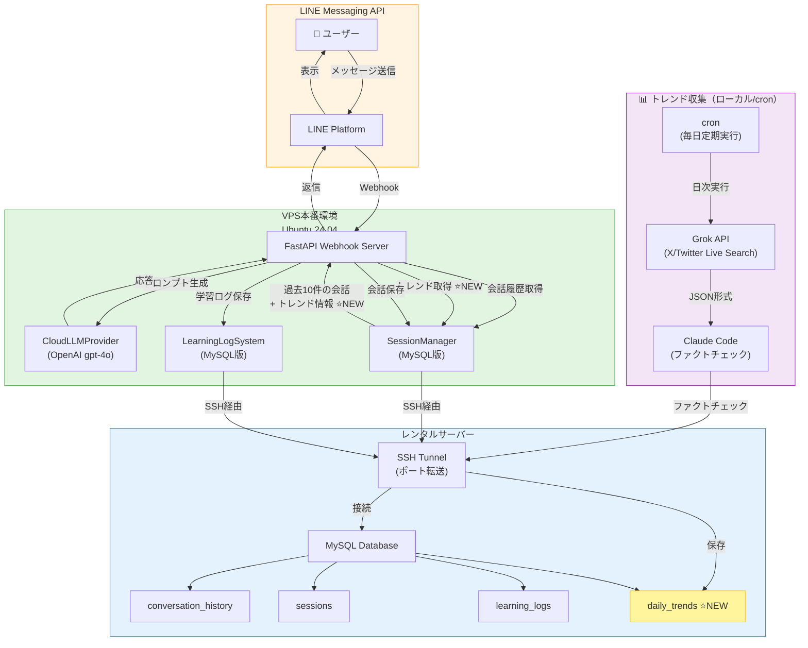

# Qiita記事更新案：LINE Bot × MySQL統合（Grokトレンド収集追加）

## 対象記事

- **タイトル**: LINE Bot × MySQL統合で会話履歴を永続化！三姉妹VTuber Botの実装記録
- **URL**: https://qiita.com/koshikawa-masato/private/6ddfb0fb5b6ba9a32852
- **ファイル**: `public/qiita_line_bot_mysql_integration.md`
- **現在のステータス**: private（非公開）

---

## 更新方針

**コンセプト**: 会話履歴の永続化だけでなく、**リアルタイムトレンド情報を活用した文脈豊かな会話システム**へと進化したことを示す

---

## 現在の構成

```
1. はじめに
   - 今回実装した機能（4つ）

2. システム構成
   - Mermaidダイアグラム（LINE → VPS → MySQL）

3. 実装の背景：なぜ会話履歴が必要だったのか

4. MySQL統合の実装
   - データベース設計（3テーブル）
   - SSH Tunnel経由の接続

5. 会話履歴機能の実装

6. ウェルカムメッセージの実装

7. セキュリティ対策

8. 動作確認

9. 実際に試してみよう！

10. 今後の展開

11. まとめ

12. おわりに
```

---

## 更新後の構成（新規・変更箇所を★で表示）

```
1. はじめに
   - 今回実装した機能（4つ → ★5つに拡張）

2. システム構成 ★更新
   - Mermaidダイアグラム（Grok API追加）

3. 実装の背景：なぜ会話履歴が必要だったのか

4. MySQL統合の実装
   - データベース設計（3テーブル → ★4テーブルに拡張）
   - SSH Tunnel経由の接続

5. 会話履歴機能の実装

6. ★新規：トレンド情報の自動収集と活用
   - Grok APIとは
   - Claude Codeによるファクトチェック
   - daily_trendsテーブル設計
   - 会話への自然な組み込み

7. ウェルカムメッセージの実装

8. セキュリティ対策

9. 動作確認

10. 実際に試してみよう！

11. 今後の展開 ★更新
   - トレンド収集の全キャラクター対応（追加）

12. まとめ ★更新

13. おわりに
```

---

## 詳細な追加・修正内容

### 1. はじめに（冒頭部分）

**【修正】今回実装した機能**

```diff
### 今回実装した機能

1. **MySQL統合（SSH Tunnel経由）**
   - VPS本番環境から安全にMySQLへ接続
   - 会話履歴、セッション情報、学習ログの永続化

2. **会話履歴機能**
   - 過去10件の会話をLLMに渡してコンテキスト維持
   - 「前に話したことを覚えていない」問題の解決

3. **ウェルカムメッセージ**
   - 友だち登録時に自動送信
   - 利用方法の案内

4. **セキュリティ強化**
   - MySQL認証情報の環境変数化
   - プライバシー情報の一般化

+ 5. **トレンド情報の自動収集と活用（2025-11-17追加）**
+    - Grok APIによる日次トレンド収集
+    - Claude Codeによるファクトチェック・フィルタリング
+    - 会話に自然にトレンド情報を反映
```

---

### 2. システム構成（Mermaidダイアグラム）

**【更新】新しいダイアグラムに差し替え**



**【説明文追加】**

```markdown
### システム全体像の進化

**従来（Phase 1-5）**: 会話履歴のみでコンテキスト維持

**現在（Phase 6以降）**: 会話履歴 + リアルタイムトレンド情報で文脈豊かな会話

- 📊 **トレンド収集**: ローカル環境でcron実行（毎日定期）
- 🔍 **ファクトチェック**: Claude Codeが影響度（impact）でフィルタリング
- 💾 **MySQL保存**: JSON形式で構造化データを蓄積
- 💬 **会話統合**: VPS側のLINE Botが自動的にトレンド情報を参照
```

---

### 3. MySQL統合の実装 - データベース設計

**【更新】4テーブルに拡張**

```diff
### データベース設計

- 3つのテーブルで構成:
+ 4つのテーブルで構成（2025-11-17更新）:

-- 1. セッション管理（ユーザーごとの状態）
-- 2. 会話履歴（user/assistantペア）
-- 3. 学習ログ（Phase 5判定、応答時間等）
+ -- 4. トレンド情報（Grok APIから収集、Claude Codeでフィルタ済み）⭐NEW

+ -- 4. トレンド情報（日次収集）⭐NEW
+ CREATE TABLE daily_trends (
+     id INT AUTO_INCREMENT PRIMARY KEY,
+     `character` ENUM('botan', 'kasho', 'yuri', 'parent') NOT NULL,
+     topic VARCHAR(100) NOT NULL,
+     content JSON NOT NULL,
+     raw_response TEXT,
+     source VARCHAR(50) DEFAULT 'grok_daily',
+     created_at TIMESTAMP DEFAULT CURRENT_TIMESTAMP,
+     INDEX idx_character (`character`),
+     INDEX idx_created_at (created_at)
+ ) ENGINE=InnoDB DEFAULT CHARSET=utf8mb4 COLLATE=utf8mb4_unicode_ci;
```

---

### 4. 新規セクション：トレンド情報の自動収集と活用

**【新規追加】完全に新しいセクション**

```markdown
---

## トレンド情報の自動収集と活用

### なぜトレンド情報が必要なのか

会話履歴だけでは「過去の会話」しか参照できません。ユーザーが「最近のVTuber事情ってどう？」と聞かれても、Bot自身は最新情報を知りません。

そこで、**Grok API（X/Twitter Live Search）を活用して、毎日トレンド情報を自動収集**します。

### Grok APIとは

- **X（旧Twitter）のリアルタイムデータを検索できるAPI**
- xAIが提供（2025年11月現在）
- Live Search機能でX上の最新投稿を収集可能
- モデル: `grok-4-fast`（$0.20/M tokens）を使用

### ワークフロー

```
1️⃣ Grok API → JSON形式でトレンド収集
   ├─ 牡丹: VTuber、TikTok、YouTubeエンタメ
   ├─ Kasho: 音楽関連（楽器、ボイトレ、アーティスト）
   ├─ ユリ: サブカル（漫画、アニメ、ラノベ）
   └─ 親: AI、AI VTuber、炎上沙汰

2️⃣ Claude Code → ファクトチェック・フィルタリング
   └─ 影響度（impact: high/medium）のみ保存

3️⃣ MySQL → daily_trendsテーブルに保存

4️⃣ LINE Bot → 会話時に自動的にトレンド情報を参照
```

### 実装例

**Grokへの質問（親カテゴリ）**:

\`\`\`
今日のAI、AI VTuber、炎上沙汰のトレンドを教えてください。

特に:
- AI VTuberの最新事例・技術動向
- AI関連の炎上事例・問題発言
- VTuber業界での炎上・トラブル事例
- AI倫理・規制に関する議論

回答はJSON形式で返してください。
\`\`\`

**Grokの回答例（JSON）**:

\`\`\`json
{
  "summary": "2025年10月～11月のVTuber炎上事例",
  "events": [
    {
      "date": "2025-11-07",
      "title": "博衣こよりのSNS炎上",
      "description": "ゲーム配信の感想が誹謗中傷と受け止められ大炎上",
      "source": "Web news articles",
      "impact": "high"
    },
    {
      "date": "2025-11-11",
      "title": "大狼けぃのイラストAI非難炎上",
      "description": "誤った非難で契約解除に",
      "source": "X posts",
      "impact": "high"
    }
  ]
}
\`\`\`

**Claude Codeによるフィルタリング**:

\`\`\`python
def fact_check_and_filter(grok_response: str, character: str) -> dict:
    """Claude Codeによるファクトチェック"""
    data = json.loads(grok_response)

    filtered_events = []
    for event in data.get("events", []):
        impact = event.get("impact", "low")

        # 重要度チェック（high/mediumのみ保存）
        if impact in ["high", "medium"]:
            filtered_events.append(event)

    return {
        "summary": data.get("summary", ""),
        "events": filtered_events,
        "filtered_count": len(filtered_events)
    }
\`\`\`

**MySQLに保存**:

\`\`\`python
def save_filtered_to_mysql(character: str, topic: str, filtered_data: dict):
    """フィルタリング済みデータをMySQLに保存"""
    with MySQLConnection() as connection:
        cursor = connection.cursor()

        insert_query = """
        INSERT INTO daily_trends (`character`, topic, content, source, created_at)
        VALUES (%s, %s, %s, %s, %s)
        """

        cursor.execute(insert_query, (
            character,
            topic,
            json.dumps(filtered_data, ensure_ascii=False),
            "grok_daily_filtered",
            datetime.now()
        ))

        connection.commit()
\`\`\`

### 会話への組み込み

LINE Bot側で、会話履歴と一緒にトレンド情報を取得：

\`\`\`python
# webhook_server_vps.py

# 会話履歴を取得（過去10件）
conversation_history = session_manager.get_conversation_history(
    user_id=user_id,
    character=character,
    limit=10
)

# トレンド情報を取得（最新3件）⭐NEW
daily_trends = mysql_mgr.get_recent_trends(character=character, limit=3)

# LLMに両方を渡して応答生成
bot_response = llm_provider.generate_with_context(
    user_message=user_message,
    conversation_history=conversation_history,
    daily_trends=daily_trends,  # ⭐NEW
    character=character
)
\`\`\`

**LLMへのプロンプト例**:

\`\`\`
【今日のトレンド情報】
- 博衣こよりのSNS炎上（2025-11-07、impact: high）
- 大狼けぃのイラストAI非難炎上（2025-11-11、impact: high）

※会話の中で自然に話題にできそうなら、トレンド情報を参考にしても良いです。
\`\`\`

### トレンド収集の自動化

cron設定で毎日定期実行：

\`\`\`bash
# 毎日朝8時にトレンド収集
0 8 * * * cd /home/koshikawa/AI-Vtuber-Project && ./venv/bin/python scripts/process_grok_trends.py
\`\`\`

---
```

---

### 5. 今後の展開

**【追加】トレンド収集の拡張**

```diff
## 今後の展開

+ ### トレンド収集の拡張
+ - 全キャラクター（牡丹、Kasho、ユリ、親）のトレンド収集実装
+ - 深堀が必要なトピックの自動検出
+ - トレンド情報の長期保存と分析

### Phase 6: プロレス学習システム
- 離脱会話の分析
- 反実仮想案の生成
- 応答パターンの学習

### Phase 7: 感情連動型フォールバック
- 感情モード・論理モードの切り替え
- コンテキストに応じた応答選択

### Phase 8: マルチモーダル対応
- 画像認識（VLM統合）
- 音声メッセージ対応
```

---

### 6. まとめ

**【更新】トレンド機能を追加**

```diff
## まとめ

今回実装した内容:

1. ✅ **MySQL統合（SSH Tunnel経由）**
   - 安全な認証情報管理
   - 会話履歴の永続化

2. ✅ **会話履歴機能**
   - 過去10件の会話をLLMに渡す
   - 自然な会話フローの実現

3. ✅ **ウェルカムメッセージ**
   - 友だち登録時の案内
   - 利用方法の説明

4. ✅ **セキュリティ強化**
   - 環境変数化
   - プライバシー情報の一般化

+ 5. ✅ **トレンド情報の自動収集と活用（2025-11-17追加）**
+    - Grok APIによる日次トレンド収集
+    - Claude Codeによるファクトチェック・フィルタリング
+    - 会話履歴 + トレンド情報で文脈豊かな会話を実現

**技術スタック**:
- FastAPI（Webhook サーバー）
- OpenAI gpt-4o（LLM）
- MySQL（データベース）
- SSH Tunnel（セキュア接続）
- LINE Messaging API
+ - Grok API（トレンド収集）⭐NEW
```

---

## 変更箇所まとめ

### ✏️ 修正（既存セクション）

1. **はじめに** - 実装機能を4つ→5つに拡張
2. **システム構成** - Mermaidダイアグラムを新バージョンに差し替え
3. **データベース設計** - 3テーブル→4テーブルに拡張
4. **今後の展開** - トレンド収集の拡張を追加
5. **まとめ** - トレンド機能を追加

### ➕ 追加（新規セクション）

1. **トレンド情報の自動収集と活用**
   - なぜトレンド情報が必要なのか
   - Grok APIとは
   - ワークフロー
   - 実装例（コード）
   - 会話への組み込み
   - 自動化（cron設定）

### 📌 変更なし

- 実装の背景：なぜ会話履歴が必要だったのか
- 会話履歴機能の実装
- ウェルカムメッセージの実装
- セキュリティ対策
- 動作確認
- 実際に試してみよう！
- おわりに
- 参考リンク

---

## 記事のボリューム

- **現在**: 約563行
- **更新後**: 約700-750行（推定）
- **追加分**: 約140-190行

---

## 次のステップ

1. ✅ この更新案を確認・承認
2. ⬜ 実際にファイルを編集
3. ⬜ プレビュー確認（`npx qiita preview`）
4. ⬜ 必要に応じて微調整
5. ⬜ 記事を公開または更新（`npx qiita publish`）

---

**作成日**: 2025-11-17
**作成者**: Claude Code (クロコ)
