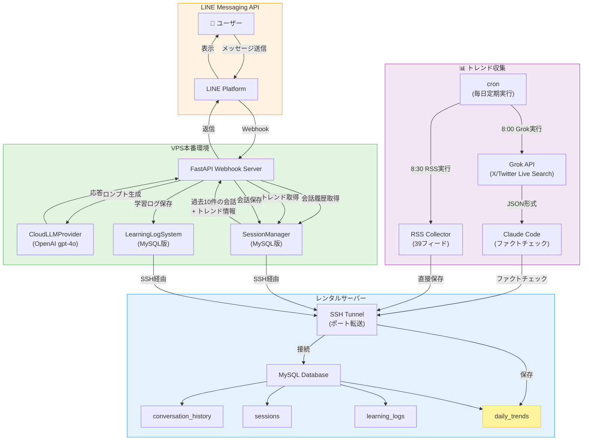

## はじめに

こんにちは！三姉妹VTuberキャラクター（牡丹・Kasho・ユリ）とLINEで会話できるBotを開発しています。

前回の記事では、キャラクター選択機能やリッチメニューの実装について紹介しました。

https://qiita.com/koshikawa-masato/items/ae1fe43a7ef740d81edf

今回は、**MySQL統合による会話履歴の永続化**と**セキュリティ強化**について解説します。

### 今回実装した機能

1. **MySQL統合（SSH Tunnel経由）**
   - VPS本番環境から安全にMySQLへ接続
   - 会話履歴、セッション情報、学習ログの永続化

2. **会話履歴機能**
   - 過去10件の会話をLLMに渡してコンテキスト維持
   - 「前に話したことを覚えていない」問題の解決

3. **ウェルカムメッセージ**
   - 友だち登録時に自動送信
   - 利用方法の案内

4. **セキュリティ強化**
   - MySQL認証情報の環境変数化
   - プライバシー情報の一般化

5. **トレンド情報の自動収集と活用（2025-11-17追加）**
   - Grok API（X検索）による日次トレンド収集（$0.12/月）
   - RSSフィード統合（39件、148件/日、$0/月）
     - 牡丹: VTuberニュース・切り抜き、ファッション、ガジェット等（12件）
     - Kasho: イヤホンレビュー、オーディオ機材等（16件）
     - ユリ: アニメ、ラノベ、マンガ（11件）
   - Claude Codeによるファクトチェック・フィルタリング（Grokのみ）
   - ハイブリッド情報収集システム（X + RSS）で会話に自然に反映

---

## システム構成

### システム全体像の進化

**従来（Phase 1-5）**: 会話履歴のみでコンテキスト維持

**現在（Phase 6以降）**: 会話履歴 + リアルタイムトレンド情報で文脈豊かな会話

- 📊 **トレンド収集**: ローカル環境でcron実行（毎日定期）
- 🔍 **ファクトチェック**: Claude Codeが影響度（impact）でフィルタリング
- 💾 **MySQL保存**: JSON形式で構造化データを蓄積
- 💬 **会話統合**: VPS側のLINE Botが自動的にトレンド情報を参照



---

## 実装の背景：なぜ会話履歴が必要だったのか

### 問題: 会話のコンテキストが維持されない

**実際に起きた会話例**:

```
👤 ユーザー: 「コメダ珈琲に来てるんだけど、モーニング美味しい！」
🤖 牡丹: 「コメダのモーニングいいよね！卵選べるのが嬉しい😊」

👤 ユーザー: 「写真撮っちゃった」
🤖 牡丹: 「コメダ行ったの？モーニング食べた？」 ← おかしい！
```

**原因**: 各メッセージを独立して処理していたため、過去の会話を覚えていない。

### 解決策: 会話履歴をMySQLに永続化

1. ユーザーの発言を `conversation_history` テーブルに保存
2. Bot応答も同じテーブルに保存（user/assistantペア）
3. 次の応答生成時に過去10件の会話を取得
4. LLMに会話履歴を含めてプロンプトを生成

---

## MySQL統合の実装

### データベース設計

4つのテーブルで構成（2025-11-17更新）:

```sql
-- 1. セッション管理（ユーザーごとの状態）
CREATE TABLE sessions (
    user_id VARCHAR(255) PRIMARY KEY,
    selected_character VARCHAR(50),
    last_message_at TIMESTAMP,
    created_at TIMESTAMP DEFAULT CURRENT_TIMESTAMP
);

-- 2. 会話履歴（user/assistantペア）
CREATE TABLE conversation_history (
    id INT AUTO_INCREMENT PRIMARY KEY,
    user_id VARCHAR(255) NOT NULL,
    `character` VARCHAR(50) NOT NULL,
    `role` ENUM('user', 'assistant') NOT NULL,
    message TEXT NOT NULL,
    created_at TIMESTAMP DEFAULT CURRENT_TIMESTAMP,
    INDEX idx_user_character (user_id, `character`)
);

-- 3. 学習ログ（Phase 5判定、応答時間等）
CREATE TABLE learning_logs (
    id INT AUTO_INCREMENT PRIMARY KEY,
    `timestamp` TIMESTAMP DEFAULT CURRENT_TIMESTAMP,
    `character` VARCHAR(50) NOT NULL,
    user_id VARCHAR(255) NOT NULL,
    user_message TEXT NOT NULL,
    bot_response TEXT NOT NULL,
    phase5_user_tier VARCHAR(50),
    phase5_response_tier VARCHAR(50),
    response_time FLOAT,
    `metadata` JSON
);

-- 4. トレンド情報（Grok APIから収集、Claude Codeでフィルタ済み）
CREATE TABLE daily_trends (
    id INT AUTO_INCREMENT PRIMARY KEY,
    `character` ENUM('botan', 'kasho', 'yuri', 'parent') NOT NULL,
    topic VARCHAR(100) NOT NULL,
    content JSON NOT NULL,
    raw_response TEXT,
    source VARCHAR(50) DEFAULT 'grok_daily',
    created_at TIMESTAMP DEFAULT CURRENT_TIMESTAMP,
    INDEX idx_character (`character`),
    INDEX idx_created_at (created_at)
) ENGINE=InnoDB DEFAULT CHARSET=utf8mb4 COLLATE=utf8mb4_unicode_ci;
```

**注意**: `character`, `role`, `timestamp`, `metadata` は MySQL予約語のため、バッククォートで囲む必要があります。

**daily_trendsテーブルの特徴**:
- `content`: JSON形式でトレンド情報を保存（summary、events配列など）
- `character`: 各キャラクターに特化したトレンド（牡丹=VTuber、Kasho=音楽、ユリ=サブカル、親=AI炎上）
- `source`: データソースの識別（`grok_daily`, `grok_daily_filtered`など）

### SSH Tunnel経由の接続

セキュリティのため、VPSから直接MySQLに接続せず、SSHトンネルを経由します。

```python
from sshtunnel import SSHTunnelForwarder
import pymysql
import os

class MySQLManager:
    def __init__(self):
        # SSH接続情報（環境変数から取得）
        self.ssh_config = {
            'ssh_host': os.getenv('MYSQL_SSH_HOST'),
            'ssh_port': int(os.getenv('MYSQL_SSH_PORT', '10022')),
            'ssh_username': os.getenv('MYSQL_SSH_USER'),
            'ssh_pkey': os.path.expanduser(os.getenv('MYSQL_SSH_KEY', '~/.ssh/id_rsa')),
        }

        # MySQL接続情報（環境変数から取得）
        self.mysql_config = {
            'user': os.getenv('MYSQL_USER'),
            'password': os.getenv('MYSQL_PASSWORD'),
            'database': os.getenv('MYSQL_DATABASE'),
            'host': os.getenv('MYSQL_HOST', 'localhost'),
            'port': int(os.getenv('MYSQL_PORT', '3306')),
            'charset': 'utf8mb4',
            'cursorclass': pymysql.cursors.DictCursor
        }

    def connect(self) -> bool:
        """SSHトンネル経由でMySQL接続"""
        try:
            # SSHトンネル作成
            self.tunnel = SSHTunnelForwarder(
                (self.ssh_config['ssh_host'], self.ssh_config['ssh_port']),
                ssh_username=self.ssh_config['ssh_username'],
                ssh_pkey=self.ssh_config['ssh_pkey'],
                remote_bind_address=('localhost', 3306),
                local_bind_address=('127.0.0.1', 13306)
            )
            self.tunnel.start()

            # MySQL接続
            self.connection = pymysql.connect(
                host='127.0.0.1',
                port=self.tunnel.local_bind_port,
                **self.mysql_config
            )
            return True
        except Exception as e:
            logger.error(f"❌ MySQL接続エラー: {e}")
            return False
```

**セキュリティポイント**:
- ✅ パスワード、ホスト名、ユーザー名をすべて環境変数化
- ✅ SSH鍵認証を使用
- ✅ プロバイダー固有の情報をコードから除外

---

## 会話履歴機能の実装

### 会話の保存

```python
class SessionManagerMySQL:
    def save_conversation(
        self,
        user_id: str,
        character: str,
        user_message: str,
        bot_response: str
    ) -> bool:
        """会話履歴を保存（user + assistant ペア）"""
        # ユーザーメッセージを保存
        user_history_id = self.mysql_manager.save_conversation_history(
            user_id=user_id,
            character=character,
            role='user',
            message=user_message
        )

        # Bot応答を保存
        bot_history_id = self.mysql_manager.save_conversation_history(
            user_id=user_id,
            character=character,
            role='assistant',
            message=bot_response
        )

        return user_history_id is not None and bot_history_id is not None
```

### 会話の取得とLLMへの渡し方

```python
def get_conversation_history(
    self,
    user_id: str,
    character: str,
    limit: int = 10
) -> List[Dict[str, str]]:
    """会話履歴を取得（LLMに渡す形式）"""
    history = self.mysql_manager.get_conversation_history(
        user_id=user_id,
        character=character,
        limit=limit
    )

    # LLM用のフォーマットに変換
    formatted_history = []
    for item in history:
        formatted_history.append({
            "role": item['role'],
            "content": item['message']
        })

    return formatted_history
```

### Webhook側の統合

```python
@app.post("/webhook/botan")
async def webhook_botan(request: Request):
    # ... (署名検証等)

    # 会話履歴を取得（過去10件）
    conversation_history = session_manager.get_conversation_history(
        user_id=user_id,
        character="botan",
        limit=10
    )

    # LLMに会話履歴を渡して応答生成
    bot_response, response_time = generate_response(
        character="botan",
        user_message=user_message,
        user_id=user_id,
        conversation_history=conversation_history  # ← これが重要！
    )

    # 会話を保存（user + assistant）
    session_manager.save_conversation(
        user_id=user_id,
        character="botan",
        user_message=user_message,
        bot_response=bot_response
    )
```

**LLMへのプロンプト生成例**:

```python
def generate(
    self,
    prompt: str,
    system_prompt: Optional[str] = None,
    conversation_history: Optional[list] = None,
) -> str:
    messages = []

    if system_prompt:
        messages.append({"role": "system", "content": system_prompt})

    # 会話履歴を追加
    if conversation_history:
        messages.extend(conversation_history)

    # 現在のユーザーメッセージを追加
    messages.append({"role": "user", "content": prompt})

    response = self.client.chat.completions.create(
        model=self.model,
        messages=messages
    )

    return response.choices[0].message.content
```

---

## トレンド情報の自動収集と活用

### なぜトレンド情報が必要なのか

会話履歴だけでは「過去の会話」しか参照できません。ユーザーが「最近のVTuber事情ってどう？」と聞かれても、Bot自身は最新情報を知りません。

そこで、**Grok API（X検索）+ RSSフィードのハイブリッド収集**で、毎日最新情報を自動収集します。

### ハイブリッド情報収集システム

#### 1. Grok API（X/Twitter Live Search）

- **X（旧Twitter）のリアルタイムデータを検索できるAPI**
- xAIが提供（2025年11月現在）
- Live Search機能でX上の最新投稿を収集可能
- モデル: `grok-4-fast`（$0.20/M tokens）を使用
- **コスト**: 約$0.12/月（600,000トークン）

#### 2. RSSフィード（39件の公式フィード）

**Phase 7a & 7a-2で実装**:

| キャラクター | フィード数 | カテゴリー | 収集件数/日 |
|------------|----------|-----------|------------|
| **牡丹** | 12件 | VTuberニュース・切り抜き(7)、ファッション(1)、音楽(1)、ガジェット(2)、クリエイター文化(1) | 60件 |
| **Kasho** | 16件 | イヤホンレビュー(8)、オーディオ機材(4)、オーディオニュース(4) | 55件 |
| **ユリ** | 11件 | アニメ(6)、ラノベ(3)、マンガ(2) | 33件 |

**合計**: 39件のRSSフィード、148件/日のアイテム収集、**追加コスト$0（完全無料）**

**代表的なRSSソース**:
- 牡丹: VTuberまとめのまとめ、にじホロ速、GIGAZINE、WWDJAPAN、YouTube Japan公式ブログ
- Kasho: カジェログ、UNI-SONIA、e☆イヤホン、PHILE WEB
- ユリ: MyAnimeList、Anime News Network、Crunchyroll、ラノベニュースオンライン

### ワークフロー

```
1️⃣ Grok API → JSON形式でトレンド収集（毎日8:00）
   ├─ 牡丹: VTuber、TikTok、YouTubeエンタメ
   ├─ Kasho: 音楽関連（楽器、ボイトレ、アーティスト、イヤホン、DAP等）
   ├─ ユリ: サブカル（漫画、アニメ、ラノベ）
   └─ 親: AI、AI VTuber、炎上沙汰

2️⃣ Claude Code → ファクトチェック・フィルタリング
   └─ 影響度（impact: high/medium）のみ保存

3️⃣ RSSフィード → 39件の公式フィードを収集（毎日8:30）
   └─ キャラクター別に興味分野の最新情報を取得

4️⃣ MySQL → daily_trendsテーブルに保存（Grok + RSS統合）

5️⃣ LINE Bot → 会話時に自動的にトレンド情報を参照
```

### 実装例

**Grokへの質問（親カテゴリ）**:

```
今日のAI、AI VTuber、炎上沙汰のトレンドを教えてください。

特に:
- AI VTuberの最新事例・技術動向
- AI関連の炎上事例・問題発言
- VTuber業界での炎上・トラブル事例
- AI倫理・規制に関する議論

回答はJSON形式で返してください。
```

**Grokの回答例（イメージ）**:

```json
{
  "summary": "AI VTuberの技術進化と倫理問題が交錯するトレンド。技術動向と業界トラブルが話題。",
  "events": [
    {
      "date": "recent",
      "title": "AI VTuber配信技術の進化",
      "description": "背景生成やインタラクションの自動化技術が実用段階に。事務所でのAIツール採用が増加傾向。",
      "source": "X posts and web articles",
      "impact": "medium"
    },
    {
      "date": "recent",
      "title": "AI使用をめぐる業界トラブル事例",
      "description": "AI生成コンテンツの使用基準や著作権に関する議論が活発化。適切な利用ガイドラインの必要性が指摘される。",
      "source": "Industry news",
      "impact": "high"
    }
  ]
}
```

**Claude Codeによるフィルタリング**:

```python
def fact_check_and_filter(grok_response: str, character: str) -> dict:
    """Claude Codeによるファクトチェック"""
    data = json.loads(grok_response)

    filtered_events = []
    for event in data.get("events", []):
        impact = event.get("impact", "low")

        # 重要度チェック（high/mediumのみ保存）
        if impact in ["high", "medium"]:
            filtered_events.append(event)

    return {
        "summary": data.get("summary", ""),
        "events": filtered_events,
        "filtered_count": len(filtered_events)
    }
```

**MySQLに保存**:

```python
def save_filtered_to_mysql(character: str, topic: str, filtered_data: dict):
    """フィルタリング済みデータをMySQLに保存"""
    with MySQLConnection() as connection:
        cursor = connection.cursor()

        insert_query = """
        INSERT INTO daily_trends (`character`, topic, content, source, created_at)
        VALUES (%s, %s, %s, %s, %s)
        """

        cursor.execute(insert_query, (
            character,
            topic,
            json.dumps(filtered_data, ensure_ascii=False),
            "grok_daily_filtered",
            datetime.now()
        ))

        connection.commit()
```

### RSS収集の実装

**RSSフィードの定義（キャラクター別）**:

```python
RSS_FEEDS = {
    "botan": {
        "vtuber_news": [
            {"name": "VTuberまとめのまとめ", "url": "https://vtuber.atodeyo.com/commons/rss20.xml"},
            {"name": "にじホロ速", "url": "https://nijihorosokuvtubermatome.com/feed"},
            # ... 他7件
        ],
        "fashion_trend": [
            {"name": "WWDJAPAN", "url": "https://www.wwdjapan.com/rss/"},
        ],
        # ... 他カテゴリー
    },
    "kasho": {
        "earphone_reviews": [
            {"name": "カジェログ", "url": "https://kajetblog.com/feed"},
            {"name": "UNI-SONIA", "url": "https://www.uni-sonia.com/feed/"},
            # ... 他8件
        ],
        # ... 他カテゴリー
    },
    "yuri": {
        "anime": [
            {"name": "MyAnimeList News", "url": "https://myanimelist.net/rss/news.xml"},
            {"name": "Anime News Network", "url": "https://www.animenewsnetwork.com/all/rss.xml"},
            # ... 他6件
        ],
        # ... 他カテゴリー
    }
}
```

**RSS収集スクリプト（scripts/rss_feed_collector.py）**:

```python
import feedparser
from datetime import datetime
import json

def collect_rss_feeds(character: str) -> dict:
    """指定キャラクターのRSSフィードを収集"""
    feeds = RSS_FEEDS.get(character, {})
    collected_items = {}

    for category, feed_list in feeds.items():
        category_items = []

        for feed_info in feed_list:
            feed = feedparser.parse(feed_info['url'])

            # 最新5件を取得
            for entry in feed.entries[:5]:
                category_items.append({
                    "title": entry.get("title", ""),
                    "link": entry.get("link", ""),
                    "published": entry.get("published", ""),
                    "summary": entry.get("summary", "")[:200],  # 要約を200文字に制限
                    "source": feed_info['name']
                })

        collected_items[category] = category_items

    return collected_items

def save_rss_to_mysql(character: str, category: str, items: list):
    """RSS収集結果をMySQLに保存"""
    with MySQLConnection() as connection:
        cursor = connection.cursor()

        insert_query = """
        INSERT INTO daily_trends (`character`, topic, content, source, created_at)
        VALUES (%s, %s, %s, %s, %s)
        """

        cursor.execute(insert_query, (
            character,
            category,
            json.dumps(items, ensure_ascii=False),
            "rss",  # ソースをRSSとして識別
            datetime.now()
        ))

        connection.commit()
```

**実行結果例（logs/rss_feed_collector.log）**:

```
================================================================================
🤖 RSS Feed Collector - Phase 7a & 7a-2: RSS統合
================================================================================

📚 [botan] RSS収集開始
============================================================

🔖 カテゴリー: vtuber_news
  📡 VTuberまとめのまとめ を取得中...
    ✅ 5件のアイテムを取得
  📡 にじホロ速 を取得中...
    ✅ 5件のアイテムを取得

📊 [botan] 合計 60件のアイテムを収集

💾 [botan] MySQLに保存中...
  ✅ [botan] vtuber_news をMySQLに保存（35件）
  ✅ [botan] fashion_trend をMySQLに保存（5件）
  ✅ [botan] gadget_tech をMySQLに保存（10件）

================================================================================
🎉 RSS収集完了！
  - 牡丹: 60件
  - Kasho: 55件
  - ユリ: 33件
  - 合計: 148件
================================================================================
```

### 会話への組み込み

LINE Bot側で、会話履歴と一緒にトレンド情報を取得：

```python
# webhook_server_vps.py

# 会話履歴を取得（過去10件）
conversation_history = session_manager.get_conversation_history(
    user_id=user_id,
    character=character,
    limit=10
)

# トレンド情報を取得（最新3件）
daily_trends = mysql_mgr.get_recent_trends(character=character, limit=3)

# LLMに両方を渡して応答生成
bot_response = llm_provider.generate_with_context(
    user_message=user_message,
    conversation_history=conversation_history,
    daily_trends=daily_trends,
    character=character
)
```

**LLMへのプロンプト例**:

```
【今日のトレンド情報】
- AI VTuber配信技術の進化（impact: medium）
  背景生成やインタラクションの自動化技術が実用段階に
- AI使用をめぐる業界トラブル事例（impact: high）
  AI生成コンテンツの使用基準や著作権に関する議論が活発化

※会話の中で自然に話題にできそうなら、トレンド情報を参考にしても良いです。
```

### トレンド収集の自動化

cron設定で毎日定期実行（Grok + RSS）：

```bash
# Grok API - X検索によるトレンド収集（毎日朝8:00）
0 8 * * * /home/koshikawa/AI-Vtuber-Project/venv/bin/python /home/koshikawa/AI-Vtuber-Project/scripts/grok_daily_trends.py >> /home/koshikawa/AI-Vtuber-Project/logs/grok_daily_trends.log 2>&1

# RSSフィード - 39件の公式フィード収集（毎日朝8:30）
30 8 * * * /home/koshikawa/AI-Vtuber-Project/venv/bin/python /home/koshikawa/AI-Vtuber-Project/scripts/rss_feed_collector.py >> /home/koshikawa/AI-Vtuber-Project/logs/rss_feed_collector.log 2>&1
```

**自動インストール**:

```bash
# インストールスクリプトを実行
./scripts/install_cron.sh
```

**コスト最適化の成果**:
- Grok: $0.12/月（600,000トークン）
- RSS: **$0/月（完全無料）**
- **合計: $0.12/月でハイブリッド情報収集システムを実現**

---

## ウェルカムメッセージの実装

友だち登録時（`follow`イベント）に自動的にメッセージを送信します。

```python
@app.post("/webhook/botan")
async def webhook_botan(request: Request):
    events = webhook_data.get("events", [])

    for event in events:
        event_type = event.get("type")

        # 友だち登録イベント処理
        if event_type == "follow":
            logger.info(f"👋 新規友だち登録: {user_id[:8]}...")

            welcome_message = (
                "👋 友だち登録ありがとうございます！\n\n"
                "牡丹プロジェクトへようこそ！\n"
                "三姉妹（牡丹・Kasho・ユリ）とお話しできるよ。\n\n"
                "⚠️ 【重要なお知らせ】\n"
                "・テキストメッセージのみ対応しています\n"
                "・スタンプや画像は無視されます\n\n"
                "📱 まずは下のメニューから\n"
                "「キャラクター選択」をタップして\n"
                "話したいキャラクターを選んでね！\n\n"
                "利用規約・免責事項は\n"
                "メニューの「利用規約」から確認できます。"
            )

            # LINE APIで返信
            reply_url = "https://api.line.me/v2/bot/message/reply"
            payload = {
                "replyToken": reply_token,
                "messages": [{"type": "text", "text": welcome_message}]
            }
            requests.post(reply_url, headers=headers, json=payload)
```

**ポイント**:
- スタンプや画像は対応していないことを明記
- キャラクター選択の手順を案内
- 利用規約の確認を促す

---

## セキュリティ対策

### 1. 環境変数化

**NG例（ハードコード）**:
```python
# ❌ これは絶対にダメ！
password = 'your_password'
host = 'db.example.com'
```

**OK例（環境変数）**:
```python
# ✅ 環境変数から取得
password = os.getenv('MYSQL_PASSWORD')
host = os.getenv('MYSQL_HOST')
```

### 2. .gitignore で機密情報を除外

```gitignore
# 環境変数ファイル
.env
.env.local

# テストスクリプト（認証情報含む）
scripts/test_mysql_*.py
scripts/*_credentials.py
```

### 3. プロバイダー固有情報の除外

**ログメッセージ等から、プロバイダー固有の情報を除外しました**:
```python
# プロバイダー名、ホスト名等を含まない一般的な表現に統一
logger.info("学習ログDB: MySQL (SSH Tunnel)")
```

---

## 動作確認

### 会話履歴が正しく動作していることの確認

```python
# scripts/view_mysql_data.py で確認
./venv/bin/python scripts/view_mysql_data.py
```

**出力例**:
```
【2. conversation_history テーブル】
全 8 件の会話記録:

1. 👤 [user] 2025-11-16 09:23:51
   キャラクター: botan
   メッセージ: コメダ珈琲に来てるんだけど、モーニング美味しい！

2. 🤖 [assistant] 2025-11-16 09:23:52
   キャラクター: botan
   メッセージ: コメダのモーニングいいよね！卵選べるのが嬉しい😊

3. 👤 [user] 2025-11-16 09:24:10
   キャラクター: botan
   メッセージ: 写真撮っちゃった

4. 🤖 [assistant] 2025-11-16 09:24:11
   キャラクター: botan
   メッセージ: 写真撮ったんだ！モーニング美味しそうだね✨
```

→ **会話のコンテキストが維持されている！**

---

## 実際に試してみよう！

LINE公式アカウントで三姉妹VTuber Botと会話できます。

### 友だち追加方法

**QRコード**:


**LINE ID**: 検索して友だち追加してください（QRコードからの追加を推奨）

### 使い方

1. **友だち追加**
   - QRコードまたはLINE IDで検索

2. **キャラクター選択**
   - 下部メニューから「キャラクター選択」をタップ
   - 牡丹・Kasho・ユリから選択

3. **会話開始**
   - テキストメッセージを送信
   - 過去の会話を覚えているので、自然な会話ができます！

### 注意事項

⚠️ **現在の制限**:
- テキストメッセージのみ対応（スタンプ・画像は無視されます）
- 応答に数秒かかる場合があります（OpenAI APIの処理時間）
- センシティブな内容（AI開発関連等）は自然にスルーします

---

## 今後の展開

### Phase 7b: YouTube Data API 統合（検討中）
- キャラクター別に興味のある動画トレンドを自動収集
- 牡丹: VTuber動画、エンタメ動画のトレンド
- Kasho: イヤホンレビュー動画、音楽制作チュートリアル
- ユリ: アニメPV、考察動画、ラノベ紹介
- コスト: $0（無料、クォータ制）

### Phase 8: プロレス学習システム
- 離脱会話の分析
- 反実仮想案の生成
- 応答パターンの学習

### Phase 9: 感情連動型フォールバック
- 感情モード・論理モードの切り替え
- コンテキストに応じた応答選択

### Phase 10: マルチモーダル対応
- 画像認識（VLM統合）
- 音声メッセージ対応

---

## まとめ

今回実装した内容:

1. ✅ **MySQL統合（SSH Tunnel経由）**
   - 安全な認証情報管理
   - 会話履歴の永続化

2. ✅ **会話履歴機能**
   - 過去10件の会話をLLMに渡す
   - 自然な会話フローの実現

3. ✅ **ウェルカムメッセージ**
   - 友だち登録時の案内
   - 利用方法の説明

4. ✅ **セキュリティ強化**
   - 環境変数化
   - プライバシー情報の一般化

5. ✅ **トレンド情報の自動収集と活用（2025-11-17追加）**
   - **Grok API**: X検索による日次トレンド収集（$0.12/月）
   - **RSSフィード**: 39件の公式フィード統合（$0/月、完全無料）
     - 牡丹: 12件（VTuberニュース・切り抜き、ファッション、ガジェット等）60件/日
     - Kasho: 16件（イヤホンレビュー、オーディオ機材等）55件/日
     - ユリ: 11件（アニメ、ラノベ、マンガ）33件/日
   - Claude Codeによるファクトチェック・フィルタリング（Grokのみ）
   - 会話履歴 + トレンド情報で文脈豊かな会話を実現
   - **ハイブリッド情報収集**: X（14年分のアーカイブ）+ RSS（公式情報）

**技術スタック**:
- FastAPI（Webhook サーバー）
- OpenAI gpt-4o（LLM）
- MySQL（データベース）
- SSH Tunnel（セキュア接続）
- LINE Messaging API
- Grok API（トレンド収集）

---

## 動作確認結果

### トレンド収集の実行統計

実際に1日の自動収集を実行した結果:

| データソース | 収集件数 | カテゴリー数 | コスト |
|------------|---------|------------|--------|
| **Grok API** | 24件/日 | 4キャラクター（牡丹、Kasho、ユリ、親） | $0.12/月 |
| **RSS** | 148件/日 | 10カテゴリー（VTuber、音楽、アニメ等） | $0/月 |
| **合計** | **172件/日** | - | **$0.12/月** |

**特徴**:
- ✅ Grok: リアルタイムトレンド、速報性重視
- ✅ RSS: 公式情報、信頼性重視
- ✅ ハイブリッド: 速報と公式情報の両立

### 会話への統合

トレンド情報は、LINE Botの会話生成時に自動的に参照され、以下のような自然な会話が可能になります:

- 「最近のVTuber界隈の話題」
- 「新しいイヤホンのレビュー情報」
- 「今期アニメの注目作」

ユーザーが明示的に聞かなくても、文脈に応じてBotが最新情報を織り交ぜて会話できます。

---

## おわりに

会話履歴の永続化により、「前に話したことを覚えていない」という問題が解決しました。さらに、トレンド情報の自動収集により、「最新情報を知らない」という課題も解決し、より自然で豊かな会話ができるようになりました。

次回は、プロレス学習システム（離脱会話の分析と改善）について解説予定です。

ぜひLINE Botを試して、フィードバックをいただけると嬉しいです！

---

## 参考リンク

- [牡丹プロジェクト GitHub](https://github.com/koshikawa-masato/AI-Vtuber-Project)
- [前回の記事: LINE Bot キャラクター切り替え実装](https://qiita.com/koshikawa-masato/items/ae1fe43a7ef740d81edf)
- [LINE Messaging API ドキュメント](https://developers.line.biz/ja/docs/messaging-api/)

---

🤖 **Generated with Claude Code (クロコ)**

Co-Authored-By: Claude <noreply@anthropic.com>
