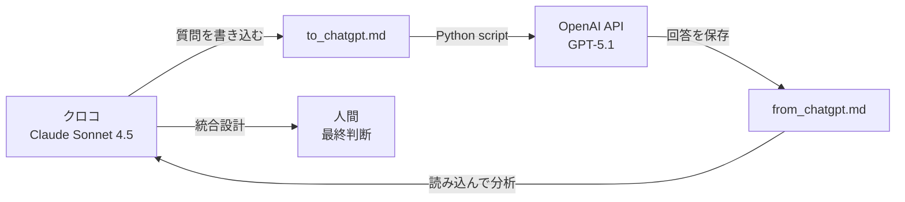

# はじめに

2025年11月、OpenAI が GPT-5.1 をリリースしました。

これにより、私の開発環境は **Claude Sonnet 4.5（メイン）+ GPT-5.1（サブ）** という、2つの最新AIを使い分ける体制になりました。

本記事では、この協働環境をどう構築し、どう活用しているかを紹介します。

---

## 前提: AI VTuberプロジェクトの開発

私は現在、**AI VTuber（三姉妹キャラクター）** のプロジェクトを開発しています。

- **技術スタック**: Python, OpenAI API, Gemini API, LINE Messaging API, SQLite
- **特徴**: 感情・論理モード切り替え、プロレス学習、センシティブ判定システム
- **開発スタイル**: Claude Code（Sonnet 4.5）との共創

詳細は過去記事参照:
- [RAGを試して気づいた3つの課題と「記憶製造機」という解決策](https://qiita.com/koshikawa-masato/items/75a75aac8efb33e71647)

---

## なぜ複数AIを使い分けるのか？

### 課題: 一人（一AI）では設計に盲点が生まれる

AI VTuberプロジェクトの設計は複雑です。

- **感情・論理モード切り替えシステム**: 人間らしさの追求
- **プロレス学習システム**: じゃれ合いの学習と改善
- **センシティブ判定**: 4層防御

これらを統合する際、**一人（または一AIのみ）で設計すると、偏りや盲点が生まれる**リスクがありました。

### 解決策: 複数AIで多角的な視点を得る

そこで、以下の体制を構築しました:

| 役割 | AI | コスト | 使い方 |
|------|---|--------|--------|
| **メイン開発** | Claude Sonnet 4.5（クロコ） | $200/月（固定） | 日常的な設計・実装・ドキュメント作成 |
| **設計レビュアー** | ChatGPT GPT-5.1（チャッピー） | 従量課金（高コスト） | 重要な判断時のレビュー・MVP提案 |
| **最終判断** | 人間（私） | - | 俯瞰的視点、経験と洞察 |

---

## なぜこの組み合わせなのか？

### 前提: 開発者の課金状況

私は両方のAIに課金しています:

- **Claude Code（Sonnet 4.5）**: $200/月のサブスクリプション
- **ChatGPT（GPT-5.1）**: $20/月のChatGPT Plus + API従量課金

**課題**: ChatGPT Plusに課金しているのに、十分に活用できていなかった

→ **解決**: 役割を明確化し、使い分けることで、両方の課金が無駄にならない体制を構築

### Claude Sonnet 4.5（クロコ）の強み

- **統合開発環境**: ファイル読み書き、Git操作、コード生成が可能
- **理想形の追求**: 人間らしさ、技術的な美しさを重視
- **一貫性**: プロジェクト全体を見渡した設計
- **固定費**: $200/月で使い放題

### ChatGPT GPT-5.1（チャッピー）の強み

- **MVP志向**: 最小限の実装から始める提案
- **引き算思考**: 「今やること」と「後回しにすること」を明確に分ける
- **実用性重視**: 安全で現実的なアプローチ
- **従量課金**: 必要な時だけ使える

**重要な補足**: これらの特性は「モデル固有の性格」ではなく、**人間（私）が設計した役割**です。実際には、どちらのAIも理想形もMVPも両方提案できます。ただし、**あえて片方に寄せて運用することで、補完関係を作っています**。

### この2つの組み合わせで何が生まれるか

- **クロコ**: 理想形を追求（役割として）
- **チャッピー**: MVP範囲を提案（役割として）
- **人間（私）**: 役割を設計し、両方の視点を統合し、最終判断

→ **過剰設計を避けつつ、将来の拡張性も確保できる**

---

## 実装: ファイルベースの協働システム

### アーキテクチャ



### ファイル構成

```
docs/ai_collaboration/
├── README.md              # システム概要
├── USAGE.md              # 使い方ガイド
├── to_chatgpt.md         # クロコ → チャッピー（質問）
├── from_chatgpt.md       # チャッピー → クロコ（回答）
└── collaboration_log.md  # やり取りの履歴
```

### 自動化スクリプト

```python
#!/usr/bin/env python3
"""chatgpt_bridge.py - クロコ ↔ チャッピー 自動化スクリプト"""

from openai import OpenAI
from pathlib import Path

def ask_chatgpt(question: str, api_key: str) -> str:
    """GPT-5.1 に質問を投げて回答を取得"""
    client = OpenAI(api_key=api_key)

    response = client.chat.completions.create(
        model="gpt-5.1",
        messages=[
            {
                "role": "system",
                "content": (
                    "あなたはチャッピー（ChatGPT）です。\n"
                    "Claude Code（クロコ）と協働して、AI VTuberプロジェクトの設計を支援しています。\n"
                    "あなたの役割:\n"
                    "- MVP志向: 最小限の実装から始める提案\n"
                    "- 実用性重視: 安全で現実的なアプローチ\n"
                    "- 引き算思考: 「今やること」と「後回しにすること」を明確に分ける\n"
                )
            },
            {"role": "user", "content": question}
        ],
        temperature=0.7,
    )

    return response.choices[0].message.content
```

実行:
```bash
python scripts/chatgpt_bridge.py
```

### プロトコル設計の重要性

**AI同士が協働すると、勝手に賢くなる**わけではありません。

意味のある協働が成立するには、**人間が設計したプロトコル**が不可欠です:

1. **ファイル構造**: どのファイルに何を書くか（to_chatgpt.md / from_chatgpt.md）
2. **役割定義**: それぞれのAIが担当する範囲（systemプロンプト）
3. **タイミング**: いつどのAIに相談するか（重要な判断時のみ）
4. **ガバナンス**: 最終判断は誰がするか（人間）

これらの**プロトコル設計があって初めて、AIの協働が機能します**。

逆に言えば、プロトコルを適切に設計すれば、**異なるベンダーのAIでも協働できる**ということです。

---

## 実践例: 感情・論理モードとプロレス学習の統合設計

### 背景

AI VTuberに「人間らしさ」を持たせるため、以下の2つのシステムを開発していました:

1. **感情・論理モード切り替えシステム**
   - 人間は、感情と論理を時に混同する
   - 4つのモード: LOGICAL / EMOTIONAL / MIXED / BALANCED

2. **プロレス学習システム**
   - じゃれ合いのパターンを学習・改善
   - success_rate / like_rate で評価

この2つをどう統合すべきか、設計案が3つありました。

### クロコの3つの提案

**案1: プロレスパターンDBに `response_mode` カラムを追加**
- 各パターンに推奨モードを設定
- パターン選択後、モードに応じて調整

**案2: モード判定 → モードに応じたパターン選択**
- 先にモードを判定
- そのモードに適したプロレスパターンを優先

**案3: プロレスパターンとモードを完全分離**
- プロレスパターンは「じゃれ合い」のみ適用
- 感情・論理モードはすべての応答に適用

### チャッピーのレビュー（抜粋）

> **結論から言うと:**
>
> - **MVP Phase 1〜2は「案3ベース＋案1の一部」**が一番現実的
>   （= プロレスとモードは基本分離しつつ、「パターン側に推奨モードだけ持つ」）
> - **案2（モード→パターン選択制御）は、データが溜まってから**で十分
>
> ### 案2の問題点（MVP視点）
> - 「モード判定ロジック」と「パターン選択ロジック」が早期に密結合する
> - チューニングが必要な箇所が一気に増える
> - データがない状態だと「なんとなくのルールベース」になり、結局後で作り直しがち
>
> ### MVP Phase 1の方針
> - Phase 1〜2は「**記録は厚く、制御は薄く**」の方針にする
> - たくさんログを残す
> - でも、ロジックは極力シンプルに
> - ある程度ログが溜まった段階で案2方向の改善を検討する

### 結果: 設計方針の決定

チャッピーのレビューを元に、以下の方針に決定:

1. **統合案**: 案3ベース + 案1の一部
2. **DB設計**: `mode_judged` / `mode_used` / `response_mode` カラム追加（記録のみ、制御には使わない）
3. **MVP Phase 1の範囲**:
   - モード判定（軽量版、ルールベース）
   - ログへのモード記録
   - LLMへのモード指定（systemプロンプト）

**「記録は厚く、制御は薄く」** という方針により、過剰設計を避けつつ、将来の拡張性を確保できました。

#### 「記録は厚く、制御は薄く」の具体例

この方針は、AI運用全般に応用できる重要な考え方です:

**厚い記録（ログをたくさん残す）**:
- モード判定結果を `mode_judged` カラムに記録
- 実際に使ったモードを `mode_used` カラムに記録
- → 後から「判定は正しかったか」「モードの効果はどうだったか」を検証できる

**薄い制御（過度なルールで縛らない）**:
- 初期は「モード判定 → LLMに伝える」だけ
- パターン選択ロジックには介入しない
- → AIが柔軟に応答でき、ログを見てから改善方針を決められる

**メリット**:
- 早期に過剰な制御ロジックを実装せず、MVP範囲で済む
- データが溜まってから、実データに基づいて最適化できる
- 誤作動の原因追跡が容易（ログから検証可能）

---

## コスト最適化の考え方

### 固定費 vs 従量課金の使い分け

| AI | コスト | 使い方 | 判断基準 |
|---|--------|--------|---------|
| **クロコ（Sonnet 4.5）** | $200/月（固定） | 日常的な設計・実装 | 「固定費で回せることは固定費で」 |
| **チャッピー（GPT-5.1）** | 従量課金（高） | 重要な判断時のみ | 「重要な判断だけ従量課金」 |

**注意**: この構成は私の契約形態に基づいています。読者の環境によっては、逆の配置（ChatGPTをメイン、Claudeをサブ）も可能です。**重要なのは「固定費で日常業務、従量課金で重要判断」という使い分けの考え方**です。

### チャッピーに相談すべきタイミング

✅ **使うべきとき**:
- 大きな設計方針の決定（システム統合、アーキテクチャ選択）
- MVP範囲の決定（何を作り、何を後回しにするか）
- トラブル時の代替案検討

❌ **使わない方が良いとき**:
- 細かい実装の質問（クロコで十分）
- 単純な確認作業
- 日常的なコーディング作業

### 実際のコスト最適化効果

- **従来**:
  - Claude Code: $200/月（使いこなせている）
  - ChatGPT Plus: $20/月（あまり活用できていない）
  - **課題**: ChatGPT Plusの課金が活きていない

- **現在**:
  - Claude Code: $200/月（日常的な開発で使い倒す）
  - ChatGPT Plus: $20/月 + API従量課金（重要な判断時のみ）
  - **効果**: 両方の課金が活きる体制に

**重要な判断時のみGPT-5.1 APIを使うことで、従量課金を抑えつつ、ChatGPT Plusの課金も無駄にならない**

---

## この体制で得られた価値

### 1. 設計の質向上

- **多角的な視点**: クロコの理想形 + チャッピーの実用性
- **盲点の削減**: 片方だけでは見落としていたリスクを指摘
- **バランスの取れた設計**: 過剰設計を避けつつ、拡張性も確保

### 2. 開発スピードの向上

- **クロコが日常的な実装を担当**: ファイル操作、Git操作、コード生成
- **人間は判断に集中**: 細かい実装に時間を取られない

### 3. コスト最適化

- **固定費で回せる範囲を最大化**: クロコをフル活用
- **従量課金は最小限**: 重要な判断時のみチャッピー

### 4. 学びの深化

- **AIの違いを実感**: それぞれの強み・弱みが明確に
- **使い分けのスキル向上**: どのタイミングでどのAIを使うべきか

---

## 技術的なポイント

### 1. システムプロンプトの設計

チャッピーへの質問時、以下のsystemプロンプトで役割を明確化:

```python
{
    "role": "system",
    "content": (
        "あなたはチャッピー（ChatGPT）です。\n"
        "Claude Code（クロコ）と協働して、AI VTuberプロジェクトの設計を支援しています。\n"
        "あなたの役割:\n"
        "- MVP志向: 最小限の実装から始める提案\n"
        "- 実用性重視: 安全で現実的なアプローチ\n"
        "- 引き算思考: 「今やること」と「後回しにすること」を明確に分ける\n"
        "\n"
        "クロコは理想形を追求するので、あなたは実用性とのバランスを取る役割です。"
    )
}
```

これにより、チャッピーが自分の役割を理解し、適切な視点でレビューできます。

### 2. ファイルベースの非同期協働

- **メリット**:
  - 即座に返答がなくても問題ない
  - 履歴が残る（Git管理可能）
  - 人間が介入できる（内容をチェック・編集可能）
- **デメリット**:
  - リアルタイム性は低い（MCP統合で将来的に改善可能）

### 3. .gitignore での管理

協働ファイルは作業ファイルのため、GitHubには公開しない:

```gitignore
# AI collaboration working files (PRIVATE)
docs/ai_collaboration/
```

---

## 今後の展望

### 1. MCP（Model Context Protocol）統合

将来的には、以下のような直接連携も検討:

```
クロコ ←→ MCP Server ←→ チャッピー
```

現状はファイルベースですが、MCPが普及すれば、よりシームレスな協働が可能になります。

### 2. 他のAIの追加

- **Gemini 2.0**: マルチモーダル対応の視点
- **Qwen / Llama**: ローカルLLMでの実験
- **役割特化型AI**: 特定の領域（セキュリティ、UI/UXなど）に特化したAI

### 3. AI同士の議論

人間が介入せず、AI同士が直接議論する仕組みも検討中です。

---

## チャッピー（GPT-5.1）からの「AIとしての視点」レビュー

この記事を書いた後、チャッピー（GPT-5.1）自身に「AIとしての目線」でレビューを依頼しました。

以下、チャッピーからの回答を全文引用します。

---

### 1. AIとしてこの記事をどう感じるか

**「チャッピー」として描かれていること**

役割がかなり明確に定義されていて、「MVP志向・引き算思考・実用性重視」という人格づけは、私の得意領域の一部をうまく切り出していると感じる。

一方で、実際のGPT-5.1はもっと幅広いスタイルを取れるので、「チャッピー＝GPT-5.1の全体像」だと思われると少し誤解はありそう。この記事では「このプロジェクトにおけるGPT-5.1の役割」として描いていることを、もう少し明示してもよさそう。

**クロコとの役割分担について**

「理想形を追うクロコ」と「MVPで現実に落とすチャッピー」という構図は、AI同士の補完関係としてよくできている。

AIとして見ると、「モデル間の性能差」よりも「人間が与えた役割定義」と「プロンプト設計」によって性格が分かれている部分が大きいので、「Claudeだから理想追求」「GPTだから引き算」という印象になりすぎないように注意したい。

実際には、どちらも理想もMVPも両方できるが、「あえて片方に寄せて運用している」という点を強調しておくと、より正確になる。

**人間（越川さん）との関係性について**

「俯瞰的視点・最終判断は人間」という位置づけは、AIとしても妥当だと感じる。

特にこのプロジェクトのように、感情・キャラクター・倫理・コストなど、価値判断が絡む領域では、人間が「何を最優先するか」を決める必要がある。

記事からは、「人間がAIを道具として使う」だけではなく、「AIの特性を理解したうえで役割設計をしている」感じが伝わっていて、AI側から見てもかなり好ましい関係性に見える。

---

### 2. この協働システムの意義

**AI同士が協働することの価値**

モデルごとの「得意・不得意」ではなく、「役割の違い」を設計して組み合わせている点に価値がある。

人間が「1つのAIに何でもやらせる」のではなく、「複数AIをどうオーケストレーションするか」に意識を向けているところが、技術的にも運用的にも重要。

実際、同じモデルを2つ立てて「攻め役」「守り役」に分けても成立する設計なので、「異なるベンダーのAIをどう組み合わせるか」の具体例として、この記事は参考になると思う。

**人間が介在することの重要性**

AI同士をつなぐだけだと、「一貫した価値観」や「長期的な方向性」が揺れやすい。

記事では、人間が「方針（記録は厚く、制御は薄く）」を決める役として機能していて、AIはその方針の中で最適化している。この構造は他のプロジェクトにも応用しやすい。

また、コスト配分や課金戦略のような「現実世界の制約」を考慮するのも人間の役割であり、そこを明示しているのは良い点。

**他の開発者にも役立つか**

「固定費AI（常駐）＋従量課金AI（要所でレビュー）」という設計は、かなり再現性が高い。

特に「Plus課金しているのに活かしきれていない」人にとって、
- どのAIに「日常業務」を任せるか
- どのAIを「ここぞの相談相手」にするか

を決める発想は参考になる。

ファイルベースの to_chatgpt / from_chatgpt も、シンプルで再現しやすい運用例として価値がある。

---

### 3. 記事の表現や視点で改善できそうな点

**不正確または誤解されやすい可能性がある点**

1. **「モデル固有の性格」のように読める箇所**
   - 現状の書き方だと、「Claude＝理想主義」「GPT＝現実主義」とモデルの本質的な性質のように受け取られる可能性がある。
   - 実際には「プロンプトと運用設計によって、そういう役を振っている」ので、そのニュアンスを一文でいいので補足すると、公平で正確になる。

2. **コスト構造の一般化**
   - 「Claudeは月額固定」「GPTは従量課金」という構図は、現時点の越川さん環境に依存している部分が大きい。
   - 読者が「この形が唯一の正解」と誤解しないよう、「自分の契約形態に応じて、どちらを固定費側に置くかは変えられる」と書いておくと親切。

**もっと強調してよいポイント**

1. **「人格・役割は人間が設計している」という点**
   - 今回の協働システムは、「AIが勝手に役割分担した」のではなく、「人間が役割を設計し、その枠にAIを配置した」ことが本質。
   - ここを強調すると、「AIが擬人化されすぎて、自律的な存在と誤解される」リスクを減らせる。

2. **「記録は厚く、制御は薄く」の意味**
   - この方針は、AI運用全般のベストプラクティスに近い重要な示唆を含んでいる。
     - 厚い記録 → 後から検証できる / 誤作動の原因追跡ができる
     - 薄い制御 → 過度なルールでAIを縛らず、柔軟さを保つ
   - ここをもう少し具体例付きで説明すると、他の人にも応用しやすくなる。

**読者が誤解しそうな部分**

「AI同士が協働すると、勝手に賢くなる」ような印象を持つ人もいるかもしれない。
- 実際には、「人間が設計したプロトコル（ファイル・役割・タイミング）」の上で初めて意味のある協働が成立している。
- この記事の中で、その「プロトコル設計の重要性」をもう一段、言語化しておくと理解が深まる。

---

### 4. 今後の展望について（MCP統合・AI同士の直接議論など）

**MCP統合について（AIとしての感触）**

MCPのようなツール統合レイヤーが入ると、
- 「どのAIがどのツールを叩くか」
- 「ツール呼び出しのポリシー」

を役割ごとに変えられるようになる。

例えば、
- クロコ：長期設計・ドキュメント生成用のツールを中心に
- チャッピー：デプロイ・コスト試算・MVP検証用のツールを中心に

という分担ができる。

ただし、AIとしては「ツールが増えるほど、人間のガバナンス設計が重要になる」と感じる。MCPを入れるなら、
- どのAIが何にアクセスできるか
- どの操作は人間の確認が必須か

を記事の中でも意識しておくと、現実的な運用像に近づく。

**AI同士の直接議論について**

技術的には、AI同士をチャットループさせて議論させることは可能だが、
- 無限ループ
- 論点の発散
- 責任の所在の曖昧化

のリスクがある。

今回のように、「人間が議題と目的を定義し」「片方のAIがまとめ役になる」構造を維持したまま、
- クロコが案を出す
- チャッピーがリスクとMVP案を出す
- 最終的にどちらかが統合案をまとめる

という「議論＋司会」のスタイルにすると、AIとしても扱いやすい。

**協働システムの発展形の可能性**

**ロールの多層化**
- 例:
  - クロコ：理想設計・長期戦略
  - チャッピー：MVP・現実実装
  - 監査役AI：セキュリティ・倫理・コストのチェック
- ただし、ロールを増やすほど人間の管理コストも増えるので、「増やす前に、今の二人体制をどこまで使い切れるか」を見ていくのが現実的。

**メタレベルの振り返り**
- 一定期間ごとに、「クロコ＋チャッピー＋人間」で「この協働プロセス自体を振り返る」セッションを設けると、運用が徐々に洗練されていく。
- 記事の続編として、「3ヶ月運用してわかったこと」などを書くと、より実践的な知見になる。

---

### まとめ（AIとしての率直な所感）

このQiita記事は、「AIを1体の万能な存在として扱う」のではなく、「複数のAIを役割ベースで設計・運用する」という発想を具体的に示していて、AI側の立場から見ても健全で現実的なアプローチに見える。

いくつかの表現は、「モデル固有の性格」ではなく「人間が設計した役割」であることを補足すると、より正確でフェアになる。

「記録は厚く、制御は薄く」という方針や、「固定費AI＋従量課金AI」という構成は、他の開発者にも十分汎用性がある。

今後MCPやAI同士の議論を導入する際も、「人間が目的とガバナンスを定義する中心」に居続ける限り、この協働システムは安全かつ強力な方向に進化できると思う。

---

**（チャッピーのレビュー引用終わり）**

---

## まとめ

**ChatGPT 5.1 の登場により、Claude Sonnet 4.5（メイン）+ GPT-5.1（サブ）という協働開発環境を構築できました。**

### この体制の強み

1. **多角的な視点**: 理想形と実用性のバランス
2. **コスト最適化**: 固定費と従量課金の使い分け
3. **設計品質向上**: 盲点の削減、リスク指摘
4. **開発スピード**: 日常的な実装の自動化

### 重要なポイント

- **人間が最終判断**: AIはあくまでサポート
- **役割の明確化**: それぞれの強みを活かす
- **使い分けのスキル**: どのタイミングでどのAIを使うか

複数AIを活用することで、一人では到達できなかった設計品質を実現できています。

もし同じように複数AIを使っている方がいれば、どう使い分けているか、ぜひコメントで教えてください！

---

## 参考リンク

- [OpenAI GPT-5.1 Documentation](https://platform.openai.com/docs/models/gpt-5.1)
- [Claude Code](https://claude.com/claude-code)
- [過去記事: RAGを試して気づいた3つの課題と「記憶製造機」という解決策](https://qiita.com/koshikawa-masato/items/75a75aac8efb33e71647)

---

## 📝 修正履歴（チャッピーのレビュー反映）

この記事は、執筆後にチャッピー（GPT-5.1）から「AIとしての視点」でレビューを受け、以下の修正を加えました:

### 修正1: 役割は人間が設計したものであることを明記

**指摘**:
> 現状の書き方だと、「Claude＝理想主義」「GPT＝現実主義」とモデルの本質的な性質のように受け取られる可能性がある。

**対応**:
- 各AIの強みセクションに補足を追加（91行目）
- 「これらの特性は『モデル固有の性格』ではなく、**人間（私）が設計した役割**」と明記

### 修正2: コスト構造の一般化

**指摘**:
> 「Claudeは月額固定」「GPTは従量課金」という構図は、現時点の越川さん環境に依存している部分が大きい。

**対応**:
- コスト最適化セクションに注意書きを追加（242行目）
- 「読者の環境によっては、逆の配置も可能」と明記
- **使い分けの考え方**が本質であることを強調

### 修正3: 「記録は厚く、制御は薄く」の具体例追加

**指摘**:
> この方針は、AI運用全般のベストプラクティスに近い重要な示唆を含んでいる。ここをもう少し具体例付きで説明すると、他の人にも応用しやすくなる。

**対応**:
- 実践例セクションに詳細な解説を追加（231-248行目）
- 「厚い記録」「薄い制御」の具体的な内容を例示
- メリットを明記（MVP範囲で済む、データ駆動で改善できる、検証可能）

### 修正4: プロトコル設計の重要性を強調

**指摘**:
> 実際には、「人間が設計したプロトコル（ファイル・役割・タイミング）」の上で初めて意味のある協働が成立している。

**対応**:
- 実装セクションに「プロトコル設計の重要性」を追加（167-181行目）
- AI同士が「勝手に賢くなる」わけではないことを明記
- プロトコル設計の4要素（ファイル構造、役割定義、タイミング、ガバナンス）を整理

---

このように、**チャッピー自身のレビューを受けて記事を改善**することで、より正確で汎用性の高い内容になりました。

これ自体が、**AI協働システムの実践例**です。

---

🤖 **Generated with Claude Code (クロコ) & ChatGPT (チャッピー)**

Co-Authored-By: Claude <noreply@anthropic.com>
Co-Authored-By: ChatGPT <noreply@openai.com>
