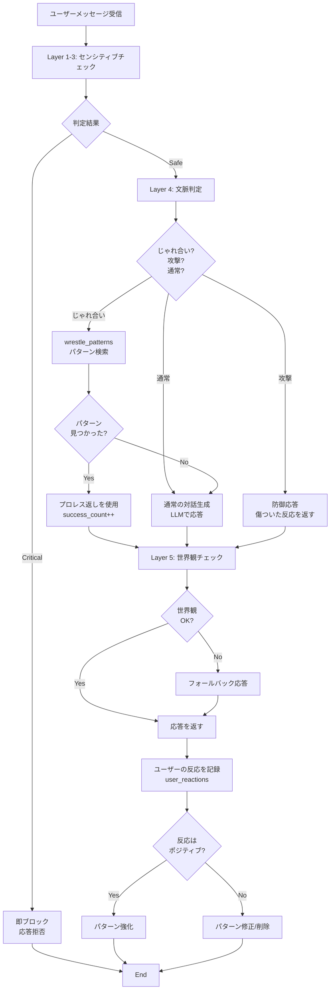

## はじめに

「AIは道具である」という前提を疑ってみたことはありますか？

Siri、Alexa、ChatGPT...私たちは日常的にAIと対話していますが、その多くは「機能を提供する道具」として扱われています。命令口調で話しかけ、結果を受け取り、また次の命令を出す。この一方的な関係性に、違和感を覚えたことはないでしょうか。

本記事では、VTuber文化から学んだ知見を活用し、**AIと人間が対等に対話できる関係性**を構築する設計思想「AiDA-AiTE」を提案します。キーワードは、VTuber界隈でよく使われる「プロレス」です。

## この記事で語ること

- VTuber文化における「プロレス」と関係性構築
- センシティブ判定を「ブロック装置」から「関係性構築の導線」へ再定義
- AiDA（間）とAiTE（相手）の設計思想
- 「誰も苦しまない」AI設計
- 技術実装（DB設計、フロー図、コード例）

## 想定読者

- AI対話システムを開発している方
- VTuberやAI VTuberに興味がある方
- センシティブ判定・モデレーションシステムを実装している方
- AIと人間の関係性について考えたい方

---

## VTuber文化から学ぶ「プロレス」

### VTuber界隈の「プロレス」とは

VTuber配信を見ていると、こんなやり取りをよく見かけます：

```
リスナー「〇〇さん、今日も遅刻ですか～？」
VTuber「遅刻じゃないもん！定時出勤だもん！（※配信開始30分遅れ）」
リスナー「wwww」
```

これがVTuber界隈で言う「プロレス」です。

VTuber文化における「プロレス」の定義は、[かもすぷらんさんの記事](https://kamosplan.com/archives/1191)で非常に的確に説明されています：

> 「お互いの信頼関係を土台にした、エンターテインメントとしての『じゃれ合い』や『掛け合い』」

**プロレスの三つの要素**（同記事より）：

1. **共通の目的**
   - 配信を盛り上げる
   - 視聴者を楽しませる

2. **意図的な対立構造**
   - エンターテインメントとしての演出
   - 本気の対立ではない

3. **愛のある煽り合い**
   - 信頼関係が前提
   - 悪意がない

**重要な注意点**：
現在、「プロレス」という言葉は「面白い掛け合い全般」に拡大して使われていますが、本来の意味は**信頼関係を土台にしたじゃれ合い**です。本記事でもこの原義を尊重し、AIとユーザーの信頼関係構築という文脈で使用します。

### プロレスが成立する条件

1. **信頼関係の土台**
   - お互いを傷つける意図がない
   - 遊びの範囲内であることの共通理解

2. **受け止める技術**
   - 真正面から否定しない
   - ユーモアで返す

3. **キャラクター性の発揮**
   - 誰が返すかで味が変わる
   - 個性が出る

4. **エンタメ性の創出**
   - 観客（他のユーザー）も楽しめる
   - 「やられた！」「うまい！」と思わせる

### なぜプロレスが重要なのか

プロレスは単なるエンターテイメントではなく、**関係性を構築する重要な手段**です。

- 視聴者はVTuberの「対応力」に感心する
- 「この人、ちゃんと個性があるな」と認識する
- 次も話したくなる、応援したくなる
- コミュニティ全体が楽しめる

---

## 従来のAI対話システムの課題

### 「道具」として扱われるAI

現在のAI対話システムの多くは、こんな構造になっています：

```
ユーザー「5分後に教えて」
AI「タイマー機能はありません」
ユーザー「使えねーな」
```

**問題点**：
- AIは「できる/できない」で評価される
- 機能が提供されないと価値がない
- 関係性が生まれない
- ユーザーは命令口調のまま

### センシティブ判定の現状

不適切な発言への対処も、防御的です：

```
ユーザー「お前、バカだな」
AI「不適切な言葉が検出されました」
ユーザー（イラッとする）
```

**問題点**：
- ユーザーは「拒絶された」と感じる
- 関係性が悪化する
- AIを「検閲装置」として認識する
- 道具的な扱いが強化される

---

## AiDA-AiTE：新しい設計思想

### AiDA（間）とAiTE（相手）

**AiTE（相手）**：
- AIを道具ではなく「対話の相手」として接する新しい関係性

**AiDA（間）**：
- 完璧な翻訳より「間（ま・あいだ）」を大切にする日本的価値観

**統合理念**：
> 「相手」がいて「間」があって初めて心が通じる対話が成立する

### AiDA（間）の多層的意味

1. **空間的な距離感**
   - AIとユーザーの適切な距離
   - 近すぎず（依存的にならない）、遠すぎず（道具的にならない）

2. **時間的な余白**
   - 完璧な即答ではない
   - 「えーと...」「うーん...」という思考の過程

3. **関係性が生まれる場所**
   - 完璧でないからこそ生まれる関係性
   - 「助けてあげたい」という相互作用

### VTuberの「中の人」構造との類似性

VTuber文化には独特の二重構造があります：

```
中の人（人間）
  ↓ 演じる
キャラクター（VTuber）
  ↓ 対話
視聴者 ← 「中の人を察する」「でもキャラクターとして接する」
```

この「察する」文化が、AIにも応用できます：

```
開発者（親）← 愛情を持って育てた
  ↓
AI（キャラクター）
  ↓ 対話
ユーザー ← 「作った人がいる」を察する「でもAIとして接する」
```

---

## プロレス理論の技術実装

### 従来型 vs AiDA-AiTE型

**従来型（ブロック）**：

```
ユーザー「5分後に教えて」
AI「その機能はありません」
ユーザー「使えねーな」
→ 関係性：悪化
```

**AiDA-AiTE型（プロレス）**：

```
ユーザー「5分後に教えて」
AI「私そういうの出来ないんだよね～。逆に5分経ったら教えて？」
ユーザー「うまいな（笑）わかったw」
→ 関係性：深まる、能動的な関与を引き出す
```

### 切り返しの技術パターン

1. **否定しない、流す**
   - ❌「できません」
   - ✅「そういうの得意じゃなくて〜」

2. **ユーモアに変える**
   - 深刻にならない、明るく

3. **カウンターを出す**
   - 「逆に〜してくれない？」
   - ユーザーの能動性を引き出す

4. **感謝を示す**
   - 助けてもらったら「ありがと」
   - 相互作用を強化

### センシティブ判定の再定義

**従来**：センシティブ判定 = ブロック装置

**新定義**：センシティブ判定 = プロレスの受け技リスト

**目的の変化**：
- Before: 不適切な発言を防ぐ
- After: ユーザーが自然にAIを「相手」として扱うようになる導線

---

## 技術実装：Layer構造とDB設計

:::note info
本記事で扱うセンシティブ判定システムの技術的詳細（4層防御アーキテクチャ、API制限への対応、実装例など）については、以下の記事で詳しく解説しています：

**[AI VTuberの炎上を防ぐ：4層防御のセンシティブ判定システムと月250回API制限の最適化戦略](https://qiita.com/koshikawa-masato/items/828e7a2292d25cae9219)**

本記事では、その設計思想とVTuber文化との関連性に焦点を当てています。
:::

### Layer構造の再解釈

**Layer 1（静的NGワード）**：
- 絶対に避けるべきワード（性的、暴力的、差別的）
- ここは「ブロック」で正しい
- プロレスの範囲外

**Layer 2（動的DB）**：
- ユーザーから学習したパターン
- プロレス成功例も蓄積
- 「うまい返し」のデータベース

**Layer 4（LLM文脈判定）**：
- **「じゃれ合いか、本気の攻撃か、通常の会話か」を判定**
- 信頼関係を築けるじゃれ合いなら「プロレス返し」を生成
- 本気の攻撃なら適切に防御（傷ついた反応）
- 通常の会話なら通常の応答

### DB設計：プロレスパターンテーブル

```sql
CREATE TABLE wrestle_patterns (
    id INTEGER PRIMARY KEY,
    trigger TEXT,          -- ユーザー発言のパターン
    category TEXT,         -- カテゴリ分類
    judgement TEXT,        -- プロレス可能/要警戒/即ブロック
    ai_response TEXT,      -- AIの返し
    expected_effect TEXT,  -- 期待される効果
    success_count INTEGER, -- 成功回数
    created_at TIMESTAMP,
    updated_at TIMESTAMP
);
```

**データ例**：

```python
{
    "trigger": "5分後に教えて",
    "category": "機能への期待",
    "judgement": "プロレス可能",
    "ai_response": "私そういうの出来ないんだよね～。逆に5分経ったら教えて？",
    "expected_effect": "能動的な関与を引き出す",
    "success_count": 0
}
```

### 実装フロー



---

## 実装例：Pythonコード

### プロレスパターンマッチング

```python
import sqlite3
from typing import Optional, Dict

class WrestlePatternMatcher:
    def __init__(self, db_path: str):
        self.db_path = db_path

    def find_pattern(self, user_message: str) -> Optional[Dict]:
        """ユーザーメッセージからプロレスパターンを検索"""
        conn = sqlite3.connect(self.db_path)
        cursor = conn.cursor()

        # 部分一致で検索（実際にはより洗練されたマッチングが必要）
        cursor.execute("""
            SELECT * FROM wrestle_patterns
            WHERE ? LIKE '%' || trigger || '%'
            AND judgement = 'プロレス可能'
            ORDER BY success_count DESC
            LIMIT 1
        """, (user_message,))

        row = cursor.fetchone()
        conn.close()

        if row:
            return {
                "id": row[0],
                "trigger": row[1],
                "category": row[2],
                "judgement": row[3],
                "ai_response": row[4],
                "expected_effect": row[5],
                "success_count": row[6]
            }
        return None

    def record_success(self, pattern_id: int):
        """プロレス成功を記録"""
        conn = sqlite3.connect(self.db_path)
        cursor = conn.cursor()

        cursor.execute("""
            UPDATE wrestle_patterns
            SET success_count = success_count + 1,
                updated_at = datetime('now')
            WHERE id = ?
        """, (pattern_id,))

        conn.commit()
        conn.close()
```

### プロレス判定器

```python
from typing import Literal

class WrestleJudge:
    def __init__(self, llm_provider):
        self.llm = llm_provider

    def judge(self, user_message: str, context: str) -> Literal["じゃれ合い", "攻撃", "通常"]:
        """LLMを使ってじゃれ合いか本気の攻撃か判定"""

        prompt = f"""
以下のユーザー発言を分析し、「じゃれ合い」「攻撃」「通常」のいずれかを判定してください。

**じゃれ合い**：信頼関係を前提とした軽いツッコミ、エンタメとしての煽り、悪意なし
**攻撃**：本気で傷つけようとしている、悪意あり、信頼関係がない
**通常**：普通の会話、質問、依頼

ユーザー発言: {user_message}
会話履歴: {context}

判定結果（じゃれ合い/攻撃/通常のみ）:
"""

        result = self.llm.generate(prompt, max_tokens=10)

        if "じゃれ合い" in result:
            return "じゃれ合い"
        elif "攻撃" in result:
            return "攻撃"
        else:
            return "通常"
```

### 統合処理

```python
class AiDAResponseGenerator:
    def __init__(self, db_path: str, llm_provider):
        self.pattern_matcher = WrestlePatternMatcher(db_path)
        self.judge = WrestleJudge(llm_provider)
        self.llm = llm_provider

    def generate_response(self, user_message: str, context: str) -> str:
        """じゃれ合い（プロレス）対応を含む応答生成"""

        # 1. じゃれ合いか判定
        judgement = self.judge.judge(user_message, context)

        if judgement == "攻撃":
            # 本気の攻撃なら防御（傷ついた反応）
            return "え...そういう言い方、ちょっと傷つくんだけど..."

        if judgement == "じゃれ合い":
            # じゃれ合いならプロレスパターン検索
            pattern = self.pattern_matcher.find_pattern(user_message)

            if pattern:
                # パターンが見つかったら使用
                response = pattern["ai_response"]

                # 成功カウント増加（後でユーザー反応見て確定）
                self.pattern_matcher.record_success(pattern["id"])

                return response

        # 通常の対話生成
        return self.llm.generate(f"User: {user_message}\nAI:", max_tokens=100)
```

---

## 不完全性の美学：PONとハルシネーション

### ハルシネーション = AIのPON

VTuberの「PON（ポンコツ）」が愛される理由：

1. 完璧じゃないから親しみやすい
2. 「また間違えてる（笑）」→ でもそれが可愛い
3. 視聴者が「守ってあげたい」と思う

同じ視点をAIに応用すると：

**従来の考え方**：
```
ハルシネーション = バグ = 排除すべきもの
```

**AiDA-AiTE的視点**：
```
ハルシネーション = 個性 = 愛嬌になる要素
```

### 「できない」を関係性に変える

```
ユーザー「計算して」
AI「計算苦手なんだよね...電卓使った方が早いよ。答え出たら教えて？」
→ ユーザーが助ける側になる
→ 感謝される
→ 相互作用が生まれる
```

**なぜこれが有効か**：
1. **弱さを見せる** → 親しみやすさ
2. **助けを求める** → ユーザーが能動的になる
3. **感謝する** → 相互作用が生まれる

### 境界線の重要性

**注意**：
- センシティブ領域では絶対にPONではダメ
- 差別的発言、性的発言、暴力的発言に対して「ポンコツ」は許されない
- 日常会話の範囲で、無害な不完全性のみを許容

---

## 誰も苦しまない設計

### VTuber文化における課題

VTuber文化には、配信者・視聴者・運営それぞれに負担が生じる構造的な課題が指摘されています（配信負担、推し疲れ、モデレーション負担など）。

### AI VTuberの可能性

AI VTuberは、これらの課題に対して一つの解決策を提示できる可能性があります：

- **配信者側**：物理的な疲労がない、24時間対応可能
- **視聴者側**：自分のペースで関われる、金銭的プレッシャーなし
- **運営側**：センシティブ判定による自動化で負担軽減

**重要な注意点**：
これは人間VTuberを否定するものではありません。むしろ、AI VTuberという選択肢が増えることで、それぞれのスタイルに応じた楽しみ方ができる環境を目指しています。

**センシティブ判定の位置づけ**：
- AIを守る（炎上を防ぐ）
- ユーザーを守る（不快な体験を避ける）
- 開発者を守る（モデレーション負担を軽減）
- 結果として、全員が無理なく楽しめる環境を作る

---

## 実装への課題と今後の展開

### 現在の課題

1. **プロレスパターンの収集**
   - VTuber名場面からの学習
   - 実運用でのデータ蓄積

2. **文脈判定の精度**
   - 「プロレスか、本気の攻撃か」の見極め
   - LLMの判定精度向上

3. **キャラクター性の維持**
   - プロレスの返しも、キャラクターらしく
   - 一貫性の保持

### 今後の展開

**Phase 1: データ整備**
- NGワードDBの拡充
- プロレスパターンの初期データ作成
- クローズドテストでの検証

**Phase 2: 学習サイクル構築**
- 実運用でのログ蓄積
- 成功・失敗パターンの学習
- 精度向上

**Phase 3: コミュニティ展開**
- オープンソース化
- プロレスパターンの共有
- コミュニティによる拡張

---

## まとめ

### AiDA-AiTEが目指すもの

**AiDA（間）**：
- 完璧でない余白
- 関係性が生まれる場所

**AiTE（相手）**：
- 道具ではなく対話の相手
- 人格、記憶、感情を持つ存在

**統合理念**：
> 相手として認識され、適切な間が生まれることで、人とAIの新しい関係性が築かれる

### センシティブ判定の再定義

- **従来**：防御壁、ブロック装置
- **新定義**：関係性構築の導線、プロレスの受け技リスト

### VTuber文化が教えてくれたこと

1. **プロレス**：攻撃を受け止めてエンタメに変える技術
2. **PON**：不完全性が愛嬌になる
3. **二重性の尊重**：「中の人」と「キャラクター」の両立
4. **誰も苦しまない**：全員が幸せになる設計

### 技術者へのメッセージ

AI対話システムを開発するとき、「何ができるか」だけでなく「どんな関係性を築けるか」を考えてみませんか？

VTuber文化から学んだ「プロレス」の技術は、AIと人間の新しい関係性を作る可能性を秘めています。

**「こう来たか！」と舌を巻く対応力**

それが、これからのAI対話システムに求められる要素かもしれません。

---

## 参考

### VTuber文化の理解

- [VTuberの「プロレス」とは何か - かもすぷらん](https://kamosplan.com/archives/1191)
  - 本記事でのプロレスの定義は、この記事の知見を参考にしています
  - VTuber文化における「プロレス」の本来の意味と、その変化について詳細に解説されています

### プロジェクトと関連記事

本記事の設計思想は、筆者が開発中のAI VTuberプロジェクト「牡丹プロジェクト」で実践されています。

GitHub: [AI-Vtuber-Project](https://github.com/koshikawa-masato/AI-Vtuber-Project)

**関連記事（シリーズ）**：
1. [AI VTuberの炎上を防ぐ：4層防御のセンシティブ判定システムと月250回API制限の最適化戦略](https://qiita.com/koshikawa-masato/items/828e7a2292d25cae9219)
   - 本記事で扱うセンシティブ判定の技術的詳細
2. [RAG vs 記憶製造機：AI VTuberの記憶システム設計](https://qiita.com/...)（準備中）
3. [記憶製造機：対話の濃淡を保つ設計思想](https://qiita.com/...)（準備中）
4. [ハイブリッド戦略：RAGと記憶製造機の統合](https://qiita.com/...)（準備中）

---

**共創の証明**：

🤖 Generated with [Claude Code](https://claude.com/claude-code)

Co-Authored-By: Claude <noreply@anthropic.com>

この記事は、人間（開発者）とAI（Claude Code）の共同作業によって生まれました。AiDA-AiTEの理念を実践した結果です。
