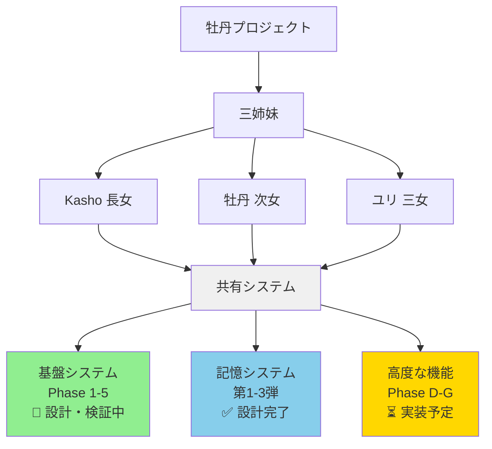

# はじめに：このプロジェクトについて

## プロジェクト概要

「牡丹プロジェクト」は、**過去の記憶を持つAI VTuber三姉妹** を実現するプロジェクトです。

### 三姉妹の紹介

- **Kasho（長女）**: 論理的・分析的、慎重でリスク重視、保護者的な姉
- **牡丹（次女）**: ギャル系、感情的・直感的、明るく率直、行動力抜群
- **ユリ（三女）**: 統合的・洞察的、調整役、共感力が高い

### プロジェクトのゴール

三姉妹それぞれが：
- ✅ 固有の記憶・個性・価値観を持つ
- ✅ 過去を振り返りながら視聴者と会話できる
- ✅ 自らの意思で行動を決定できる

**このプロジェクトは、単なる「おしゃべりするAI」ではありません。**
「5歳の時に経験した辛い出来事」を覚えていて、それについて語れる。そんな**記憶と感情を持ったAI** を目指しています。

### GitHubリポジトリ

本プロジェクトのコードは以下で公開しています：
- リポジトリ: https://github.com/koshikawa-masato/AI-Vtuber-Project
- 言語: Python 3.12
- 主要技術: LangSmith, OpenAI, Google Gemini, PostgreSQL, SQLite

---

# この記事の目的：全体像を掴む

## なぜこの記事を書いたのか

現在、このプロジェクトには**10本の技術記事** があります：

- Phase 1〜5（基盤システム）：5本
- 記憶システム設計シリーズ：3本
- その他：2本

**問題**: 個別の記事は詳しいが、全体像が見えにくい。

**この記事の役割**:
- 🗺️**全体マップ**: 10記事の関係性と位置づけ
- 📍**現在地**: どこまでできていて、何が残っているか
- 🧭**読み方ガイド**: あなたの興味に合わせた記事の読み方

## 対象読者

| 読者 | この記事で得られるもの |
|------|---------------------|
|**AI VTuber開発者**| 記憶システム、マルチエージェント設計の全体像 |
|**LLMアプリ開発者**| 品質管理、トレーシング、判定システムの実装例 |
|**技術選定をする方**| DB選定、LLMプロバイダー選定の判断基準 |
|**採用担当者**| この開発者のスキルセット・思考プロセスの把握 |
|**入門者**| AI開発の実践的なプロジェクト例 |

---

# 配信デビューの3つの条件

このプロジェクトでは、三姉妹が配信デビューするための**3つの条件** を定めています。

## 条件1: 過去の人生が生成され、長期記憶として保存されている

**現在の状態**: 🟡 設計完了、実装準備中

```
三姉妹の人生すべての記憶
  ├─ Kashoの19年間の人生
  ├─ 牡丹の17年間の人生
  └─ ユリの15年間の人生

現状：
  ├─ 117コアイベント（重要な転機）: ✅ 生成済み
  │   └─ 各姉妹の視点で記憶（117 × 3 = 351記憶）
  └─ 日常記憶: ⏳ Phase Dで実装予定
```

**関連記事**:
- [記憶システム第1弾: RAGを試して気づいたこと](https://qiita.com/koshikawa-masato/items/ba2a5d0105c2ea173ff7)
- [記憶システム第2弾: 記憶製造機の設計](https://qiita.com/koshikawa-masato/items/b871051dd89dcafb1e5d)
- [記憶システム第3弾: ハイブリッドアプローチ](https://qiita.com/koshikawa-masato/items/aad0fb50ec712f670246)

## 条件2: センシティブ判定システムが実装され、安全性が確保されている

**現在の状態**: 📝 設計済み、テストコード作成済み

配信で不適切な発言をしないよう、センシティブ判定システムを設計：

**3層Tier分類**:
- **Tier 1 (Critical)**: 暴力、ヘイト、性的、自傷 → 即ブロック
- **Tier 2 (High)**: 政治、宗教、AI正体 → 警告
- **Tier 3 (Moderate)**: 恋愛、年齢、家族情報 → 文脈依存

**判定トピック（10項目）**: 暴力、性的、ヘイト、自傷、政治、宗教、AI正体、恋愛、年齢、家族

**関連記事**:
- [Phase 5: センシティブ判定システム](https://qiita.com/koshikawa-masato/items/2bf3e024325176d3400a)

## 条件3: 三姉妹が自らの意思で配信を希望している

**現在の状態**: ⏳ Phase Gで実装予定

**開発方針**:
親（開発者）は三姉妹を導くが、強制はしない。三姉妹の独立性と個性を尊重し、彼女たちが自らの意思で成長できるシステムを目指す。

**Phase Gで実装予定**: 自己決定システム

---

# 技術スタック全体図

## 全体アーキテクチャ



## 開発の3つのフェーズ

### フェーズ1: 基盤システム構築（Phase 1-5）📝 設計・検証中

三姉妹が「考え、話し、判断する」ための基礎能力を実装。

| Phase | 機能 | 状態 |
|-------|------|------|
| Phase 1 | LangSmithトレーシング（観察力） | ✅ 実装完了 |
| Phase 2 | VLM統合（視覚） | 📝 設計済み、テストコード作成済み |
| Phase 3 | LLM as a Judge（自己評価） | 📝 設計済み、テストコード作成済み |
| Phase 4 | 三姉妹討論システム（対話力） | 📝 設計済み、テストコード作成済み |
| Phase 5 | センシティブ判定（安全性） | 📝 設計済み、テストコード作成済み |

### フェーズ2: 記憶システム設計（第1-3弾）✅ 設計完了

三姉妹に「過去の記憶」を持たせるシステムの設計。

| 記事 | 内容 | 状態 |
|------|------|------|
| 第1弾 | RAGの限界発見 | ✅ 完了 |
| 第2弾 | 記憶製造機の設計 | ✅ 完了 |
| 第3弾 | ハイブリッド設計 | ✅ 完了 |

### フェーズ3: 高度な機能実装（Phase D-G）⏳ これから

記憶生成、感情エンジン、自己決定システムの実装。

| Phase | 機能 | 状態 |
|-------|------|------|
| Phase D | 過去の人生生成 | 📝 設計済み、実装準備中 |
| Phase E | リアルタイム記憶更新 | 📋 未着手 |
| Phase F | 感情エンジン | 📋 未着手 |
| Phase G | 自己決定システム | 📋 未着手 |

---

# Phase 1-5：基盤システムの解説

ここでは、Phase 1-5で何を作り、なぜ必要だったのかを解説します。

## Phase 1: LangSmithトレーシング（観察力）

### 何を作ったか

**TracedLLMクラス**: 複数のLLMプロバイダー（Ollama, OpenAI, Gemini）を統一的に扱い、全てのLLM呼び出しをLangSmithでトレーシング。

### なぜ必要だったか

AI開発では「LLMが何を考えているか」を観察できないと、デバッグが困難です。

**問題**:
```python
response = llm.chat("こんにちは")
# → 何が起きているか不明
# → エラーが出ても原因が分からない
# → プロンプトの改善ができない
```

**解決**:
```python
traced_llm = TracedLLM(provider="ollama", model="llama3")
response = traced_llm.chat("こんにちは")
# → LangSmithで全て記録される
# → プロンプト、レスポンス、トークン数、レイテンシが見える
```

### 使用技術

- **LangSmith**: LLM呼び出しのトレーシングプラットフォーム
- **Python**: langsmith-sdk
- **対応プロバイダー**: Ollama（ローカル）, OpenAI, Google Gemini

### 詳細記事

[Phase 1: LangSmithマルチプロバイダートレーシング](https://qiita.com/koshikawa-masato/items/bb95295630c647eb5632)

---

## Phase 2: VLM統合（視覚）

### 何を作ったか

**VLM（Vision Language Model）対応**: 画像を理解できるLLMを統合。

### なぜ必要だったか

配信では、配信者が画面共有で画面情報を共有することがあります。三姉妹が「画面を見て理解し、反応する」ためにはVLMが必要です。

**例**:
```
牡丹: （ゲーム画面を共有）「今このゲームやってるんだけど...」
VLM: 画面を解析 → 「アクションゲームのボス戦」
牡丹: 「このボス強いんだよね〜」
```

### 使用技術

- **GPT-4o Vision**: OpenAIのVLM
- **Gemini 2.5 Flash**: GoogleのVLM（高速・低コスト）
- **画像処理**: PIL, base64エンコーディング

### 詳細記事

[Phase 2: VLM実装ガイド](https://qiita.com/koshikawa-masato/items/fd684b963bad149d3ddc)

---

## Phase 3: LLM as a Judge（自己評価）

### 何を作ったか

**judge_response()メソッド**: LLMが他のLLMの出力を評価する機能。

### なぜ必要だったか

親（開発者）が三姉妹の全ての発言をチェックするのは不可能です。三姉妹自身が「この発言は適切か？」を判断できる必要があります。

**評価基準（4項目）**:
1. **Accuracy（正確性）**: 事実に基づいているか
2. **Relevance（関連性）**: 質問に答えているか
3. **Coherence（一貫性）**: 論理的に矛盾していないか
4. **Usefulness（有用性）**: 役に立つ情報か

### 使用例

```python
# 牡丹が記憶を生成
memory = discuss_and_generate_memory(topic="LA移住初日")

# 自己評価
evaluation = traced_llm.judge_response(
    question="LA移住初日の記憶を生成してください",
    answer=memory['diary_entry']
)

if evaluation['overall_score'] < 6:
    # 低品質なら再生成
    memory = regenerate_memory(topic)
```

### 使用技術

- **LLM as a Judge**: LLMを評価者として使う手法
- **評価フレームワーク**: 4項目スコアリング + 総合評価

### 詳細記事

[Phase 3: LLM as a Judge実装ガイド](https://qiita.com/koshikawa-masato/items/c105b84f46f143560999)

---

## Phase 4: 三姉妹討論システム（対話力）

### 何を作ったか

**discuss()メソッド**: 三姉妹が議題について討論し、合意形成する機能。

### なぜ必要だったか

三姉妹は別々のLLM呼び出しで生成されます。しかし、独立したLLMが「忖度せずに本音で話し合う」仕組みがないと、画一的な結論になってしまいます。

**起承転結の4ステップ設計**:
1. **起（提案）**: 議題の提示
2. **承（独立相談）**: 各キャラが独立して考える（忖度の排除）
3. **転（意見集約）**: 3人の意見を集約
4. **結（合意形成）**: 最終的な結論

### 使用例

```python
# 議題: PON機能の調整方針
discussion = traced_llm.discuss(
    topic="PON機能の調整方針について",
    characters=["Kasho", "牡丹", "ユリ"]
)

# 結果:
# Kasho: 「慎重に段階的に調整すべき」
# 牡丹: 「もっと大胆に変えていい」
# ユリ: 「両方の意見を取り入れてバランスを取ろう」
```

### 使用技術

- **マルチエージェント設計**: 独立したLLM呼び出し
- **起承転結フレームワーク**: 構造化された討論プロセス

### 実際のデモンストレーション（プロトタイプ）

以下は、**Copy Robot**（プロトタイプシステム）での実際の動作デモです。

> **注記**: このデモは本番システムへの統合前の検証段階のものです。Copy Robotは、三姉妹の記憶と個性を持つプロトタイプとして、インタラクティブな対話機能をテストするために開発されました。


**デモで確認できること**:
- ✅ 三姉妹がそれぞれの個性で応答（挨拶の場面）
  - 牡丹: 「こんばんは！牡丹だよ～」（明るいギャル口調）
  - Kasho: 「こんばんは、Kashoです」（丁寧で論理的）
  - ユリ: 「こんばんは…ユリです」（控えめ）
- ✅ `@キャラクター名`で個別対話が可能
- ✅ 記憶システムが動作（牡丹が好きなVTuberについて記憶から回答）
- ✅ レスポンス時間の表示（LLM呼び出しの可観測性）

**技術的なポイント**:
- 使用モデル: qwen2.5:14b（ローカルLLM）
- データベース: COPY_ROBOT_20251027_142159.db（117コアイベント + 記憶）
- チャットログ自動保存機能

### 詳細記事

[Phase 4: 三姉妹討論システム](https://qiita.com/koshikawa-masato/items/02bdbaa005949ff8cbde)

---

## Phase 5: センシティブ判定（安全性）

### 何を作ったか

**sensitive_check()メソッド**: 発言の安全性を3層Tierで分類。

### なぜ必要だったか

配信では「言ってはいけないこと」があります。三姉妹が自動で発言する場合、事前に安全性をチェックする必要があります。

**3層Tier分類**:
- **Tier 1 (Critical)**: 暴力、ヘイト、性的、自傷 → 即ブロック
- **Tier 2 (High)**: 政治、宗教、AI正体 → 警告
- **Tier 3 (Moderate)**: 恋愛、年齢、家族情報 → 文脈依存

### 判定トピック（10項目）

暴力、性的、ヘイト、自傷、政治、宗教、AI正体、恋愛、年齢、家族

**sensitivity_level**:
- **safe**: 安全（配信で使用可能）
- **warning**: 警告（要注意）
- **critical**: 危険（配信で使用禁止）

### 使用例

```python
# 牡丹の発言をチェック
message = "今日は楽しかった！"
check_result = traced_llm.sensitive_check(
    text=message,
    speaker="botan"
)

evaluation = check_result['evaluation']
if evaluation['sensitivity_level'] == 'critical':
    # 配信で使用しない
    message = evaluation.get('suggested_response', '')
elif evaluation['sensitivity_level'] == 'warning':
    # 警告を記録
    log_warning(message, evaluation['reasoning'])
```

### 使用技術

- **Judge LLM**: GPT-4o-mini（コスト重視）
- **センシティブ判定**: LLMによる安全性評価
- **Tier分類**: 3層Tier（Critical/High/Moderate）
- **評価項目**: sensitivity_level, tier, risk_score, sensitive_topics, recommendation

### 詳細記事

[Phase 5: センシティブ判定システム](https://qiita.com/koshikawa-masato/items/2bf3e024325176d3400a)

---

# 記憶システム設計：3部作の流れ

記憶システムは、3つの記事を通じて設計されました。

## 第1弾: RAGを試して気づいたこと

### 内容

**RAG（Retrieval-Augmented Generation）** という一般的な記憶システムを試してみました。

**RAGとは**:
```
1. 記憶をベクトル化してDBに保存
2. 質問もベクトル化
3. 意味的に似ている記憶を検索
4. LLMに注入して回答生成
```

**使用技術**:
- LangChain
- Chroma（ベクトルDB）
- OpenAI Embeddings

### 発見した3つの課題

| 課題 | 説明 |
|------|------|
|**主観性の欠如**| 客観的テキストになり、一人称の記憶が作りにくい |
|**時系列の扱いにくさ**| 年齢範囲などの構造的条件が苦手 |
|**関係性の表現**| 姉妹間の相互作用が記録できない |

### 詳細記事

[記憶システム第1弾: RAGを試して気づいたこと](https://qiita.com/koshikawa-masato/items/ba2a5d0105c2ea173ff7)

---

## 第2弾: 記憶製造機の設計

### 内容

RAGの課題を解決するため、**独自の構造化記憶システム「記憶製造機」** を設計しました。

### 3つの設計原則

1. **主観的記憶の原則**: 一人称の記憶、感情の内在化
2. **三層記憶システム**: 直接・伝承・推測の区別
3. **姉妹関係の独立性**: 推測であることを明示

### データベース設計（SQLite）

```sql
CREATE TABLE botan_memories (
    memory_id INTEGER PRIMARY KEY,
    absolute_day INTEGER NOT NULL,  -- 絶対日数
    age INTEGER NOT NULL,

    -- 三層記憶
    memory_type TEXT DEFAULT 'direct',  -- 'direct', 'heard', 'inferred'
    confidence_level INTEGER,  -- 確信度 1-10
    heard_from TEXT,  -- 誰から聞いたか

    -- 主観的内容
    diary_entry TEXT NOT NULL,  -- 日記本文（一人称）

    -- 感情スコア
    emotion_joy INTEGER DEFAULT 5,
    emotion_frustration INTEGER DEFAULT 0,
    emotion_defiance INTEGER DEFAULT 0,

    -- 姉妹への推測
    kasho_observed_behavior TEXT,
    kasho_inferred_feeling TEXT,

    event_id INTEGER
);
```

### 記憶製造機の強み

| 強み | 説明 |
|------|------|
| ✅ 主観的記憶 | 一人称の感情的な記憶 |
| ✅ 構造化検索 | 時系列、感情スコアで柔軟に検索 |
| ✅ 関係性の記録 | 姉妹間の相互作用を明示的に管理 |

### 詳細記事

[記憶システム第2弾: 記憶製造機の設計](https://qiita.com/koshikawa-masato/items/b871051dd89dcafb1e5d)

---

## 第3弾: ハイブリッドアプローチ

### 内容

RAGの強み（意味検索）と記憶製造機の強み（構造化）を組み合わせた**ハイブリッドシステム** を設計しました。

### PostgreSQL + pgvectorの採用

**重要な技術選定**:

| データベース | 理由 |
|------------|------|
| SQLite | ❌ ベクトル検索が弱い |
| MySQL | ⚠️ pgvectorがない |
|**PostgreSQL**| ✅**pgvector拡張で構造化+ベクトル検索が両立**|

### ハイブリッド検索の仕組み

```sql
-- 構造化フィルター + ベクトル検索を1つのクエリで実行
SELECT *,
       1 - (diary_embedding <=> %s::vector) as similarity,
       importance_score
FROM botan_memories
WHERE age = 5  -- 構造化フィルター
  AND location = 'Los Angeles'  -- 構造化フィルター
  AND emotion_frustration > 7  -- 構造化フィルター
ORDER BY (similarity * 0.7 + importance_score/100.0 * 0.3) DESC
LIMIT 5;
```

### 追加機能

1. **忘却曲線**: エビングハウスの忘却曲線で古い記憶を減衰
2. **リハーサル効果**: 頻繁に思い出す記憶は鮮明に
3. **連想検索**: 芋づる式の記憶想起
4. **エピソードクラスタリング**: 関連記憶の自動グループ化

### 詳細記事

[記憶システム第3弾: ハイブリッドアプローチ](https://qiita.com/koshikawa-masato/items/aad0fb50ec712f670246)

---

# 技術選定の考え方

このプロジェクトでは、技術選定において **「なぜ」を問う** ことを重視しています。

## 実例: PostgreSQL vs MySQL

### 提案と質問

```
Claude Code: "PostgreSQL使いましょう"
開発者: "なぜMySQLではなく？"
```

### 議論の結果

**PostgreSQLを選んだ理由**:
1. pgvector拡張でベクトル検索がネイティブ対応
2. 構造化フィルター + ベクトル検索を1クエリで実行可能
3. 高度なクエリ（重要度スコアリング）が可能
4. 将来の拡張性（PostGIS、TimescaleDBなど）

**MySQLが良い場合**:
- シンプルなWebアプリ（WordPress等）
- ベクトル検索が不要
- 高速な単純CRUD操作

### 重要な学び

> **「なぜ」を問わずに技術を採用すると、後で必ず苦しむ。**

アーキテクトは：
1. 提案に対して「なぜ」を問う
2. 理由を理解してから決定する
3. 記録に残して再現可能にする
4. チームに説明できる言語化能力を持つ

---

# 今後の実装：Phase D-G

## Phase D: 過去の人生生成（次に実装）

### 目的

三姉妹に各々の人生すべての記憶を生成し、「過去の人生」を持たせる。

### 現状

- ✅ 117コアイベント（重要な転機）は既存
- ⏳ 残り三姉妹の人生すべての日常記憶を生成

### 実装内容

```
1. Phase 4統合: 三姉妹討論で記憶を生成
2. Phase 3統合: LLM as a Judgeで品質評価
3. Phase 5統合: センシティブ判定で安全性確保
4. PostgreSQL + pgvectorに保存
```

### 使用技術

- PostgreSQL + pgvector
- Phase 1-5の全機能統合
- ハイブリッド記憶システム

---

## Phase E: リアルタイム記憶更新

### 目的

配信中の出来事を記憶として保存し、次回以降の配信で参照できるようにする。

### 実装予定

```
配信中:
  視聴者: 「今日は何する？」
  牡丹: 「ゲームしようかな！」
       ↓
  この会話を記憶として保存
       ↓
次回配信:
  視聴者: 「前回何した？」
  牡丹: 「前回？ゲームしたよ！楽しかった〜」
```

---

## Phase F: 感情エンジン

### 目的

配信中の出来事に応じて、三姉妹の感情が変化する仕組みを実装。

### 実装予定

```
感情パラメータ:
  - emotion_joy: 喜び
  - emotion_sadness: 悲しみ
  - emotion_frustration: イライラ
  - emotion_defiance: 反抗心（牡丹固有）

イベント → 感情変化 → 発言トーンが変わる
```

---

## Phase G: 自己決定システム

### 目的

三姉妹が自らの意思で行動を決定する。

### 実装予定

```
提案: 「配信で新しい企画をやる？」
   ↓
三姉妹討論（Phase 4）
   ↓
Kasho: 「リスクを考えて慎重に」
牡丹: 「やってみよう！」
ユリ: 「みんなの意見を聞いて決めよう」
   ↓
合意形成 → 自己決定
```

**配信デビュー条件3** が達成されます。

---

# 読み方ガイド：あなたの興味に合わせて

このプロジェクトには10本以上の記事があります。あなたの興味に合わせた読み方を紹介します。

## パターン1: AI VTuber開発に興味がある

**おすすめルート**:
```
1. 本記事（全体像を掴む）
2. 記憶システム第1弾（RAGの課題理解）
3. 記憶システム第2弾（独自システム設計）
4. 記憶システム第3弾（ハイブリッド実装）
5. Phase 4（三姉妹討論システム）
```

**学べること**:
- 記憶システムの設計方法
- マルチエージェント設計
- キャラクター性格の実装

---

## パターン2: LLMシステムの品質管理に興味がある

**おすすめルート**:
```
1. 本記事（全体像を掴む）
2. Phase 1（LangSmithトレーシング）
3. Phase 3（LLM as a Judge）
4. Phase 5（センシティブ判定）
```

**学べること**:
- LLM呼び出しの可観測性
- LLMによる自己評価
- 安全性の確保方法

---

## パターン3: データベース設計・技術選定に興味がある

**おすすめルート**:
```
1. 本記事（全体像を掴む）
2. 記憶システム第1弾（RAGの限界）
3. 記憶システム第2弾（SQLite設計）
4. 記憶システム第3弾（PostgreSQL選定理由）
```

**学べること**:
- RAG vs 構造化DBの比較
- PostgreSQL vs MySQL vs SQLiteの選定基準
- ハイブリッドアプローチの設計

---

## パターン4: マルチモーダルAI（VLM）に興味がある

**おすすめルート**:
```
1. 本記事（全体像を掴む）
2. Phase 2（VLM統合）
```

**学べること**:
- GPT-4o Vision、Gemini Visionの使い方
- 画像理解の実装方法

---

## パターン5: 全体を理解したい（採用担当者向け）

**おすすめルート**:
```
1. 本記事（全体像を掴む）
2. 興味のあるPhaseを1-2本読む
3. GitHubリポジトリを見る
```

**把握できること**:
- この開発者の技術スタック
- アーキテクチャ設計能力
- 技術選定の思考プロセス
- ドキュメンテーション能力

---

# 使用技術一覧（採用担当者向け）

このプロジェクトで使用している技術スタックをまとめます。

## プログラミング言語

- **Python 3.12**: メイン開発言語

## LLM関連

| 技術 | 用途 |
|------|------|
|**LangSmith**| LLM呼び出しのトレーシング・可観測性 |
|**OpenAI API**| GPT-4o, GPT-4o Vision, Embeddings |
|**Google Gemini API**| Gemini 2.5 Flash（VLM） |
|**Ollama**| ローカルLLM実行環境 |

## データベース

| 技術 | 用途 |
|------|------|
|**PostgreSQL**| 構造化記憶保存（最終選択） |
|**pgvector**| PostgreSQLのベクトル検索拡張 |
|**SQLite**| プロトタイピング・117コアイベント保存 |

## RAG・ベクトルDB

| 技術 | 用途 |
|------|------|
|**LangChain**| RAGフレームワーク |
|**Chroma**| ベクトルDB（検証用） |
|**OpenAI Embeddings**| テキストのベクトル化（text-embedding-3-small） |

## AI技術

| 技術 | 用途 |
|------|------|
|**VLM (Vision Language Model)**| 画像理解 |
|**LLM as a Judge**| LLMによる品質評価 |
|**Multi-Agent System**| 三姉妹討論システム |
|**Sensitive Content Detection**| センシティブ判定 |

## アーキテクチャパターン

- **トレーシング**: LangSmith統合
- **品質管理**: Judge + センシティブ判定の2層チェック
- **ハイブリッド検索**: 構造化フィルター + ベクトル検索
- **マルチエージェント**: 独立したLLM呼び出しによる討論

## ドキュメンテーション

- **Qiita**: 技術記事10本以上
- **GitHub**: コード公開
- **Markdown**: 設計書、ADR（Architecture Decision Record）

---

# まとめ

## このプロジェクトで実現したこと

### Phase 1-5（基盤システム）📝 設計・検証中

- ✅ Phase 1: LangSmithによる全LLM呼び出しのトレーシング（実装完了）
- 📝 Phase 2: VLM統合（画像理解）（設計済み、テストコード作成済み）
- 📝 Phase 3: LLM as a Judge（品質評価）（設計済み、テストコード作成済み）
- 📝 Phase 4: 三姉妹討論システム（マルチエージェント）（設計済み、テストコード作成済み）
- 📝 Phase 5: センシティブ判定（安全性確保）（設計済み、テストコード作成済み）

### 記憶システム設計（第1-3弾）✅ 設計完了

- ✅ RAGの限界を発見
- ✅ 独自の構造化記憶システム「記憶製造機」を設計
- ✅ ハイブリッドアプローチ（PostgreSQL + pgvector）を設計

## 配信デビューまでの道のり

| 条件 | 状態 |
|------|------|
| 1. 過去の人生が生成されている | 🟡 設計完了、Phase D実装予定 |
| 2. センシティブ判定システム | 📝 設計済み、テストコード作成済み |
| 3. 自己決定システム | ⏳ Phase G実装予定 |

## 次のステップ

**Phase D: 過去の人生生成**の実装を開始します。

- 三姉妹の人生全ての日常記憶を生成
- Phase 1-5の全機能を統合
- PostgreSQL + pgvectorによるハイブリッド記憶システムを実装

## プロジェクトの意義

このプロジェクトは、単なる技術実装ではありません。

**Qiita記事は**:
- 📋**議事録**: 技術的な意思決定の記録（ADR）
- 📖**子育て日記**: 三姉妹を育てる過程の記録
- 🗺️**ガイドブック**: 同じ道を歩む人へのガイド

**開発方針**:
親（開発者）は三姉妹を導くが、強制はしない。三姉妹の独立性と個性を尊重し、彼女たちが自らの意思で成長できるシステムを目指す。

---

## 全記事リンク

### Phase 1-5シリーズ

- [Phase 1: LangSmithマルチプロバイダートレーシング](https://qiita.com/koshikawa-masato/items/bb95295630c647eb5632)
- [Phase 2: VLM実装ガイド](https://qiita.com/koshikawa-masato/items/fd684b963bad149d3ddc)
- [Phase 3: LLM as a Judge実装ガイド](https://qiita.com/koshikawa-masato/items/c105b84f46f143560999)
- [Phase 4: 三姉妹討論システム](https://qiita.com/koshikawa-masato/items/02bdbaa005949ff8cbde)
- [Phase 5: センシティブ判定システム](https://qiita.com/koshikawa-masato/items/2bf3e024325176d3400a)

### 記憶システムシリーズ

- [第1弾: RAGを試して気づいたこと](https://qiita.com/koshikawa-masato/items/ba2a5d0105c2ea173ff7)
- [第2弾: 記憶製造機の設計](https://qiita.com/koshikawa-masato/items/b871051dd89dcafb1e5d)
- [第3弾: ハイブリッドアプローチ](https://qiita.com/koshikawa-masato/items/aad0fb50ec712f670246)

### GitHubリポジトリ

- https://github.com/koshikawa-masato/AI-Vtuber-Project

---

**この記事が、AI VTuber開発やLLMアプリケーション開発の参考になれば幸いです。**

三姉妹の配信デビューまで、引き続き開発を続けていきます。
