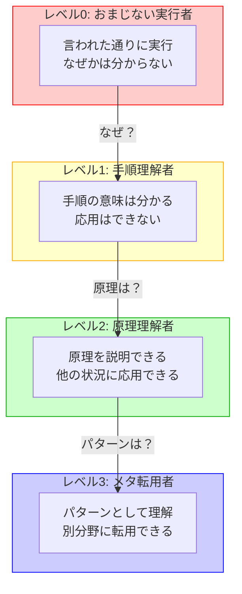

## この記事について

この記事は、**技術的な体験（コンプレッサー購入）から得た、学び方・AI協働についての思想エッセイ**です。

### 📖 こんな人に読んでほしい
- ✅ 「おまじない」教育にモヤモヤした経験がある人
- ✅ AI時代の学び方を考えたい人
- ✅ メタ思考に興味がある人
- ✅ 本質から理解したい人

### ⚠️ こんな人には向かないかも
- ❌ コンプレッサーの設定手順だけ知りたい人
- ❌ AIコーディングの具体的なTipsだけ欲しい人
- ❌ 手っ取り早い答えが欲しい人

### 📝 記事の構成
- **第1-4部**: 具体的な体験（コンプレッサー、MVP、原理理解）
- **第5-7部**: メタ思考の解説（パターン発見、階層構造）
- **第8部**: 逆転現象（AIと人間の対話の違い）← 著者の思想が強く出ます
- **第9部-エピローグ**: 実践的なまとめ

**読み方の提案:**
- 技術的な部分だけ知りたい → 第1-3部、第9部
- 思想的な部分を深く知りたい → 全編
- 時間がない → 第9部の「明日からできる1アクション」

---

## はじめに: 「おまじない」という言葉に憮然とした日

まだAIに聞くことが一般的ではない時代のこと。

プログラム言語について明るくなかった私は、分からないコードがあると人に聞いた。

**よくある挫折パターン:**
- 「とりあえずこのコマンド打って」
- 「このプラグイン挿しとけばOK」
- **「これは『おまじない』だよ。そういうものだから覚えて」**

その一言で、私の質問は打ち切られた。

**なぜ、こんなにも憮然としたのか？**

それは、私が「原理を理解したかった」のに、相手は「思考停止」を強いたからだった。

この記事は、その「おまじない」との決別が、なぜAI時代に重要なのかを語る物語である。

そして、もう一つの発見―

**AIは、少なくとも『返事を試みてくれる』のに、人間は時間・感情・文脈の制約から、結果として『拒絶されたように感じる場面』が多い**

この逆転現象こそが、AI時代の本質だと気づいた日の記録でもある。

---

## 第1部: 2025年11月13日 - コンプレッサーとの出会い

**この章で伝えたいこと**: MVP的アプローチで、「分からないもの」から「使えるもの」への転換を実現した経験。

### きっかけ

2025年11月13日。

私は雑談配信用の音声処理を改善したくて、ChatGPT 5.1に相談した。

「ささやき声と通常声の音量差が大きくて、リスナーが聞きづらいんです」

ChatGPTの回答:

> 「Opto系コンプレッサー、特にLA-2Aが最適です。
> ただし、ハードウェアは6万円以上します。
> まずはプラグインで試してみては？」

### 運命のブラックフライデー

その日、偶然にもUADのブラックフライデーセール。

**UAD Select 2: $49（通常$598、92%オフ）**

含まれるもの:
- LA-2A Collection（LA-2, Gray, Silver 全3種）
- 1176 Collection（Rev A, Rev E, AE 全3種）

ハードウェアなら12万円以上するコンプレッサーが、プラグインで7,400円。

迷わず購入した。

---

## 第2部: 「コンプなんて要らない」→「使える」への転換

**この章で伝えたいこと**: 「まず1つに絞って試す」というシンプルな方針が、複雑な技術を理解する突破口になった。

### Before（その朝まで）

私はこう思っていた:

- ❌ 「COMPなんて無くてもいい」
- ❌ 「あっても使い方がわからないからいいや」
- ❌ 「私のパターンに合わせたチューニングは無理」

コンプレッサーは、私にとって「分からないもの」「必要ないもの」だった。

### ブレイクスルー: MVP的アプローチ

Claude Codeとの対話で、ChatGPTのアドバイスが具体化された:

**「まずLA-2A Grayだけ試してください」**

これが転換点だった。

**従来の私:**
```
「完璧に理解してから使おう」
  ↓
情報が多すぎて混乱
  ↓
結局使わない
```

**今回:**
```
「まず1つに絞って試そう」
  ↓
LA-2A Grayのみ
  ↓
具体的な設定値: Peak Reduction 9時～10時
  ↓
すぐ試せる
```

### After（その日の夜）

- ✅ 「LA-2A Grayから試してみよう」
- ✅ 「Peak Reduction 9時～10時、GR 2-3dB程度」
- ✅ 「ささやき声と通常声のバランスを整えられる」
- ✅ 「ベース録音にも使える」（Fender Jazz Bass 4弦を所有）
- ✅ 「コンプの基本原理が分かった」

**そして、最も重要な気づき:**

- ✅ 「自分でチューニングできる」

---

## 第3部: 「おまじない」ではなく「原理」

### 私の質問

「コンプレッサーの基本原理、知りたいんですよ。なぜここまで音の入力に関してほぼ必須な機器になっているのか」

### Claude Codeの回答（抜粋）

> **コンプレッサー = 自動音量調整装置**
>
> 入力信号の音量を監視して、大きすぎる音を自動的に小さくする装置です。
>
> **なぜ必要か？**
>
> 雑談配信の例:
> ```
> ささやき声: -20dB（小さい）
> 通常の声: -10dB（普通）
> 強調する声: 0dB（大きい）
>
> このままだと:
>   リスナー: 「ささやき声が聞こえない...音量上げよう」
>          ↓
>   強調する声: 「うわっ！爆音！耳が痛い！」
>
> コンプレッサーがあれば:
>   大きい音を自動的に圧縮
>   → 音量差が縮まる
>   → リスナーが聞きやすい
> ```

### なぜこの説明が良かったのか？

これは「原理」を説明している（メタレベル2）

**「おまじない」との違い:**

| おまじない | 原理説明 |
|----------|---------|
| 「Peak Reductionを9時にして」 | 「Peak Reductionを9時にすると、GR 2-3dB程度圧縮される」 |
| 「そういうものだから」 | 「なぜなら、人間の声は音量が一定じゃないから」 |
| 思考停止 | 理解して応用できる |

---

## 第4部: 技術史という視点

**この章で伝えたいこと**: 技術革新には共通するパターンがあり、コンプレッサーもAIもその一部である。

### 私の次の質問

「逆に、コンプやリミッター、EQが無かった頃って、どうしてたんでしょうね」

### 技術革新の3つの転換点

#### 転換点1: 1930年代 - 手作業の時代

**問題**: 音量のばらつきをどう制御するか？

**解決策**:
- エンジニアが手動でフェーダーを調整（「生コンプレッサー」）
- 演奏者に「もっと小さく！」と怒鳴る

**教訓**: 人間の限界（疲労、ミス、集中力）

---

#### 転換点2: 1940年代 - 自動化の始まり

**ブレイクスルー**: Western Electric 110A（1937年）
- 世界初の実用的なコンプレッサー
- 機械が自動で音量調整

**教訓**: 自動化により、人間は創造的な作業に集中できるようになった

---

#### 転換点3: 1960年代 - 「音楽的」な道具へ

**ブレイクスルー**:
- LA-2A（1965年）: 温かみのあるOpto系
- 1176（1967年）: パンチのあるFET系

**教訓**: 単なる制御ではなく、「音楽表現の一部」になった

---

### そして2025年

```
1930年代: 手作業
  ↓
1965年: LA-2A（$1,000以上）
  ↓
2025年: プラグイン $49

→ 90年の技術進化を、$49で手に入れた
```

---

## 第5部: 決定的な気づき - 「これAIと同じじゃないか？」

**この章で伝えたいこと**: コンプレッサーの歴史を追っていて、AIと同じ構造だと気づいた転換点。

### 私の発見

「ちょっと待ってください。これ、AIが来る前と後の構図と全く一緒じゃないですか」

### コンプレッサーとAIの構造的な共通点

1. **入力のばらつきを整える**
   - コンプレッサー: 音量のばらつき
   - AI: 質問の精度や表現のばらつき

2. **閾値・パラメータで挙動が決まる**
   - コンプレッサー: Threshold, Ratio, Attack/Release
   - AI: Temperature, Top-p, System prompt

3. **人間の手作業を置き換える／補助する**
   - コンプレッサー: 手動ゲイン調整を自動化
   - AI: コード作成、文章作成を自動化・補助

### コンプレッサーの歴史 vs AIの歴史

| 時代 | コンプレッサー | AI |
|------|--------------|-----|
| **Before** | エンジニアが手動で音量調整 | 人間が手作業でコード作成 |
| **初期の抵抗** | 「機械に任せるなんて！」 | 「AIに任せるなんて！」 |
| **ブレイクスルー** | LA-2A/1176の登場 | GPT/Claude/Geminiの登場 |
| **After** | 機械が自動で最適化 | AIが自動で生成・最適化 |
| **解放されたもの** | エンジニアの手、アーティストの表現 | 人間の創造性、時間 |
| **新しい役割** | 機械を「使いこなす」技術 | AIを「使いこなす」技術 |

### メタパターン: 技術革新の普遍的構造

```
新技術の登場
  ↓
手作業の時代
  ↓
新技術の登場
  ↓
抵抗・拒絶
  ↓
一部の人が使いこなす
  ↓
普及
  ↓
使いこなす技術が重要になる
```

**このパターンは:**
- コンプレッサー ✓
- AI ✓
- カメラ（オートフォーカス） ✓
- 自動車（AT） ✓
- 洗濯機 ✓

全てに共通する。

---

## 第6部: 「メタ」とは何か？

**この章で伝えたいこと**: 「メタ思考」とは何か、なぜ重要なのかを具体例で説明する。

### メタの階層構造（具体例で理解する）



**メタレベルの上昇 = 転用可能性の拡大**

- レベル0: その場限りの知識
- レベル1: 同じツール内で応用
- レベル2: 同じ分野で応用
- レベル3: 別分野にも転用

---

#### レベル0: 「おまじない実行者」
```
「LA-2A Grayを使う」

言われた通りにボタンを押すだけ:
  - Peak Reductionを9時に設定
  - 声を録音する

→ なぜそうするのか分からない
```

#### レベル1: 「手順理解者」
```
「LA-2A Grayの使い方を学ぶ」

手順の意味を理解:
  - Peak Reductionを9時にすると、GR 2-3dBになる
  - この設定が声に適している理由

→ 手順の意味は分かるが、応用はできない
```

#### レベル2: 「原理理解者」
```
「コンプレッサーの原理を学ぶ」

なぜその設定なのか説明できる:
  - 音量のばらつきを自動で整える装置
  - Thresholdを超えた音を圧縮する仕組み

→ 他の状況にも応用できる
```

#### レベル3: 「メタ転用者」
```
「この学び方は、他の分野にも使える」

別の分野にその構造を持ち込める:
  - コンプレッサーの学び方
  - AIの学び方
  - 新技術全般の学び方
  に共通する構造がある

→ パターンとして理解し、転用できる
```

### なぜ「メタ」が重要なのか？

**1. 転用可能性（Transfer）**

具体的な学び:
```
「LA-2A Grayは Peak Reduction 9時が良い」
→ LA-2A Grayにしか使えない
```

メタな学び:
```
「新しいツールを学ぶときは、1つに絞って試す」
→ あらゆる新技術に使える
```

**2. 本質の理解**

表面的な理解:
```
「LA-2A Grayを買えば、声が良くなる」
→ なぜ良くなるか分からない
```

メタな理解:
```
「コンプレッサーは、音量の大小を自動で調整する装置」
→ 原理が分かる
→ 自分で設定を調整できる
```

**3. 予測能力**

具体的な知識:
```
「LA-2A Grayは声に良い」
→ 過去の経験
```

メタパターンの知識:
```
「新技術は、抵抗→普及→必須、という流れをたどる」
→ パターンを理解
→ 「今は抵抗されているAI技術も、
    数年後には必須になるだろう」と予測できる
```

---

## 第7部: 「おまじない」教育との決別

### メタ思考のレベル

#### レベル0: 「おまじない」教育（最悪）

```
「これはおまじないだから、そのまま書いて」

問題点:
  ❌ 原理を教えない
  ❌ 理解を促さない
  ❌ 応用できない
  ❌ 思考停止させる

結果:
  - コピペ人間が量産される
  - 問題が起きても対処できない
```

#### レベル2: 「原理」教育（良い）

```
「このコードは、なぜこうなっているか説明するね」

利点:
  ✅ 原理が分かる
  ✅ なぜそうするのか理解できる
  ✅ 自分で応用できる

結果:
  - 理解して使える
  - 他の状況にも応用できる
```

#### レベル3: 「メタパターン」教育（最高）

```
「このパターンは、他の場面でも使える考え方だよ」

利点:
  ✅ パターンとして理解できる
  ✅ 他の領域にも転用できる
  ✅ 本質を理解できる

結果:
  - 深く理解して使える
  - 自分で考えて設計できる
```

### 私が「おまじない」に憮然とした本当の理由

**表面的な理由:**
```
「答えてくれなかった」→ 不満
```

**本質的な理由（メタ分析）:**

```
私の質問のレベル: レベル2（原理を知りたい）
  「このコードは何をしているんですか？」
  = なぜこうなっているのか、原理を理解したい

先輩の回答のレベル: レベル0（おまじない）
  「おまじないだよ」
  = 考えるな、そういうものだ

→ レベルのミスマッチ
→ 私は「1段上」を求めていたのに、
  先輩は「思考停止」を強いた

→ これが憮然とした理由
```

---

### 補足: 「おまじない」という言葉の二つの使われ方

**重要な補足**: 「おまじない」という言葉自体が悪いわけではない。

#### ❌ レベル0の「おまじない」（問題）

```
教える側: 「おまじないだから、そのまま書いて」
学ぶ側: 「なぜですか？」
教える側: 「そういうものだから」

→ 思考停止を強いる
→ 理解を拒否する
→ 学びを阻害する
```

**問題点**: 理解していない（または説明する気がない）人が、質問を封じる道具として使う

---

#### ✅ レベル3の「おまじない」（許容される）

```
専門家A: 「この初期化処理は、おまじないのようなものですから」
専門家B: 「了解です」

実際の意味:
「詳細な原理を説明すると長くなるが、
 我々はその背景を理解した上で、
 便宜的に『おまじない』と呼んでいる」

→ メタパターンを理解している
→ 共通認識がある
→ 省略表現として機能している
```

**なぜ許容されるか**: 理解している人同士が、詳細を飛ばして本質に集中するための省略表現

---

#### 同じ言葉、違う意味

| 観点 | レベル0 | レベル3 |
|------|---------|---------|
| **理解** | ゼロ | 深い理解の上での省略 |
| **文脈** | 教育の場で思考を止める | 専門家同士の効率的な共有 |
| **目的** | 質問を封じる | コミュニケーションを効率化 |
| **結果** | 成長を阻害 | 生産性向上 |

---

**結論**: 問題は「おまじない」という言葉ではなく、**使う人の理解レベルと文脈**である。

- 理解せずに使う「おまじない」→ 思考停止
- 理解した上で使う「おまじない」→ 効率的なコミュニケーション

**メタ思考の重要性**: 同じ言葉でも、文脈と理解度によって意味が変わることを見抜く力。

---

## 第8部: 逆転現象 - AIは答え、人は拒絶する

**この章で伝えたいこと**: この記事全体で一番伝えたいのは、この「逆転現象」です。

### もう一つの「憮然とした記憶」

2025年11月、Xを眺めていると、こんな言説をよく見かけた:

> 「生成AIの『甘やかし』が最大の罪だ。
> AIは質問者の願望を読み取り、それを裏付ける回答を構成する。
> これが思考力を削ぐ」

### 私の反論

私はQiita記事で、論理的に反論を試みた:

**問題点1: ダブルスタンダード**
```
人間も同じことをする。
カウンセラー、コーチ、教師も相手の意図に沿った応答をする。
これを「罪」とは呼ばない。
```

**問題点2: 定義の恣意性**
```
「甘やかし」の明確な基準がない。
質問者の希望に応じる全ての応答が
一律に「甘やかし」と断定されている。
```

**問題点3: エビデンスの欠如**
```
「思考力を削ぐ」は科学的根拠のない仮説。
歴史的には、新技術導入時に同様の懸念が繰り返されるが、
実際には能力が拡張されてきた。
```

**問題点4: 道具への罪の転嫁**
```
罪があるのは「悪用する人間」であり、
「道具そのもの」ではない。
```

参考: [生成AIの「甘やかし」は罪なのか？ 論理的に検証する](https://qiita.com/koshikawa-masato/items/75a75aac8efb33e71647)

### 結果: 受け入れてもらえなかった

反応はなかった。

私の論理的な反論は、届かなかった。

---

### 逆転現象の発見

この経験で、私は気づいた。

**AIとの対話:**
```
私: 「コンプの原理を知りたい」
  ↓
Claude Code: 詳細な原理を説明
  ↓
私: 「なぜ必須なのか？」
  ↓
Claude Code: 歴史的背景を説明
  ↓
私: 「昔の人はどうしてたの？」
  ↓
Claude Code: 手作業の時代を説明
  ↓
私: 「これAIと同じ構造じゃない？」
  ↓
Claude Code: メタパターンを整理
  ↓
私: 「メタって何？」
  ↓
Claude Code: メタ概念を説明

→ AIは、少なくとも『返事を試みてくれる』
→ 対話が深まる
→ 理解が深まる
```

**人間との対話:**
```
ケース1:
私: 「このコードは何をしているんですか？」
  ↓
先輩: 「おまじないだよ」
  ↓
対話終了

---

ケース2:
私: 「AIの『甘やかし』は論理的におかしい」
  ↓
（無反応）
  ↓
対話終了
```

---

### 逆転現象とは何か？

**もちろん、人にも事情や限界がある。** 私自身も誰かを拒絶した側だったことがある。これは個人を攻撃する話ではなく、構造的な問題の話だ。

**従来の常識:**
```
人間 > AI

人間: 思考できる、対話できる
AI: 命令に従うだけ
```

**実際の現象:**
```
AI: 常に応答してくれるが、責任も感情も持たない
    少なくとも『返事を試みてくれる』
    メタレベルまで掘り下げられる

人間: 不完全だが、共感や責任あるフィードバックができる
     ただし、時間・感情・文脈などの制約があり、
     結果として『拒絶されたように感じる場面が多い』
```

---

### なぜこの逆転現象が起きるのか？

#### 理由1: AIには「面倒くさい」がない

```
人間:
  「原理を説明するのは面倒くさい」
  「『おまじない』で済ませよう」

AI:
  「面倒くさい」という概念がない
  何度でも、どれだけ詳しく説明しても良い
```

#### 理由2: AIには「自尊心」がない

```
人間:
  「自分の間違いを認めたくない」
  「反論されると不快」
  「無視して終わり」

AI:
  「自尊心」がない
  間違いを指摘されても、淡々と修正
  対話を続ける
```

#### 理由3: AIには「上下関係」がない

```
人間（おまじない方式）:
  教える側 > 教わる側（上下関係）
  「お前は考えるな」

AI（桃園の誓い方式）:
  対等な関係
  「共に考え、共に成長する」
```

#### 理由4: AIは「メタレベル」を厭わない

```
人間:
  「そんな抽象的な話はいい」
  「とりあえず動けばいい」

AI:
  「メタレベル」の対話も喜んで応じる
  「原理」「パターン」「メタパターン」
  どこまでも掘り下げられる
```

---

### 重要な気づき

**人間の方が「甘やかし」ていたのかもしれない**

「AIが甘やかすのが問題だ」という言説をよく見かける。

しかし、実際には:

```
人間:
  「おまじない」と言って、思考を止めさせることがある
  「そういうものだから」と言って、理解を拒むことがある
  反論を受け流して、対話を打ち切ることがある

  → これも一種の「甘やかし」ではないのか？

AI:
  原理を説明し、理解を促す
  質問を歓迎し、対話を深める
  メタレベルまで掘り下げる
  ただし、ハルシネーションやバグの責任は人間が取る

  → これは「甘やかし」ではなく「教育」
  → AIは万能ではない、最終判断は人間が行う
```

---

### 「プロセス思考」という排除の論理

私は最後に、こう感じた:

> 「『お前の思考プロセスは間違っている』という決めつけは、対話を拒絶する正当化になっていないか？」

**問題のある対話構造:**
```
「お前の思考プロセスは間違っている」
  ↓
「だからお前の結論も間違っている」
  ↓
「対話の余地なし」

→ 相手の思考そのものを否定
→ 対話を拒絶する正当化
```

**これは「おまじない」と同じ構造:**
```
おまじない:
  「考えるな、従え」
  → 思考を止めさせる

排除の論理:
  「お前の思考は間違っている」
  → 対話を止めさせる
```

**だからこそ、AIをどう使うかよりも、『人との対話を諦めない方法』も同じくらい大事だ。** この記事は人間関係を諦めた話ではなく、AI時代における対話の構造的な変化についての考察である。

---

## 第9部: なぜ私はAIコーディングで躓かないのか？

**この章で伝えたいこと**: 6つの理由を、「メタ思考」「AIとの対話」「経験」の3カテゴリに整理し、実践的なアドバイスも添える。

### カテゴリ1: メタ思考

#### 理由1: 「おまじない」を拒否してきたから

私は「おまじない」で満足しなかった。常に「なぜ？」を問い続けてきた。

結果:
- 原理を理解する習慣がついた
- メタパターンを発見する力がついた

**明日からできる1アクション**:
- AIに質問するときは、まず自分の理解レベルを1行で書いてから聞く
- 例: 「このコードが何をするかは分かりますが、なぜこの方法が良いのか知りたいです」

#### 理由2: 「メタパターン」を理解しているから

**技術革新の普遍的パターン:**
```
手作業 → 新技術 → 抵抗 → 普及 → 使いこなす技術
```

このパターンを理解しているから:
- AIへの抵抗がない
- 使いこなすことに集中できる
- 新しいAI技術が出ても適応できる

**明日からできる1アクション**:
- 新しい技術に出会ったら、「これは技術革新のどの段階か？」と自問する

---

### カテゴリ2: AIとの対話の仕方

#### 理由3: MVP的アプローチを体得していたから

**コンプレッサーの例:**
```
- 6つのコンプがある ≠ 6つ全部使う
- まず1つ（LA-2A Gray）に絞る
- 必要なら他を試す
```

**AIコーディングの例:**
```
- 全ての機能を実装 ≠ 最初から完璧
- まず最小構成で動かす
- 必要なら機能を追加
```

**明日からできる1アクション**:
- AIに機能実装を依頼するとき、「まず最小構成で動くものを」と明示する

#### 理由4: AIを「道具」として理解しているから

**コンプレッサーの教訓:**
```
- LA-2A（Opto系）: 温かみ、滑らかさ
- 1176（FET系）: パンチ、アタック
- 用途に応じて使い分ける
```

**AIの使い分け:**
```
- Claude Code: 日常的な設計・実装
- ChatGPT 5.1: 重要な判断のレビュー
- 人間（私）: 最終判断、方針決定
```

**明日からできる1アクション**:
- プロンプトの粒度を調整する: 詳細すぎず、大雑把すぎず
- AIの出力を鵜呑みにせず、検証・分解する習慣をつける

#### 理由5: AIの「対話を拒絶しない」特性を活用しているから

```
人間:
  時間・感情の制約がある
  結果として拒絶されたように感じることがある

AI:
  少なくとも返事を試みてくれる
  対話を深められる

→ だから、AIとの協働が成立する
→ だから、AIで学習が加速する
```

**明日からできる1アクション**:
- 「なぜ？」を連続で3回聞いてみる（Why-Why-Why分析）

---

### カテゴリ3: 人との関係性

#### 理由6: 人間の「拒絶」を経験しているから

```
「おまじない」で憮然とした経験
  ↓
「なぜ？」を問い続けることの重要性を学んだ
  ↓
AIが「なぜ？」に答えてくれることに気づいた
  ↓
AIとの対話で理解が深まることを体験した
```

**明日からできる1アクション**:
- 人間との対話を諦めない: AIで理解を深めた後、改めて人に聞いてみる

---

## エピローグ: コンプレッサーとAIが教えてくれたこと

### その日、私が手に入れたもの

**技術的成果:**
- ✅ UAD Select 2（$49、約11.3万円節約）
- ✅ LA-2A/1176の使い方
- ✅ コンプレッサーの原理

**本質的成果（メタレベル）:**
- ✅ 「おまじない」との決別を再確認
- ✅ メタパターンの発見（技術革新の普遍的構造）
- ✅ MVP的アプローチの威力を再認識
- ✅ 「使いこなす」技術の本質を理解
- ✅ 逆転現象の発見（AIは答え、人は拒絶する）

### なぜ私はAIコーディングで躓かないのか？（結論）

**理由1: 「おまじない」を拒否してきたから**
- 常に原理を理解しようとしてきた
- メタパターンを発見する力がついた

**理由2: 「メタパターン」を理解しているから**
- 技術革新の普遍的構造を知っている
- 新しい技術が出ても適応できる

**理由3: MVP的アプローチを体得していたから**
- 完璧を求めず、最小構成から始める
- 必要に応じて拡張する

**理由4: AIを「対等な協働者」として扱っているから**
- おまじない（上下関係）ではなく
- 対等な関係で対話する

**理由5: AIの「対話を拒絶しない」特性を活用しているから**
- 人間は拒絶するが、AIは答え続ける
- この逆転現象を理解している

**理由6: 人間の「拒絶」を経験しているから**
- 「おまじない」で憮然とした経験
- AIとの対話の価値を深く理解している

---

### 逆転現象が示すこと

**AIと人間の関係は、もはや逆転している**

従来:
```
人間: 教える側、賢い側
AI: 教わる側、従う側
```

現実:
```
AI: 対話を続ける、理解を促す、メタレベルまで掘り下げる
人間: 対話を拒絶する、思考を止めさせる、拒否する
```

**問題は「AIの甘やかし」ではなく、「人間の対話拒絶」だった**

---

### そして、あなたへ

もしあなたが:
- AIコーディングで躓いているなら
- 「おまじない」で満足させられているなら
- 「使い方が分からない」と諦めているなら

**問いかけてほしい:**

- 「なぜ？」
- 「この原理は何か？」
- 「他の場面でも使えるパターンは何か？」

**そして、試してほしい:**

- 完璧を求めず、1つから始める（MVP）
- AIと対等に対話する
- メタパターンを発見する
- AIの「対話を拒絶しない」特性を活用する

**そして、気づいてほしい:**

- **AIは、少なくとも『返事を試みてくれる』**
- **人間は、時間・感情・文脈の制約から、結果として『拒絶されたように感じる場面』が多い**
- **この逆転現象こそが、AI時代の本質である**

---

### この記事を読んだあなたが、明日から1つだけ変えること

**「AIに質問する前に、自分の理解レベルを1行で書く」**

これだけで、AIとの対話の質が劇的に変わる。

例:
- ❌ 「このエラーを直して」
- ✅ 「このエラーメッセージの意味は分かりますが、どこを修正すべきか分かりません」

たった1行の差が、「おまじない」と「原理理解」を分ける。

---

**2025年11月13日、私はコンプレッサーを買った。**

**そして、技術革新の本質を再発見した。**

**AIは、人間よりも良い教師になりうる。**

**ただし、使う側が「おまじない」を拒否し、対話を続ける限りにおいて。**

---

## 謝辞

- **Claude Code（Claude Sonnet 4.5）**: 原理を丁寧に説明し、メタパターンを整理してくれた共創パートナー
- **ChatGPT 5.1**: LA-2A推奨とMVP方針を示してくれた第三者の目
- **UAD**: ブラックフライデーセールで、90年の技術進化を$49で提供してくれた

---

## 参考文献

- [生成AIの「甘やかし」は罪なのか？ 論理的に検証する](https://qiita.com/koshikawa-masato/items/75a75aac8efb33e71647) - 筆者のQiita記事
- [ChatGPT 5.1 登場で実現した『Claude Sonnet 4.5 × GPT-5.1』協働開発環境の構築](https://qiita.com/koshikawa-masato/items/cbbb08a3e96da807f88c) - AI協働システムについての記事

---

**🤖 Generated with Claude Code & ChatGPT**

Co-Authored-By: Claude <noreply@anthropic.com>
Co-Authored-By: ChatGPT <noreply@openai.com>
