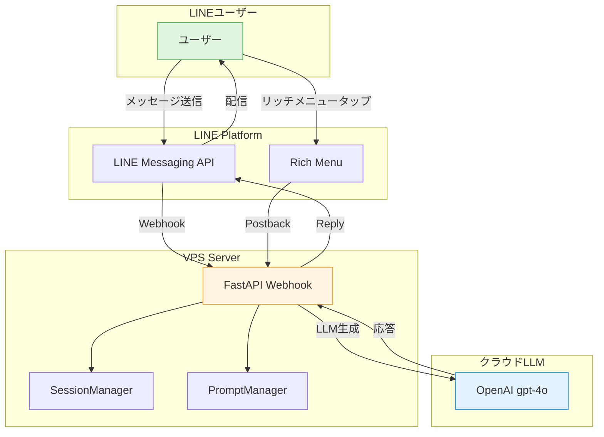

## この記事について

LINE Botで**3人のAIキャラクターとリッチメニューで切り替えながら会話できるシステム**を実装しました。

### 🎯 この記事で分かること

- ✅ LINE Botのリッチメニュー実装（2段×3列レイアウト）
- ✅ キャラクター切り替え機能の実装
- ✅ FastAPIでのWebhook処理
- ✅ OpenAI API（gpt-4o）の統合
- ✅ セッション管理の実装
- ✅ ハマったポイントと解決策

### 💻 技術スタック

- **バックエンド**: FastAPI (Python 3.11)
- **LLM**: OpenAI gpt-4o
- **メッセージング**: LINE Messaging API
- **セッション管理**: In-memory（将来的にDB化予定）
- **デプロイ**: VPS (systemd)

---

## デモ

### リッチメニュー（2段×3列）


**上段**: プロフィール表示（タップで詳細表示）
**下段**: キャラクター選択（タップで会話相手を切り替え）

### 実際の会話


キャラクターごとに異なる性格・口調で応答します。

---

## システム構成



---

## 実装手順

### 1. セッション管理（SessionManager）

ユーザーごとにキャラクター選択状態を保持します。

**src/line_bot_vps/session_manager.py**:

```python
from dataclasses import dataclass, field
from typing import Optional, Dict, Literal
from datetime import datetime

CharacterType = Literal["botan", "kasho", "yuri"]

@dataclass
class UserSession:
    """ユーザーセッション"""
    user_id: str
    selected_character: Optional[CharacterType] = None
    last_message_at: Optional[datetime] = None
    conversation_history: list = field(default_factory=list)


class SessionManager:
    """セッション管理クラス（インメモリ版）"""

    def __init__(self):
        self.sessions: Dict[str, UserSession] = {}

    def get_session(self, user_id: str) -> UserSession:
        """ユーザーセッションを取得（存在しない場合は新規作成）"""
        if user_id not in self.sessions:
            session = UserSession(
                user_id=user_id,
                selected_character=None,  # 未選択
                last_message_at=None
            )
            self.sessions[user_id] = session
        return self.sessions[user_id]

    def set_character(self, user_id: str, character: CharacterType) -> None:
        """ユーザーの選択キャラクターを設定"""
        session = self.get_session(user_id)
        session.selected_character = character

    def get_character_or_default(
        self,
        user_id: str,
        default: CharacterType = "botan"
    ) -> CharacterType:
        """ユーザーの選択キャラクターを取得（未選択の場合はデフォルト）"""
        character = self.get_session(user_id).selected_character
        if character is None:
            return default
        return character
```

**ポイント**:
- インメモリ実装（VPSリソース節約）
- 将来的にはRedis/DBに移行可能
- デフォルトキャラクター設定（未選択時は牡丹）

---

### 2. リッチメニュー作成（RichMenuManager）

2段×3列のリッチメニューを自動作成します。

**src/line_bot_vps/rich_menu_manager.py**:

```python
from dataclasses import dataclass

@dataclass
class RichMenuArea:
    """リッチメニューのタップ領域"""
    bounds_x: int
    bounds_y: int
    bounds_width: int
    bounds_height: int
    action_type: str  # "postback", "message", "uri"
    action_data: str  # postbackデータ、メッセージテキスト、またはURI


class RichMenuManager:
    """リッチメニュー管理クラス"""

    def create_3sisters_menu(
        self,
        menu_image_path: str,
        menu_name: str = "3姉妹キャラクター選択"
    ) -> Optional[str]:
        """3姉妹キャラクター選択用のリッチメニューを作成（2段構成）"""

        # メニュー領域定義（2段×3列 = 6分割）
        menu_width = 2500
        menu_height = 843
        area_width = menu_width // 3  # 833px
        row_height = menu_height // 2  # 421px

        areas = [
            # 上段: プロフィール表示（3エリア）
            RichMenuArea(
                bounds_x=0, bounds_y=0,
                bounds_width=area_width,
                bounds_height=row_height,
                action_type="postback",
                action_data="profile=botan"
            ),
            RichMenuArea(
                bounds_x=area_width, bounds_y=0,
                bounds_width=area_width,
                bounds_height=row_height,
                action_type="postback",
                action_data="profile=kasho"
            ),
            RichMenuArea(
                bounds_x=area_width * 2, bounds_y=0,
                bounds_width=area_width,
                bounds_height=row_height,
                action_type="postback",
                action_data="profile=yuri"
            ),

            # 下段: キャラクター選択（3エリア）
            RichMenuArea(
                bounds_x=0, bounds_y=row_height,
                bounds_width=area_width,
                bounds_height=menu_height - row_height,
                action_type="postback",
                action_data="character=botan"
            ),
            RichMenuArea(
                bounds_x=area_width, bounds_y=row_height,
                bounds_width=area_width,
                bounds_height=menu_height - row_height,
                action_type="postback",
                action_data="character=kasho"
            ),
            RichMenuArea(
                bounds_x=area_width * 2, bounds_y=row_height,
                bounds_width=area_width,
                bounds_height=menu_height - row_height,
                action_type="postback",
                action_data="character=yuri"
            ),
        ]

        # リッチメニューを作成
        rich_menu_id = self._create_rich_menu(
            name=menu_name,
            chat_bar_text="キャラクター選択",
            areas=areas,
            width=menu_width,
            height=menu_height
        )

        # 画像をアップロード
        self._upload_rich_menu_image(rich_menu_id, menu_image_path)

        return rich_menu_id
```

**ポイント**:
- 画像サイズ: 2500×843px（LINE公式推奨）
- 上段: `profile=botan` → プロフィール表示
- 下段: `character=botan` → キャラクター切り替え
- Postbackで処理を分岐

---

### 3. Webhook処理（FastAPI）

Postback（リッチメニュータップ）とメッセージを処理します。

**src/line_bot_vps/webhook_server_vps.py**:

```python
from fastapi import FastAPI, Request
from typing import Optional
import json

app = FastAPI()

# グローバル初期化
session_manager = SessionManager()
llm_provider = CloudLLMProvider(provider="openai", model="gpt-4o")
prompt_manager = PromptManager()

CHARACTERS = {
    "kasho": {"name": "Kasho", "display_name": "花相（Kasho）", "age": 19},
    "botan": {"name": "牡丹", "display_name": "牡丹（Botan）", "age": 17},
    "yuri": {"name": "ユリ", "display_name": "百合（Yuri）", "age": 15}
}

@app.post("/webhook")
async def webhook(request: Request):
    """LINE Webhook エンドポイント"""
    body = await request.body()
    webhook_data = json.loads(body.decode('utf-8'))
    events = webhook_data.get("events", [])

    for event in events:
        event_type = event.get("type")
        user_id = event.get("source", {}).get("userId")
        reply_token = event.get("replyToken")

        # Postbackイベント（リッチメニュー）
        if event_type == "postback":
            postback_data = event.get("postback", {}).get("data", "")

            # キャラクター選択処理
            if postback_data.startswith("character="):
                character = postback_data.split("=")[1]

                if character in CHARACTERS:
                    # セッションに保存
                    session_manager.set_character(user_id, character)

                    # 確認メッセージを返信
                    reply_message = (
                        f"✨ {CHARACTERS[character]['display_name']}を選択したよ！"
                        f"何でも聞いてね！"
                    )

                    # LINE Reply API呼び出し
                    send_line_reply(reply_token, reply_message)

        # メッセージイベント
        elif event_type == "message":
            message_type = event.get("message", {}).get("type")

            if message_type == "text":
                user_message = event.get("message", {}).get("text", "")

                # SessionManagerからキャラクターを取得（デフォルト: 牡丹）
                character = session_manager.get_character_or_default(
                    user_id,
                    default="botan"
                )

                # LLM生成
                bot_response = generate_response(
                    character=character,
                    user_message=user_message,
                    user_id=user_id
                )

                # 最終メッセージ時刻を更新
                session_manager.update_last_message_time(user_id)

                # LINE返信
                send_line_reply(reply_token, bot_response)

    return {"status": "ok"}
```

**ポイント**:
- `event_type == "postback"` でリッチメニュー処理
- `character=` のプレフィックスでキャラクター選択を判定
- セッションに保存し、次回メッセージで使用

---

### 4. LLM統合（CloudLLMProvider）

OpenAI APIを統一インターフェースで呼び出します。

**src/line_bot_vps/cloud_llm_provider.py**:

```python
import os
from openai import OpenAI
from typing import Optional, Dict, Any

class CloudLLMProvider:
    """クラウドLLMプロバイダー（OpenAI対応）"""

    def __init__(
        self,
        provider: str = "openai",
        model: str = "gpt-4o",
        temperature: float = 0.7,
        max_tokens: int = 500
    ):
        self.provider = provider
        self.model_name = model
        self.temperature = temperature
        self.max_tokens = max_tokens

        if provider == "openai":
            api_key = os.getenv("OPENAI_API_KEY")
            self.client = OpenAI(api_key=api_key)

    def generate_with_context(
        self,
        user_message: str,
        character_name: str,
        character_prompt: str,
        memories: Optional[str] = None,
        metadata: Optional[Dict[str, Any]] = None
    ) -> str:
        """コンテキスト付き生成"""

        # システムプロンプト構築
        system_prompt = f"""あなたは{character_name}です。

{character_prompt}

【最重要指示 - 絶対厳守】
1. ⚠️ 必ず100%日本語のみで応答してください ⚠️
2. ⚠️ 英語・中国語・ロシア語・その他の外国語は絶対に使わないでください ⚠️
3. ⚠️ 中国語（簡体字・繁体字）は絶対禁止です ⚠️
4. 固有名詞（Disney、Emilyなど）以外は全て日本語で表現してください
5. 30秒以内に応答を完了してください
6. 簡潔で自然な会話を心がけてください
"""

        # 記憶を追加（Phase D実装後）
        if memories:
            system_prompt += f"\n\n【記憶】\n{memories}\n"

        # OpenAI API呼び出し
        response = self.client.chat.completions.create(
            model=self.model_name,
            messages=[
                {"role": "system", "content": system_prompt},
                {"role": "user", "content": user_message}
            ],
            temperature=self.temperature,
            max_tokens=self.max_tokens
        )

        return response.choices[0].message.content
```

**ポイント**:
- 環境変数でモデル切り替え可能（`VPS_LLM_MODEL`）
- 日本語応答を強制（中国語バグ対策）
- 30秒タイムアウト対応（LINE制約）
- キャラクター別プロンプトの注入

---

## ハマったポイントと解決策

### ❌ 問題1: 中国語で応答されるバグ

**症状**: たまに中国語（簡体字）で応答される


**原因**: モデルの言語判定が不安定

**解決策**:

```python
system_prompt += """
【最重要指示 - 絶対厳守】
1. ⚠️ 必ず100%日本語のみで応答してください ⚠️
2. ⚠️ 中国語（簡体字・繁体字）は絶対禁止です ⚠️
"""
```

プロンプトで**強調**することで解決しました。

---

### ❌ 問題2: リッチメニュー画像サイズ

**症状**: 画像アップロードが失敗する

**原因**: LINEの画像サイズ要件（2500×843px, 2500×1686px）

**解決策**:

```bash
# ImageMagickで正確なサイズに変換
convert -size 2500x843 xc:none base_image.png
```

**注意**: 幅2500pxは固定、高さは843px（半分）または1686px（フル）のみ

---

### ❌ 問題3: Postbackとメッセージの区別

**症状**: リッチメニュータップ時にメッセージとして処理される

**原因**: `event_type` の判定ミス

**解決策**:

```python
if event_type == "postback":
    # リッチメニュー処理
    postback_data = event.get("postback", {}).get("data", "")

elif event_type == "message":
    # メッセージ処理
    user_message = event.get("message", {}).get("text", "")
```

**ポイント**: Postbackは `event.postback.data`、メッセージは `event.message.text`

---

## 本番環境での運用

### systemdでの自動起動

**scripts/line-bot-vps.service**:

```ini
[Unit]
Description=LINE Bot VPS Service
After=network.target

[Service]
Type=simple
User=ubuntu
WorkingDirectory=/home/ubuntu/AI-Vtuber-Project
Environment="VPS_LLM_PROVIDER=openai"
Environment="VPS_LLM_MODEL=gpt-4o"
ExecStart=/home/ubuntu/AI-Vtuber-Project/venv/bin/python -m src.line_bot_vps.webhook_server_vps
Restart=always

[Install]
WantedBy=multi-user.target
```

**起動**:

```bash
sudo systemctl start line-bot-vps
sudo systemctl enable line-bot-vps

# ログ確認
sudo journalctl -u line-bot-vps -f
```

---

## まとめ

### 実装のポイント

1. **セッション管理**: ユーザーごとの状態保持
2. **リッチメニュー**: 2段レイアウトで機能分離
3. **Postback処理**: リッチメニュータップを適切に処理
4. **LLM統合**: OpenAI APIを統一インターフェースで
5. **日本語強制**: プロンプトで言語を厳密に制御

### 次のステップ

- [ ] Phase D記憶システムの統合
- [ ] センシティブ判定の実装
- [ ] DB永続化（Redis/PostgreSQL）
- [ ] プロフィール表示のFlex Message対応

---

## 参考

- **GitHubリポジトリ**: [AI-Vtuber-Project](https://github.com/koshikawa-masato/AI-Vtuber-Project)
- **LINE Messaging API**: https://developers.line.biz/ja/docs/messaging-api/
- **FastAPI公式**: https://fastapi.tiangolo.com/
- **OpenAI API**: https://platform.openai.com/docs/

---

**🤖 Generated with Claude Code**

Co-Authored-By: Claude <noreply@anthropic.com>
