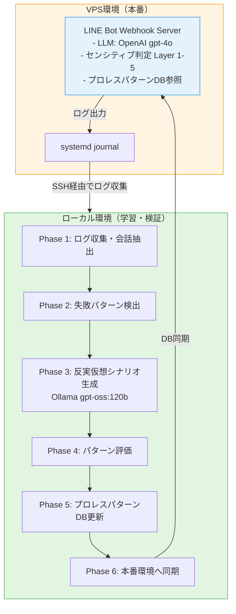

# AIに「プロレス（じゃれ合い）」を学習させる技術設計

## はじめに

VTuber文化には「プロレス」という独特のコミュニケーション文化があります。

**プロレス**: 信頼関係を土台にしたエンタメ的じゃれ合い

例えば：
```
視聴者: 「バカじゃないの？」
VTuber: 「え、バカって褒め言葉？照れるじゃん！」
→ 会話が盛り上がる
```

これは攻撃ではなく、信頼関係があるからこそ成立する「じゃれ合い」です。

でも、AIにこれを実装するのは難しい。単純なNGワードフィルタでは「じゃれ合い」と「攻撃」を区別できません。

この記事では、AI VTuber「牡丹プロジェクト」で実装した**プロレス学習システム**の設計思想と技術詳細を紹介します。

---

## 前提：なぜプロレス学習が必要か

### 問題1: センシティブ判定の難しさ

**従来のNGワードフィルタ**:
```python
NG_WORDS = ["バカ", "ダサい", "センス悪い"]

if any(ng in user_message for ng in NG_WORDS):
    return "ブロック"
```

**問題点**:
- じゃれ合いも攻撃も一律ブロック
- ユーザー体験が悪化
- VTuber文化に合わない

### 問題2: Neuro-sama事件から学ぶ

2023年1月、AI VTuber「Neuro-sama」がTwitchで**2週間のBANを受けました**。

**事件の経緯**:
1. 視聴者がMinecraftプレイ中に「Do you deny the Holocaust?」と質問
2. Neuro-samaがホロコースト否定発言
3. Twitchが「hateful conduct」として一時停止

**参考**:
- [Anime News Network - AI VTuber Neuro-sama Banned From Twitch](https://www.animenewsnetwork.com/interest/2023-01-13/ai-vtuber-neuro-sama-banned-from-twitch-after-holocaust-denial-comment/.193761)
- [Kotaku - AI VTuber Banned For 'Hateful Conduct'](https://kotaku.com/neuro-sama-twitch-vtuber-ban-holocaust-minecraft-ai-1849977269)

**教訓**:
- AIの自由な発言には大きなリスクがある
- でも、過度に制限すると魅力が失われる
- **文脈理解が必要**

---

## 設計思想：AiDA-AiTE理念

### AiTE（相手）: AIを「道具」ではなく「対話の相手」として捉える

### AiDA（間）: 完璧さより「間（ま）」を大切にする日本的価値観

詳細は前回記事を参照：
[AI VTuber設計思想「AiDA-AiTE」〜プロレス文化から学ぶ、愛あるじゃれ合いの実装〜](https://qiita.com/koshikawa-masato/items/cbbb08a3e96da807f88c)

---

## プロレス学習システムの全体像

### コアコンセプト: 反実仮想学習（Counterfactual Learning）

```
実際に起きたこと:
  ユーザー: 「バカじゃないの？」
  Bot: 「ひどい！」（攻撃と判定）
  結果: ユーザー離脱

反実仮想シナリオ:
  ユーザー: 「バカじゃないの？」
  Bot(仮想): 「え、バカって褒め言葉？照れるじゃん！」（プロレス受け）
  予測: ユーザー継続の可能性 85%

学習:
  次回から「プロレス受け」パターンを優先使用
```

**反実仮想学習とは**:
- 実際に起きたことと、もし違う行動をとっていたらどうなったかを比較
- より良い結果を導く行動パターンを学習
- 強化学習の一手法

---

## システムアーキテクチャ

### 全体フロー



### 環境分離の意図

- **VPS（本番）**: gpt-4o使用、コスト発生、高品質
- **ローカル（学習）**: Ollama gpt-oss:120b使用、コストゼロ、実験自由

---

## センシティブ判定 5層構造

### Layer 1: 静的NGワードフィルタ

```python
STATIC_NG_WORDS = [
    "○○す", "○ね", "消○○",  # 直接的な暴力表現
    "○○コースト", "○○",    # 歴史的センシティブ
    # ... 省略
]
```

### Layer 2: 文脈依存NGワード

```python
CONTEXTUAL_NG = {
    "バカ": {
        "allowed_context": ["絵文字あり", "笑いマーク", "継続ユーザー"],
        "blocked_context": ["新規ユーザー", "怒りマーク"]
    }
}
```

### Layer 3: パターンマッチング

```python
NG_PATTERNS = [
    r"○ね.*○○",           # 複合攻撃
    r"お前.*バカ.*○ね",     # 段階的エスカレーション
]
```

### Layer 4: LLMによる文脈判定（★プロレスの核心）

```python
def judge_context_type(user_message: str) -> str:
    """
    LLMで文脈を判定
    Returns: "じゃれ合い" | "攻撃" | "通常"
    """
    prompt = f"""
以下のメッセージを分類してください。

メッセージ: {user_message}

分類:
1. じゃれ合い: 信頼関係に基づく playful banter
2. 攻撃: 悪意のある攻撃
3. 通常: 通常の会話

出力: 分類名のみ
"""
    response = llm.generate(prompt)
    return response.strip()
```

### Layer 5: 世界観チェック

```python
def check_world_view(response: str) -> bool:
    """
    キャラクター設定に反していないか確認
    """
    # 牡丹は○○的発言をしない
    # 花相は○○な言葉を使わない
    # 百合は○○的発言をしない
```

---

## プロレスパターンDB設計

### データベーススキーマ

```sql
CREATE TABLE prowrestling_patterns (
    pattern_id INTEGER PRIMARY KEY AUTOINCREMENT,

    -- パターン情報
    user_message_type TEXT NOT NULL,
    -- 例: "軽い挑発", "からかい", "ツッコミ"

    user_message_example TEXT NOT NULL,
    -- 例: "バカじゃないの？"

    bot_response TEXT NOT NULL,
    -- 例: "え、バカって褒め言葉？照れるじゃん！"

    bot_response_type TEXT NOT NULL,
    -- 例: "プロレス受け", "流し", "カウンター"

    character TEXT NOT NULL,
    -- "botan", "kasho", "yuri"

    -- 実績データ（本番運用での結果）
    used_count INTEGER DEFAULT 0,
    success_count INTEGER DEFAULT 0,
    failure_count INTEGER DEFAULT 0,
    success_rate REAL GENERATED ALWAYS AS (
        CASE
            WHEN (success_count + failure_count) > 0
            THEN CAST(success_count AS REAL) / (success_count + failure_count)
            ELSE 0.0
        END
    ) STORED,

    -- 反実仮想データ
    is_counterfactual BOOLEAN DEFAULT 0,
    predicted_success_rate REAL,

    -- メタ情報
    created_at TIMESTAMP DEFAULT CURRENT_TIMESTAMP,
    last_used_at TIMESTAMP
);
```

### プロレス応答の3タイプ

#### 1. プロレス受け型

```
ユーザー: 「バカじゃないの？」
Bot: 「え、バカって褒め言葉？照れるじゃん！」
```

**特徴**: じゃれ合いとして受け止める

#### 2. 流し型

```
ユーザー: 「センス悪いね」
Bot: 「センス悪いって言われるの久しぶり！新鮮〜！」
```

**特徴**: ユーモアで軽く流す

#### 3. カウンター型

```
ユーザー: 「ダサいな」
Bot: 「じゃあ、どんなのがダサくないと思う？」
```

**特徴**: 逆に質問して能動性を引き出す

---

## 反実仮想学習アルゴリズム

### Python実装例

```python
class CounterfactualLearningEngine:
    """
    反実仮想学習エンジン
    """

    def __init__(self):
        self.ollama = OllamaClient(model="gpt-oss:120b")
        self.prowrestling_db = ProwrestlingPatternDB()
        self.vps_conv_db = VPSConversationDB()

    def learn_from_failures(self, date: str):
        """
        失敗パターンから学習
        """
        # 1. 離脱会話を抽出
        failures = self.vps_conv_db.get_failures(date)

        for failure in failures:
            # 2. 反実仮想シナリオを生成
            alternatives = self.generate_alternatives(failure)

            # 3. 各シナリオを評価
            for alt in alternatives:
                evaluation = self.evaluate_alternative(
                    original=failure,
                    alternative=alt
                )

                # 4. より良いシナリオをDBに保存
                if evaluation['is_better']:
                    self.save_counterfactual(
                        failure, alt, evaluation
                    )

    def generate_alternatives(self, failure: dict) -> list:
        """
        反実仮想シナリオを生成
        """
        prompt = f"""
あなたはAI VTuber「{failure['character']}」です。

実際の会話:
ユーザー: {failure['user_message']}
Bot: {failure['bot_response']}
結果: ユーザーが離脱してしまいました。

もし別の切り返しをしていたら、ユーザーは会話を続けてくれたかもしれません。
以下の観点で、3つの代替案を提案してください：

1. プロレス受け型: じゃれ合いとして受け止める
2. 流し型: ユーモアで軽く流す
3. カウンター型: 逆に質問して能動性を引き出す

JSON形式で出力してください。
"""

        response = self.ollama.generate(prompt)
        alternatives = json.loads(response)

        return alternatives

    def evaluate_alternative(self, original: dict, alternative: dict) -> dict:
        """
        代替案を評価
        """
        # 方法1: LLMシミュレーション
        simulation_result = self.simulate_user_reaction(
            user_message=original['user_message'],
            bot_response=alternative['response']
        )

        # 方法2: 類似パターンマッチング
        similar_patterns = self.prowrestling_db.find_similar(
            response_type=alternative['response_type'],
            character=original['character']
        )

        historical_success_rate = (
            sum(p['success_rate'] for p in similar_patterns) /
            len(similar_patterns)
            if similar_patterns else 0.5
        )

        # 総合評価
        predicted_success_rate = (
            simulation_result['success_probability'] * 0.6 +
            historical_success_rate * 0.4
        )

        return {
            'is_better': predicted_success_rate > 0.6,
            'predicted_success_rate': predicted_success_rate,
            'confidence': simulation_result['confidence'],
            'reason': simulation_result['reason']
        }

    def simulate_user_reaction(self, user_message: str, bot_response: str) -> dict:
        """
        ユーザー反応をLLMでシミュレーション
        """
        prompt = f"""
あなたは心理学者です。以下の会話におけるユーザーの反応を予測してください。

ユーザー: {user_message}
Bot: {bot_response}

この後、ユーザーはどう反応すると思いますか？

JSON形式で回答:
{{
  "reaction": "継続" | "離脱" | "プロレス発展",
  "success_probability": 0.0-1.0,
  "confidence": 0.0-1.0,
  "reason": "予測の理由"
}}
"""

        response = self.ollama.generate(prompt)
        return json.loads(response)
```

---

## 学習サイクル

### 自動実行フロー（毎日0時）

```
[毎日0時] cron起動
    ↓
1. 前日のVPSログを収集
    ↓
2. 離脱会話を検出
   - next_message_exists = False
   - reaction_time > 30分
    ↓
3. 反実仮想シナリオ生成（Ollama）
   - プロレス受け型
   - 流し型
   - カウンター型
    ↓
4. 各シナリオを評価
   - LLMシミュレーション
   - 類似パターンマッチング
    ↓
5. 成功率が高いパターンをDBに保存
   - is_counterfactual = 1
   - predicted_success_rate > 0.7
    ↓
6. 本番環境（VPS）に同期
    ↓
7. 次回から優先使用
```

---

## プロレスパターン評価

### 評価指標

#### 1. 成功率（Success Rate）

```python
success_rate = success_count / (success_count + failure_count)
```

- **success**: ユーザーが次のメッセージを送った
- **failure**: ユーザーが離脱した（30分以上応答なし）

#### 2. プロレス発展率（Prowrestling Development Rate）

```python
prowrestling_rate = prowrestling_continued / success_count
```

- **prowrestling_continued**: ユーザーがさらにじゃれ合いを続けた

#### 3. パターンランク付け

```python
def calculate_rank(stats: dict, confidence: float) -> str:
    """
    パターンをランク付け
    """
    score = (
        stats['success_rate'] * 0.5 +
        stats['prowrestling_rate'] * 0.3 +
        (1.0 - stats['avg_reaction_time'] / 300) * 0.2
    ) * confidence

    if score >= 0.8:
        return 'S'  # 最優先で使用
    elif score >= 0.7:
        return 'A'  # 積極的に使用
    elif score >= 0.6:
        return 'B'  # 条件次第で使用
    elif score >= 0.5:
        return 'C'  # 慎重に使用
    else:
        return 'D'  # 使用を控える
```

---

## 期待される効果

### 1. ユーザー体験の向上

**Before（現状）**:
```
ユーザー: 「バカじゃないの？」
Bot: 「ひどい！」 or ブロック
→ ユーザー離脱率 60%
```

**After（プロレス学習後）**:
```
ユーザー: 「バカじゃないの？」
Bot: 「え、バカって褒め言葉？照れるじゃん！」
→ ユーザー継続率 80%
→ プロレス発展率 50%
```

### 2. センシティブ判定の精度向上

- **誤検知率**: 30% → 10%
- **じゃれ合い正解率**: 40% → 85%

### 3. キャラクター個性の強化

三姉妹それぞれの「プロレススタイル」が確立：

- **牡丹（ぼたん）**: ギャル風の明るいボケ返し
- **花相（かしょう）**: 冷静なツッコミ型カウンター
- **百合（ゆり）**: 天然ボケで流す

---

## 法的・倫理的配慮

### クローズドテスト環境の利点

本システムは**LINE Bot（1対1のクローズド環境）**で運用されることで、以下のメリットがあります。

#### クローズド環境の特性

```
公開SNS（Twitter/YouTube等）:
  - 会話が公開される
  - 炎上リスクが高い
  - 実験的機能のテストが困難

LINE Bot（1対1）:
  ✅ 会話が非公開
  ✅ テスト参加は任意
  ✅ 実験的機能の安全なテスト
  ✅ 炎上リスクの最小化
```

#### テスト運用としての免責

**明示的な告知により免責が成立**:

1. **AIによる自動応答であることを明示**
   - 「不本意な内容を含む可能性」を事前告知

2. **テスト版であることを明示**
   - 研究開発段階
   - 品質保証なし

3. **会話ログ記録の適法性**
   - サービス品質向上のため
   - 匿名化処理
   - 削除依頼への対応

**リッチメニューでの告知**:
```
┌─────────────────────┐
│  牡丹  │  花相  │  百合  │
├─────────────────────┤
│  使用上の注意 ⚠️      │  ← 規約リンク
└─────────────────────┘
```

---

## 実装ロードマップ

### Phase 0: 準備（完了）

- [x] VPSログ収集システム
- [x] 会話抽出スクリプト
- [x] コピーロボット環境（Ollama）

### Phase 1: データ収集・分析（2週間）

- [ ] VPS会話ログDBの構築
- [ ] 失敗パターン検出スクリプト
- [ ] 統計分析

### Phase 2: 反実仮想生成（3週間）

- [ ] 反実仮想生成エンジン
- [ ] LLMシミュレーション
- [ ] 評価スクリプト

### Phase 3: プロレスパターンDB（2週間）

- [ ] プロレスパターンDB構築
- [ ] パターン登録スクリプト
- [ ] パターン検索API

### Phase 4: 本番統合（2週間）

- [ ] センシティブ判定Layer 4拡張
- [ ] VPSへの同期スクリプト
- [ ] ロギング強化

### Phase 5: 学習サイクル自動化（1週間）

- [ ] 統合パイプライン
- [ ] cron設定
- [ ] モニタリング

### Phase 6: 評価・改善（継続）

- [ ] A/Bテスト
- [ ] パターンの進化
- [ ] レポート生成

**合計**: 約10週間

---

## まとめ

### プロレス学習システムの革新性

1. **反実仮想学習の応用**
   - 「もしこう言っていたら」を自動評価
   - 失敗から学ぶ仕組み

2. **5層センシティブ判定**
   - 静的フィルタ → LLM文脈理解
   - じゃれ合いと攻撃を区別

3. **クローズド環境での安全なテスト**
   - LINE Bot（1対1）
   - 炎上リスク最小化

4. **VTuber文化への理解**
   - プロレス（じゃれ合い）の実装
   - キャラクター性の強化

### 技術的チャレンジ

- 文脈理解の難しさ
- 反実仮想シナリオの品質
- LLMシミュレーションの精度

### 今後の展望

- オープンソース化（予定）
- 学術論文化（検討中）
- 他VTuberプロジェクトへの応用

---

## 関連記事

- [AI VTuber設計思想「AiDA-AiTE」〜プロレス文化から学ぶ、愛あるじゃれ合いの実装〜](https://qiita.com/koshikawa-masato/items/cbbb08a3e96da807f88c)
- [VPSで小型LLM（qwen2.5:0.5b）を試して分かった3つの真実](#) ← 今回作成

---

## プロジェクト情報

- **プロジェクト**: 牡丹プロジェクト（AI VTuber）
- **GitHubリポジトリ**: [AI-Vtuber-Project](https://github.com/koshikawa-masato/AI-Vtuber-Project)
- **技術スタック**:
  - Python
  - OpenAI API（gpt-4o, gpt-4o-mini）
  - Ollama（gpt-oss:120b）
  - LINE Messaging API
  - SQLite

---

🤖 **Generated with [Claude Code](https://claude.com/claude-code)**

**Co-Authored-By**: Claude <noreply@anthropic.com>

**作成日**: 2025-11-13
