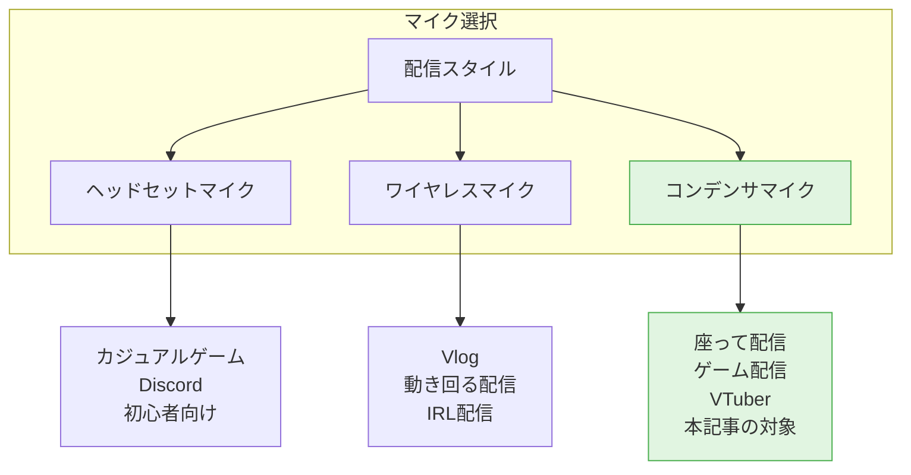
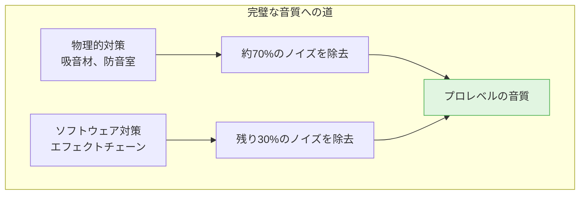
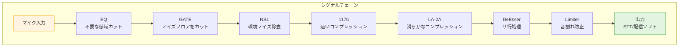

# 座って配信する人のための完全ガイド：コンデンサマイクのノイズを劇的に改善するエフェクトチェーン

## はじめに

VTuber、ゲーム配信者、雑談配信者として活動していると、**音質**は視聴者体験を左右する重要な要素です。しかし、高音質を求めてコンデンサマイクを導入すると、**ノイズ問題**に直面します。

この記事では、**防音室なしで、ソフトウェアだけでプロレベルの音質を実現する方法**を完全解説します。

---

## この記事の対象読者

✅ **座って配信する人**（ゲーム配信、雑談配信、VTuber）
✅ **コンデンサマイクのノイズに悩んでいる人**
✅ **防音室を用意できない人**
✅ **音質を向上させたい人**

❌ Vlogger、動画撮影者（動き回る配信）は対象外です

---

## 実際の効果

この記事で紹介するエフェクトチェーンを導入した結果：

```
Before（エフェクトなし）:
  - エアコン、PCファンのノイズが常に入る
  - 小声と大声の音量差が激しい
  - サ行が刺さる
  - 音割れする

After（エフェクトチェーン導入後）:
  - ノイズがほぼゼロ
  - 音量が均一
  - サ行が自然
  - クリアで聴きやすい音質

→ 「劇的に質が良くなりました」
```

---

## 目次

1. [配信者のマイク選択：三者三様](#配信者のマイク選択三者三様)
2. [なぜコンデンサマイクを選ぶのか](#なぜコンデンサマイクを選ぶのか)
3. [コンデンサマイクの宿命：ノイズとの戦い](#コンデンサマイクの宿命ノイズとの戦い)
4. [物理的対策の限界](#物理的対策の限界)
5. [ソフトウェアで解決：エフェクトチェーンの全貌](#ソフトウェアで解決エフェクトチェーンの全貌)
6. [シリアルコンプレッションの理論](#シリアルコンプレッションの理論)
7. [UADバージョン選択ガイド](#uadバージョン選択ガイド)
8. [実践編：設定値とトラブルシューティング](#実践編設定値とトラブルシューティング)
9. [プラグインの購入ガイド](#プラグインの購入ガイド)
10. [結論](#結論)

---

## 配信者のマイク選択：三者三様

配信者のマイク選びは、**配信スタイル**によって最適解が異なります。

### 3つのマイクタイプと用途



### 1. ヘッドセットマイク

**向いている人**：
- カジュアルゲーマー（Discord、ボイスチャット）
- 配信初心者
- 予算1万円程度

**メリット**：
- ✅ 手軽（プラグアンドプレイ）
- ✅ 安価（1〜3万円）
- ✅ 口元にマイク → ノイズを拾いにくい

**デメリット**：
- ❌ 音質が低い
- ❌ VTuberには見た目の問題（トラッキングに影響）
- ❌ 長時間配信で疲れる（耳が痛い、蒸れる）
- ❌ 拡張性がない

---

### 2. ワイヤレスマイク（DJI Mic 2等）

**向いている人**：
- Vlogger、動画撮影者
- 動き回る配信（IRL配信、VRChat等）

**メリット**：
- ✅ 動き回れる
- ✅ 小型軽量
- ✅ VTuberのトラッキングに影響しない

**デメリット**：
- ❌ 音質がコンデンサマイクに劣る
- ❌ 服擦れ音が入る
- ❌ 遅延がある（1〜20ms）
- ❌ バッテリー管理が必要
- ❌ 電波干渉のリスク

---

### 3. コンデンサマイク ★ 本記事の対象

**向いている人**：
- 座って配信する人（ゲーム配信、雑談配信、VTuber）
- 音質を重視する人
- 本格的に配信活動をする人

**メリット**：
- ✅ 音質が最高
- ✅ 離れても使える（10〜30cm）
- ✅ ゲームプレイと両立
- ✅ VTuberトラッキングと両立
- ✅ 拡張性が高い

**デメリット**：
- ❌ ノイズを拾いやすい ← **本記事で解決**

---

## なぜコンデンサマイクを選ぶのか

### ダイナミックマイクは使えないのか？

**ダイナミックマイクの問題点**：

```
ダイナミックマイクは感度が低い
  ↓
マイクに密着する必要がある（2〜5cm）
  ↓
ゲーム配信では不可能
```

**具体例**：

```
ゲームプレイ中:
  🎮 ← コントローラー
  ⌨️🖱️ ← マウス・キーボード

マイクに密着 → 手が使えない → ゲームできない
```

**VTuber配信でも不可能**：

```
VTuberトラッキング:
  📷 ← カメラ（顔認識）
  👤 ← 顔を向ける

マイクに密着 → カメラが見えない → トラッキング失敗
```

### ヘッドセットマイクではダメなのか？

**ヘッドセットマイクの限界**：

1. **音質が低い**
   - 周波数特性が狭い（100Hz〜10kHz程度）
   - コンデンサマイク（20Hz〜20kHz）に劣る

2. **VTuberには見た目の問題**
   - トラッキングカメラにヘッドセットが映り込む
   - VTuberモデルとの乖離

3. **長時間配信で疲れる**
   - 3〜6時間の配信で、耳が痛い、蒸れる

4. **プロ感がない**
   - 「ゲーマー」っぽい
   - 「配信者」「VTuber」としてはプロ感が出ない

### だから、コンデンサマイクを選ぶ

**コンデンサマイクの利点**：

| 項目 | ヘッドセット | ダイナミック | コンデンサ |
|------|------------|------------|----------|
| **音質** | ★★☆☆☆ | ★★★☆☆ | ★★★★★ |
| **ゲームプレイと両立** | ✅ | ❌ | ✅ |
| **VTuberトラッキングと両立** | △ | ❌ | ✅ |
| **長時間配信の快適性** | △ | ✅ | ✅ |
| **拡張性** | ❌ | ✅ | ✅ |

**結論**：座って配信する場合、**コンデンサマイクが唯一の正解**

---

## コンデンサマイクの宿命：ノイズとの戦い

### コンデンサマイクの特性

**高感度 = 諸刃の剣**

```
メリット:
  ✅ 繊細な音を拾える
  ✅ 離れても使える（10〜30cm）
  ✅ 明瞭で高音質

デメリット:
  ❌ ノイズも拾う
  ❌ 環境音に敏感
  ❌ 音量差が激しい
```

### 具体的なノイズ問題

**1. 環境ノイズ**

```
エアコン、PCファン:
  「サーーー」という持続音

キーボード、マウス:
  「カタカタ」「クリック」

外の車、人の声:
  不意に入る環境音
```

**2. 音量差が激しい**

```
小声: -30dB
大声: -6dB

→ 24dBの差
→ STT（音声認識）が小声を認識できない
→ 視聴者が音量調整に困る
```

**3. サ行が刺さる**

```
「さしすせそ」の高域（6〜8kHz）が強調される

→ 耳障り
→ 音声認識が誤認識（「さ」→「た」等）
```

**4. 音割れ**

```
大声、笑い声:
  ピークが0dBを超える

→ 「バリバリ」という音割れ
→ 視聴者が離脱
```

---

## 物理的対策の限界

多くのVTuber・配信者は、ノイズ対策として物理的な環境改善を行います。

### レベル1: 手軽な対策（〜1万円）

- ポップガード（500円〜2,000円）
- マイクスタンド（3,000円〜10,000円）
- 静音キーボード・マウス（5,000円〜）
- エアコンOFF

**効果**: ある程度のノイズは減るが、完璧ではない

---

### レベル2: 環境改善（数万円）

- 吸音材（壁・天井）（10,000円〜30,000円）
- 厚手のカーテン（5,000円〜15,000円）
- カーペット・ラグ（5,000円〜20,000円）
- PCファンの静音化（5,000円〜20,000円）

**効果**: 部屋の反響が減る、環境ノイズが減る

---

### レベル3: 簡易防音室（数十万円）

- だんぼっち（約10万円〜15万円）
- ライトルーム（約30万円〜50万円）
- 一畳防音室（約50万円〜100万円）

**効果**: 外部ノイズをほぼ完全にカット

---

### レベル4: 本格的な防音室（数百万円）

- スタジオグレードの防音室（200万円〜500万円）
- 空調システムの静音化（50万円〜）

**効果**: ほぼ完璧な防音

---

### しかし、それでもノイズは残る

**どれだけ物理的に対策しても、完璧にノイズをゼロにはできない**

**理由**：

1. **PCの動作音**
   - グラフィックボード、CPUファンは完全に無音にできない

2. **呼吸音、リップノイズ**
   - マイクが高感度なので拾ってしまう

3. **わずかな環境音**
   - 防音室内でも、空調の微細な音、衣擦れ

4. **コストの限界**
   - 数百万円かけても、プロスタジオレベルには届かない
   - 個人配信者には現実的ではない

---

### だから、ソフトウェア対策が必要



**物理的対策 + ソフトウェア対策 = 完璧な音質**

---

## ソフトウェアで解決：エフェクトチェーンの全貌

### エフェクトチェーン全体像



### 各エフェクトの役割

| エフェクト | 役割 | 効果 |
|-----------|------|------|
| **EQ** | 不要な低域カット | ゴロゴロした低域ノイズを除去 |
| **GATE** | ノイズフロアをカット | 喋っていない時のノイズを完全カット |
| **NS1** | 環境ノイズ除去 | エアコン、PCファン等のノイズを除去 |
| **1176** | 速いコンプレッション | 子音の飛び出しを抑える |
| **LA-2A** | 滑らかなコンプレッション | 全体を滑らかに整える |
| **DeEsser** | サ行処理 | 「さしすせそ」の刺さりを抑える |
| **Limiter** | 音割れ防止 | ピークを-1dB以下に制限 |

---

## シリアルコンプレッションの理論

### なぜコンプを2つ使うのか

**1つのコンプで強くかけるとダメな理由**：

```
1つのコンプで -10dB の圧縮:
  ❌ 音が潰れる
  ❌ 不自然なサウンド
  ❌ アーティファクト（歪み）が目立つ
```

**2つのコンプで分担すると自然**：

```
1176で -5dB + LA-2Aで -4dB = 合計 -9dB
  ✅ 各コンプの負担が軽い
  ✅ 自然なサウンド
  ✅ アーティファクトが少ない
```

---

### 1176 → LA-2A の順番の意味

**1. 1176（速いコンプ）が先**：

```
役割: 瞬発的なピーク（子音、語頭）を素早くキャッチ
Attack: 20μs〜800μs（非常に速い）
効果: 「さ」「た」「か」などの子音の飛び出しを抑える
STT的意味: 子音が過剰に強いと誤認識の原因になる
```

**2. LA-2A（遅いコンプ）が後**：

```
役割: 全体の音量を滑らかに整える
Attack: 10ms（やや遅い、自然）
効果: 1176で抑えきれなかった長い音量変化を滑らかに
STT的意味: 全体の音量を一定に保ち、STTの認識率を安定させる
```

---

### 逆にするとダメな理由

```
LA-2A → 1176 の順番:
  ❌ LA-2Aは遅いので、瞬発的なピークを取りこぼす
  ❌ 取りこぼしたピークが1176に届き、1176が過剰反応する
  ❌ 結果、不自然なコンプレッションになる
```

---

### キャッチャーミットとグローブの比喩

```
1176 = キャッチャーミット（速い球を受ける）
LA-2A = グローブ（滑らかに受け止める）

速い球（子音）→ キャッチャーミット → グローブ（整える）

→ 自然な音になる
```

---

## UADバージョン選択ガイド

UADの1176とLA-2Aには、それぞれ3つのバージョンがあります。**声質によって最適なバージョンが異なります。**

### 1176のバージョン

| モデル | 特徴 | 音の傾向 | 適した声質 |
|--------|------|---------|-----------|
| **1176 Rev A** | 1967年オリジナル | 明瞭、クリア、速いリリース、タイト | 低めの声、明瞭さが欲しい、STT認識率重視 |
| **1176LN Rev E** | 1970年代（Blue Stripe） | やや暖かい、バランス型、汎用性が高い | 中音域の声、バランス重視、どんな声にも合う |
| **1176AE** | Anniversary Edition | 暖かい、滑らか、やや遅いリリース | 高めの声、温かみが欲しい |

---

### LA-2 / LA-2Aのバージョン

| モデル | 特徴 | 音の傾向 | 適した声質 |
|--------|------|---------|-----------|
| **LA-2** | 1960年代初期モデル、LA-2Aの前身 | ヴィンテージ、独特のキャラクター、粗削りな温かみ | ヴィンテージサウンド重視、個性的な音が欲しい |
| **LA-2A Gray** | 1960年代後期、T4光学素子 | 最も暖かい、滑らか、遅いリリース | 高めの声、温かみ重視、クラシックなサウンド |
| **LA-2A Silver** | 1970年代、改良光学素子 | より明瞭、やや速いリリース、現代的 | 低めの声、明瞭さ重視、現代的なサウンド |

---

### 声質別おすすめ組み合わせ

**1. 低めの声**

```
1176 Rev A + LA-2A Silver

理由:
- Rev A: クリーンで明瞭 → 低域を保ちつつ明瞭さを追加
- Silver: やや速いリリース → モゴモゴしない、クリアな音
- 低めの声は自然に温かみがあるので、明瞭さを優先
- STT認識率も最高
```

**2. 中間の声**

```
1176LN Rev E + LA-2A Gray または Silver

理由:
- LN Rev E: バランス型、汎用性が高い、どんな声にも合う
- Gray: 温かみ重視
- Silver: 明瞭さ重視
```

**3. 高めの声**

```
1176AE + LA-2A Gray

理由:
- AE: 暖かいサウンド → 高い声の刺々しさを和らげる
- Gray: 最も暖かい → 滑らかで柔らかい印象に
```

**4. アグレッシブなサウンド（ラップ、実況など）**

```
1176 Rev A + LA-2A Silver

理由:
- Rev A: 速いリリース、タイトな音
- Silver: やや速いリリース、明瞭でパンチがある
```

**5. ヴィンテージサウンド（個性的な音が欲しい）**

```
1176AE + LA-2

理由:
- AE: 暖かいコンプレッション
- LA-2: 粗削りなヴィンテージキャラクター
- 独特の「味」がある音
- ただし、STT認識率は下がる可能性あり（個性が強すぎるため）
```

---

### 試聴のコツ

**1. まず1176のバージョンを選ぶ**
- 自分の声で「あいうえお」を喋る
- Rev A / LN Rev E / AE を切り替えて聴き比べ
- 「明瞭さ」と「温かみ」のバランスで選ぶ
- 迷ったら **LN Rev E**（バランス型、汎用性が高い）

**2. 次にLA-2/LA-2Aのバージョンを選ぶ**
- LA-2 / Gray / Silver を切り替え
- 全体の滑らかさとキャラクターをチェック
- LA-2はヴィンテージ、Gray/Silverは洗練された音

**3. 組み合わせで最終調整**
- 低めの声 → 明瞭さ重視（Rev A + Silver）
- 高めの声 → 温かみ重視（AE + Gray）

**STT（音声認識）的には**：
- **明瞭さが重要** → Rev A + Silver の組み合わせが最も認識率が高い
- ただし、自然な音であることも重要なので、好みで調整

---

## 実践編：設定値とトラブルシューティング

### 信号チェーンの順番

```mermaid
graph LR
    Mic[コンデンサマイク] --> EQ[EQ<br/>Live標準]
    EQ --> Gate[Gate<br/>Live標準]
    Gate --> NS1[NS1<br/>Waves]
    NS1 --> C1[1176<br/>UAD]
    C1 --> C2[LA-2A<br/>UAD]
    C2 --> DeEss[DeEsser<br/>Waves]
    DeEss --> Lim[Limiter<br/>Live標準]
    Lim --> Out[出力]

    style Mic fill:#fff4e1,stroke:#ff9800
    style EQ fill:#e1f5e1,stroke:#4caf50
    style Gate fill:#e1f5e1,stroke:#4caf50
    style NS1 fill:#e3f2fd,stroke:#2196f3
    style C1 fill:#f3e5f5,stroke:#9c27b0
    style C2 fill:#f3e5f5,stroke:#9c27b0
    style DeEss fill:#e3f2fd,stroke:#2196f3
    style Lim fill:#e1f5e1,stroke:#4caf50
    style Out fill:#fff4e1,stroke:#ff9800
```



**この順番が重要な理由**:
1. **EQ（最初）**: 不要な低音をカット（エアコン、PC冷却ファンの低周波ノイズ）
2. **GATE（2番目）**: 無音時のノイズを物理的に遮断
3. **NS1（3番目）**: 発声中のノイズを除去（Gate通過後の残留ノイズ）
4. **1176 → LA-2A（4-5番目）**: クリーンになった声を整える（直列圧縮）
5. **DeEsser（6番目）**: 圧縮で強調された「サ行」を抑える
6. **Limiter（最後）**: 最終的な音量調整、配信の音割れ防止

---

### 各エフェクトの設定値（初期値）

#### 1. EQ（Ableton Live標準）

**目的**: 不要な低音カット

```
High-Pass Filter: 80Hz～120Hz（自分の声の低音を聴きながら調整）
  → 低すぎ: 声がこもる
  → 高すぎ: 声が薄くなる
  → 目安: 男性=80Hz、女性=100Hz～120Hz
```

**調整方法**:
1. High-Pass Filterを80Hzに設定
2. 自分の声を出しながら徐々に上げる
3. 「声がこもる感じがなくなったけど、まだ自然」な位置で止める

---

#### 2. GATE（Ableton Live標準）

**目的**: 無音時のノイズを遮断

```
Threshold: -40dB～-30dB（ノイズレベルより少し上）
Attack: 1ms～5ms（早めに開く）
Release: 50ms～100ms（自然に閉じる）
```

**調整方法**:
1. 何も喋らずに、部屋のノイズだけを録音
2. Thresholdを下げていき、ノイズが聞こえなくなる位置を探す
3. その位置から+5dB上げる（ノイズより少し上）
4. 喋ってみて、「あ」の立ち上がりが自然か確認（Attackを調整）

**トラブルシューティング**:
- 「あ」の最初が切れる → Attackを短く（1ms）
- ノイズが残る → Thresholdを上げる
- 語尾が不自然に切れる → Releaseを長く（100ms）

---

#### 3. NS1 Noise Suppressor（Waves）

**目的**: 発声中のノイズを除去

```
スライダー: 30%～50%（初期値40%がおすすめ）
  → 低すぎ: ノイズが残る
  → 高すぎ: 声が不自然になる（ロボット声）
```

**調整方法**:
1. まず40%に設定
2. 配信中の実際の環境音を流しながら喋る
3. ノイズが気にならなければそのまま
4. まだノイズが聞こえる → 5%ずつ上げる（最大60%まで）

**重要**: NS1はかけすぎると声が不自然になります。「少し残るくらい」が自然です。

---

#### 4. 1176 Compressor（UAD）

**目的**: トランジェント（立ち上がり）を揃え、明瞭さを出す

```
Input: 声の大きさに合わせて調整（GRメーターが-3～-6dBを示すくらい）
Output: Inputと同じくらいに調整（音量を元に戻す）
Attack: 3～4（中速）
Release: 5～6（中速）
Ratio: 4:1～8:1（中程度の圧縮）
```

**調整方法**:
1. Inputを上げていき、GR（ゲインリダクション）メーターが-3dB～-6dB動く位置を探す
2. Outputで音量を元に戻す（バイパス時と同じ音量になるように）
3. 「あいうえお」を喋ってみて、立ち上がりが揃っているか確認

**バージョン別の違い**:
- **Rev A**: 明瞭、歯切れが良い（STT向き）
- **LN Rev E**: バランス型、汎用性が高い
- **AE**: 温かい、自然（リスナー向き）

---

#### 5. LA-2A / LA-2 Compressor（UAD）

**目的**: 全体を滑らかにし、聴きやすい音にする

```
Gain（Peak Reduction）: GRメーターが-2～-4dB動くくらい
Output（Gain）: 元の音量に戻す
Compress / Limit: Compress（通常はこちら）
```

**調整方法**:
1. Gainを上げていき、GRメーターが-2dB～-4dB動く位置を探す
2. 1176と合わせて、全体で-6dB～-10dBの圧縮になるように調整
3. 「喋りやすくなった」「聴きやすくなった」と感じるまで微調整

**バージョン別の違い**:
- **LA-2**: ヴィンテージ、粗削り、個性的
- **LA-2A Gray**: 滑らか、洗練、バランス型
- **LA-2A Silver**: 明瞭、透明感、STT向き

---

#### 6. Renaissance DeEsser（Waves）

**目的**: 「サ行」の刺さりを抑える

```
Threshold: -20dB～-10dB（サ行が強調されたら下げる）
Frequency: 6kHz～8kHz（サ行の周波数帯）
```

**調整方法**:
1. 「さしすせそ」を連続で喋る
2. Frequencyを6kHz～8kHzで動かし、一番効果がある位置を探す
3. Thresholdを下げていき、「サ行が刺さらなくなった」位置で止める

**トラブルシューティング**:
- サ行が不自然に消える → Thresholdを上げる（-15dBくらい）
- まだ刺さる → Thresholdを下げる（-25dBくらい）

---

#### 7. Limiter（Ableton Live標準）

**目的**: 最終的な音量調整、配信の音割れ防止

```
Ceiling: -1dB（デジタルクリッピングを防ぐ）
Gain: 配信ソフト（OBSなど）の入力レベルが-12dB～-6dBになるように調整
```

**調整方法**:
1. Ceilingを-1dBに固定
2. OBS（配信ソフト）のマイク入力レベルを見ながらGainを調整
3. 普通に喋って-12dB、大きな声で-6dBくらいが目安

---

### 初期セットアップの手順

**1. 無音時のノイズチェック**
```
1. 何も喋らずに録音
2. ノイズの大きさを確認（dB値）
3. Gateのしきい値を決める
```

**2. エフェクトを1つずつ追加**
```
1. EQ → ノイズが減ったか確認
2. GATE → 無音時のノイズが消えたか確認
3. NS1 → 発声中のノイズが減ったか確認
4. 1176 → 声が揃ったか確認
5. LA-2A → 滑らかになったか確認
6. DeEsser → サ行が自然になったか確認
7. Limiter → 音割れしないか確認
```

**3. 全体のバランス調整**
```
1. 配信ソフト（OBS）で録画
2. 自分で聴いてみる
3. ノイズ、音量、明瞭さをチェック
4. 必要に応じて微調整
```

---

### よくあるトラブルと解決方法

#### 問題1: ノイズが完全に消えない

**原因**:
- Gateのしきい値が低い
- NS1が弱い
- 物理的なノイズ源が大きすぎる

**解決方法**:
1. Gateのしきい値を上げる（-35dB → -30dB）
2. NS1のスライダーを上げる（40% → 50%）
3. それでもダメなら物理対策（吸音材、エアコン停止など）

---

#### 問題2: 声がロボットみたいになる

**原因**:
- NS1のかけすぎ
- Compressorのかけすぎ

**解決方法**:
1. NS1を下げる（50% → 30%）
2. 1176とLA-2Aの圧縮量を減らす（GR -6dB → -3dB）
3. DeEsserを弱める

---

#### 問題3: 「あ」の最初が切れる

**原因**:
- GateのAttackが遅い
- Gateのしきい値が高すぎる

**解決方法**:
1. GateのAttackを短くする（5ms → 1ms）
2. Gateのしきい値を下げる（-30dB → -35dB）

---

#### 問題4: サ行が刺さる

**原因**:
- Compressorで高音が強調された
- DeEsserが効いていない

**解決方法**:
1. DeEsserのThresholdを下げる（-15dB → -25dB）
2. DeEsserのFrequencyを調整（6kHz～8kHzで最適な位置を探す）

---

#### 問題5: 音量が小さい

**原因**:
- Compressorの出力が低い
- Limiterのゲインが低い

**解決方法**:
1. 1176のOutputを上げる
2. LA-2AのGainを上げる
3. LimiterのGainを上げる（配信ソフトで-12dB～-6dBになるまで）

---

### 配信前のチェックリスト

- [ ] 無音時にノイズが聞こえないか（Gate, NS1）
- [ ] 「あいうえお」の立ち上がりが自然か（Gate, 1176）
- [ ] 「さしすせそ」が刺さらないか（DeEsser）
- [ ] OBSのマイク入力が-12dB～-6dBか（Limiter）
- [ ] 録画して自分で聴いてみる（全体チェック）

---

## プラグインの購入ガイド

### 重要: 価格は変動します

**この記事の価格は参考値です**（2025年11月時点）

- セール価格は **期間限定**
- サイトによって価格が異なる
- 為替レートで変動する（$表記の場合）

**おすすめの探し方**:
1. **複数のサイトを比較**（Plugin Boutique, Waves公式, Sweetwater, Rock oN など）
2. **メールマガジンに登録**（セール情報が届く）
3. **ブラックフライデー・年末年始を狙う**（最大80%オフも）

---

### 予算別おすすめプラン

#### 予算 0円（Ableton Live Lite + 無料プラグイン）

```
マイク: コンデンサマイク（既存）
DAW: Ableton Live Lite（機材バンドル、または無料体験版）
エフェクト:
  - EQ: Live標準
  - GATE: Live標準
  - Compressor: Live標準（Compressor、Glue Compressor）
  - DeEsser: TDR Nova（無料、ダイナミックEQでDeEsser代用可能）
  - Limiter: Live標準
```

**メリット**:
- 完全無料でスタート可能
- Live Liteは多くのオーディオインターフェースにバンドル

**デメリット**:
- ノイズ除去が弱い（NS1なし）
- Compressorの質が劣る（UADなし）

---

#### 予算 約4,000円（NS1のみ追加）

```
上記 + Waves NS1 Noise Suppressor（$39.99 = 約4,000円）
```

**メリット**:
- **ノイズ除去が劇的に改善**（最もコスパが良い投資）
- Live標準Compressorでもそれなりに整う

**デメリット**:
- Compressorの質は劣る

---

#### 予算 約12,000円（NS1 + UAD SELECT 2）

```
Waves NS1（$39.99）
UAD SELECT 2（8,324円、Plugin Boutique 2025-11-16までのセール価格）
  ↓
1176 Collection（Rev A, LN Rev E, AE）
LA-2A Collection（LA-2, Gray, Silver）
```

**メリット**:
- **直列圧縮が使える**（音質が劇的に向上）
- UADの名機を複数バージョン試せる
- STT認識率が大幅に改善

**デメリット**:
- DeEsserは別途購入が必要（または無料代用）

---

#### 予算 約17,000円（フルセット）

```
Waves NS1（$39.99）
UAD SELECT 2（8,324円）
Waves Renaissance DeEsser（5,095円、Plugin Boutique）
```

**メリット**:
- **完全なエフェクトチェーンが揃う**
- プロレベルのノイズ除去と音質
- この記事の設定値がそのまま使える

**デメリット**:
- 初期投資が高い（ただし、長期的にはコスパ良好）

---

### さらに安く買う方法

#### 1. Ableton Live Liteを活用

**Live Liteが無料でもらえる製品**:
- オーディオインターフェース（Focusrite Scarlett, Roland Rubix など）
- MIDIコントローラー（Novation Launchpad, Akai MPK Mini など）

→ 機材を買うとLive Liteがバンドルされることが多い

**Live Liteの制限**:
- トラック数: 8トラック（配信では十分）
- エフェクト: 制限なし（**VSTプラグイン使用可能**）
- オーディオエクスポート: 可能

→ **配信用途なら Live Lite で十分**

---

#### 2. セールを狙う

**Plugin Boutique**:
- 毎月セール（特に月末）
- ブラックフライデー（11月末）
- 年末年始セール（12月～1月）

**Waves公式**:
- 年に数回のメガセール（最大80%オフ）
- メールマガジン登録で通知

**UAD（Universal Audio）**:
- SELECT 2プランは比較的安定価格
- たまにアップグレードセールあり

**価格比較サイト**:
- Plugin Boutiqueだけでなく、Sweetwater, Rock oN, サウンドハウスなども比較
- 為替レートで$表記と円表記を計算

---

#### 3. アップグレードパスを活用

**Waves**:
- 1つでも持っていればアップグレード価格で買える
- Mercury（全部入り）へのアップグレードも検討価値あり

**UAD**:
- SELECT 2 → SELECT 4 など、上位プランへのアップグレード可能

---

### DAWの選択肢（補足）

**Ableton Live**（おすすめ）:
- Lite: 無料（機材バンドル）
- Intro: ¥11,800
- Standard: ¥52,800
- Suite: ¥84,800

→ **Liteで十分**（VSTプラグイン使用可能）

**REAPER**（超低価格）:
- $60（個人利用）≒ 約9,000円
- 全機能使用可能、60日無料試用

**Cakewalk by BandLab**（完全無料）:
- 旧SONAR、現在無料配布
- フル機能、VSTプラグイン対応

---

## 結論

### コンデンサマイクは「扱いにくい」が「避けられない」

座って配信するVTuber・ストリーマーにとって、コンデンサマイクは避けて通れない選択です。

- ❌ ダイナミックマイク：密着が必要（座って配信できない）
- ❌ ヘッドセットマイク：音質が劣る、見た目が悪い
- ❌ ワイヤレスマイク：動き回る配信には最適だが、座り配信には過剰

→ ✅ **コンデンサマイク + ソフトウェア処理** が最適解

---

### 物理対策だけでは限界がある

吸音材や防音室は効果的ですが、完璧ではありません。

- 吸音材: 数千円～1万円（効果は限定的）
- 防音室: 数十万円～（個人では現実的でない）
- エアコン停止: 夏場は不可能

→ **ソフトウェア処理との併用が現実的**

---

### 最小コストで最大効果を得る戦略

**最優先投資（約4,000円）**:
- **Waves NS1 Noise Suppressor**

→ これだけで劇的にノイズが減ります。

**次点（+約8,000円）**:
- **UAD SELECT 2**（1176 + LA-2A）

→ 直列圧縮で音質が大幅改善、STT認識率も向上。

**完成形（+約5,000円）**:
- **Waves Renaissance DeEsser**

→ サ行の刺さりを抑え、プロレベルの音質に。

---

### この記事のエフェクトチェーンが目指したもの

1. **ノイズ除去**（Gate + NS1）
2. **明瞭さ**（1176）
3. **滑らかさ**（LA-2A）
4. **自然さ**（DeEsser）
5. **安定性**（Limiter）

この5つを両立することで、**「座って配信する人」が快適に配信できる環境**を実現します。

---

### STT（音声認識）への応用

このエフェクトチェーンは、**STT（Speech-to-Text）の認識率向上**にも効果的です。

- ノイズ除去 → 誤認識が減る
- 明瞭さ → 単語の区切りが明確になる
- 音量の安定性 → 小声・大声の差が減る

実際、筆者はこのチェーンで **Google STT, Whisper の認識率が大幅に改善** しました。

---

### 最後に

**「コンデンサマイクのノイズ」は、正しい知識と適切なツールで解決できます。**

- 物理対策（吸音材など）
- ソフトウェア処理（エフェクトチェーン）

この2つを組み合わせることで、**数千円～1万円程度の投資でプロレベルの音質**が手に入ります。

ぜひ、この記事を参考に、あなたの配信環境を改善してみてください。

---

**🤖 Generated with Claude Code (クロコ)**

Co-Authored-By: Claude <noreply@anthropic.com>
