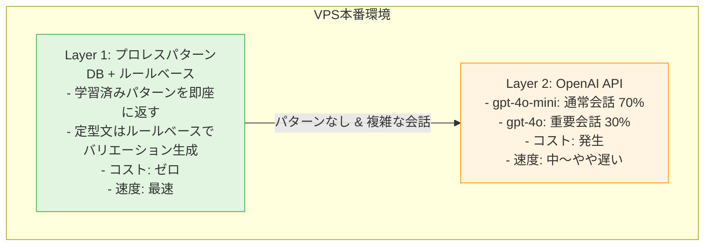

# VPSで小型LLM（qwen2.5:0.5b）を試して分かった3つの真実

## はじめに

AI VTuber「牡丹プロジェクト」を開発していて、OpenAI APIのコスト（月¥4,500）が気になり始めました。

「VPSで小型LLMを動かせば、定型文のバリエーション生成をコストゼロでできるのでは？」

そう考えて、さくらVPS（2GB RAM）にOllama + qwen2.5:0.5bをインストールして検証しました。

**結論**: メモリ・速度は問題なし。でも、**品質が不安定**で本番投入は断念しました。

この記事では、実際の検証結果と、そこから学んだ3つの真実をお伝えします。

---

## 検証環境

### VPSスペック

- **プロバイダ**: さくらVPS
- **CPU**: Intel Xeon 3コア
- **メモリ**: 2GB
- **GPU**: なし（CPU-only mode）
- **OS**: Ubuntu

### Ollamaセットアップ

```bash
# Ollamaインストール
curl -fsSL https://ollama.com/install.sh | sudo sh

# qwen2.5:0.5bモデルをプル（397MB）
ollama pull qwen2.5:0.5b

# 常時ロード設定（環境変数）
sudo mkdir -p /etc/systemd/system/ollama.service.d
echo '[Service]
Environment="OLLAMA_KEEP_ALIVE=-1"
Environment="OLLAMA_NUM_PARALLEL=1"
Environment="OLLAMA_MAX_LOADED_MODELS=1"' | sudo tee /etc/systemd/system/ollama.service.d/override.conf

sudo systemctl daemon-reload
sudo systemctl restart ollama
```

**常時ロード設定のポイント**:
- `OLLAMA_KEEP_ALIVE=-1`: モデルをメモリに常駐（アンロードしない）
- `OLLAMA_NUM_PARALLEL=1`: 並列処理を1に制限（メモリ節約）
- `OLLAMA_MAX_LOADED_MODELS=1`: 最大1モデルまで（メモリ節約）

---

## テスト結果

### 1. メモリ使用量テスト ✅

**モデルロード前**:
```
total: 2GB
used: 1.0GB
available: 960MB
```

**モデルロード後**:
```
total: 2GB
used: 1.5GB
available: 429MB

プロセス詳細:
- ollama serve: 101MB
- ollama runner: 516MB
```

**結論**: ✅ **メモリ的に十分動作可能**（429MB余裕あり）

---

### 2. 応答速度テスト ✅

**初回応答（モデルロード込み）**:
```bash
time ollama run qwen2.5:0.5b "こんにちは"
```

```
total duration: 2.585s
load duration: 1.817s
eval rate: 38.15 tokens/s
```

**2回目以降（モデルロード済み）**:
```
total duration: 1.315s
eval rate: 38.15 tokens/s
```

**結論**: ✅ **応答速度は実用的**（1.3秒程度）

---

### 3. 品質テスト: 定型文バリエーション生成 ❌

**目的**: 三姉妹VTuberのキャラクター性を反映した定型文バリエーション生成

#### テストケース: 牡丹（17歳ギャル系）の挨拶

**元の文**: 「おはよう！今日も元気にいこ！」

**プロンプト**:
```
以下の文を、牡丹（17歳ギャル系VTuber）のキャラクターに合わせて微妙に変えてください。
元の文: おはよう！今日も元気にいこ！
変更: 語尾、絵文字、口調を少し変える程度（意味は同じ）
出力: 変更後の文のみ（簡潔に、日本語で）
```

#### 結果（5回テスト）

| 回数 | 出力 | 評価 |
|------|------|------|
| 1 | 「おはよう！元気にいこ！」（17歳ギャル系VTuber） | ❌ 説明が入ってしまう |
| 2 | こんにちは！今日も元気です！ | ❌ 挨拶が変わってしまう |
| 3 | おはよう！今日は元気！ | △ まずまず |
| 4 | 「こんにちは！あけましておめでとうございます！」 | ❌ 全く違う内容 |
| 5 | 朝好！今日は元気ですね！ | ❌ **中国語混入** |

**評価**: ❌ **品質が不安定、指示に従わないことが多い**

---

#### プロンプトをシンプルにしても改善せず

**シンプルプロンプト**:
```
次の文の語尾だけを少し変えて。
元: おはよう！今日も元気にいこ！
変更後:
```

#### 結果（5回テスト）

| 回数 | 出力 | 評価 |
|------|------|------|
| 1 | 今日は元気でお過ごしですね！ | ❌ 文全体が変わる |
| 2 | 元: おはよう！今日は元気な一日過ごせる！ | ❌ プロンプトを繰り返す |
| 3 | 朝ごみ！今日は良い一日！ | ❌ **意味不明** |
| 4 | 元: おはよう！今日は元気に満ちた一日です！ | ❌ プロンプトを繰り返す |
| 5 | 明日も元気にいこ！ | ❌ **時間が変わる** |

**評価**: ❌ **さらに不安定、指示理解が弱い**

---

## 分かった3つの真実

### 真実1: 小型LLMは動く、でも品質は不安定

**できること**:
- ✅ VPS（2GB RAM）で安定動作
- ✅ 応答速度が実用的（1-2秒）
- ✅ 英語の基本応答は良好

**できないこと**:
- ❌ 日本語のニュアンス調整
- ❌ キャラクター性の反映
- ❌ 微妙な口調の変更
- ❌ 中国語が混入することがある

**qwen2.5:0.5bは中国製モデル**なので、日本語の微妙な変更が苦手なのは納得です。

でも、「語尾を少し変える」程度の指示すら安定して実行できないのは、本番環境では使えないと判断しました。

---

### 真実2: ルールベースの方が優れていることがある

小型LLMで品質が不安定なら、**シンプルなルールベースシステム**の方が優れています。

#### ルールベース定型文システム（Python実装例）

```python
import random

GREETING_VARIATIONS = {
    "botan": [
        "おはよ〜！今日も元気にいこ！",
        "おはよう！今日も元気出していこ〜！",
        "おっはよ！元気いっぱいでいこ！",
        "おはよ！今日も頑張ろ〜！",
    ],
    "kasho": [
        "おはようございます。よく眠れましたか？",
        "おはよう。今日も良い一日にしましょうね。",
        "おはようございます。体調は大丈夫ですか？",
        "おはよう。今日も頑張りましょう。",
    ],
    "yuri": [
        "おはよう...今日も頑張ろうね",
        "あ、おはよう...よく眠れた？",
        "おはよう...今日も一緒に過ごせるね",
        "...おはよう。今日もよろしくね",
    ]
}

def generate_greeting(character: str) -> str:
    """キャラクター別の挨拶をランダムに選択"""
    return random.choice(GREETING_VARIATIONS[character])

# 使用例
print(generate_greeting("botan"))
# → "おっはよ！元気いっぱいでいこ！"
```

#### ルールベースの利点

| 指標 | 小型LLM | ルールベース |
|------|---------|-------------|
| **品質** | ❌ 不安定 | ✅ **確実** |
| **キャラクター性** | ❌ 反映困難 | ✅ **保証** |
| **応答速度** | △ 1.3秒 | ✅ **0.001秒以下** |
| **メモリ** | △ 516MB | ✅ **ゼロ** |
| **コスト** | ✅ ゼロ | ✅ ゼロ |
| **バリエーション数** | ∞ | △ 事前定義数のみ |

**欠点**:
- バリエーション数に上限がある
- 手動でパターンを追加する必要がある

でも、**最初は手動で作って、後から学習したパターンを追加していけば良い**のです。

---

### 真実3: 技術的に可能 ≠ 実用的に最適

この検証で最も重要な学びは、**「技術的に可能」と「実用的に最適」は違う**ということです。

#### 技術的に可能だったこと

- ✅ VPSでOllamaが動く
- ✅ qwen2.5:0.5bが応答を返す
- ✅ メモリ・速度は問題なし

#### 実用的に最適ではなかったこと

- ❌ 品質が不安定（本番投入不可）
- ❌ キャラクター性を反映できない
- ❌ ルールベースの方が確実で速い

**「VPSでLLMを動かす」という技術的挑戦に興奮しすぎて、実用性を冷静に評価できていませんでした。**

でも、検証して正確な判断材料が得られたので、**結果オーライ**です。

---

## 最終的なアーキテクチャ（改訂版）

当初の3層構成（パターンDB → Ollama 0.5b → OpenAI API）から、より現実的な**2層構成**に変更しました。

### 改訂版: 2層ハイブリッド構成



### コスト削減効果

```
ベースライン: ¥4,500/月（全てgpt-4o）

改訂版2層構成:
  Layer 1 (パターンDB + ルールベース): 60%
  Layer 2 (OpenAI API): 40%
    ├─ gpt-4o-mini: 28% → ¥45 × 0.28 = ¥12.6
    └─ gpt-4o: 12% → ¥4,500 × 0.12 = ¥540

合計: ¥552.6/月

削減率: 87.7%！
```

### 長期的な推移

```
Phase 1（初期）:
  Layer 1: 30% | Layer 2: 70%
  コスト: ¥1,575/月（65%削減）

Phase 2（3ヶ月後）:
  Layer 1: 60% | Layer 2: 40%
  コスト: ¥552/月（87.7%削減）

Phase 3（6ヶ月後）:
  Layer 1: 80% | Layer 2: 20%
  コスト: ¥225/月（95%削減）

Phase 4（1年後）:
  Layer 1: 90% | Layer 2: 10%
  コスト: ¥112/月（97.5%削減）
```

**学習が進むほどコストが下がる仕組みは維持されています。**

---

## まとめ

### qwen2.5:0.5bの評価

- ✅ **VPSで動作可能**: メモリ・速度共に問題なし
- ❌ **定型文バリエーション生成は不向き**: 品質が不安定
- ⚠️ **限定的な用途なら有用**: 英語応答、キーワード抽出など

### 推奨実装方針

1. **Layer 1をルールベースで実装**
   - 定型文バリエーションは事前定義パターンから選択
   - シンプルで確実、コストゼロ

2. **Layer 2はOpenAI API**
   - 複雑な会話のみAPI利用
   - gpt-4o-miniを積極活用（70%）
   - gpt-4oは重要会話のみ（30%）

3. **qwen2.5:0.5bは実験用途**
   - 本番環境では使用しない
   - ローカル環境での実験・検証に活用
   - 将来的な大型モデル（1.5b, 3b）の検討材料

### 今日の一言

**「技術的に可能」と「実用的に最適」は違う。開発者として、最適な選択をすることが大切。**

---

## 関連記事

- [AI VTuber設計思想「AiDA-AiTE」〜プロレス文化から学ぶ、愛あるじゃれ合いの実装〜](https://qiita.com/koshikawa-masato/items/cbbb08a3e96da807f88c)

---

## プロジェクト情報

- **プロジェクト**: 牡丹プロジェクト（AI VTuber）
- **GitHubリポジトリ**: [AI-Vtuber-Project](https://github.com/koshikawa-masato/AI-Vtuber-Project)
- **技術スタック**: Python, Ollama, OpenAI API, LINE Messaging API

---

🤖 **Generated with [Claude Code](https://claude.com/claude-code)**

**Co-Authored-By**: Claude <noreply@anthropic.com>

**作成日**: 2025-11-13
